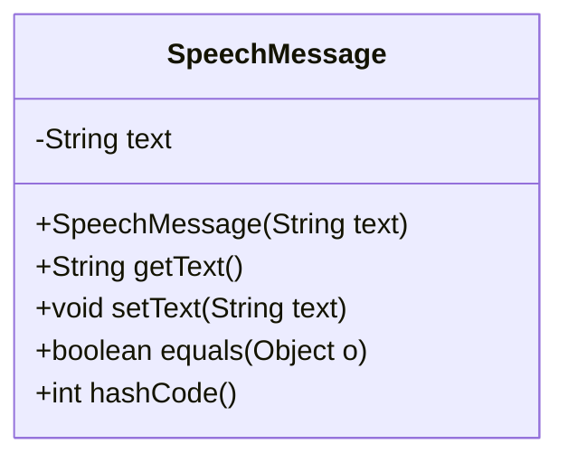
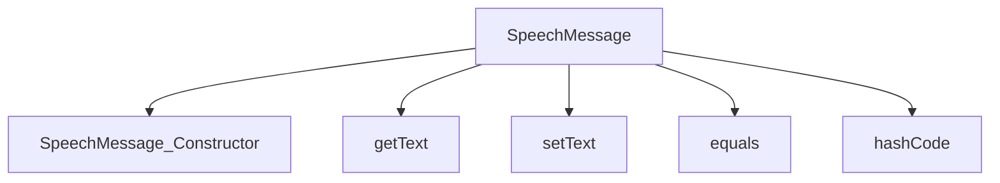

# 基础信息

|      |      |
|------|------|
| 编码语言 | .java |
| 代码路径 | yudao-module-ai/yudao-spring-boot-starter-ai/src/main/java/com/alibaba/cloud/ai/tongyi/audio/speech/api/SpeechMessage.java |
| 包名 | com.alibaba.cloud.ai.tongyi.audio.speech.api |
| 依赖项 | ['java.util.Objects'] |
| 概述说明 | SpeechMessage类用于封装语音消息的文本内容，提供构造函数初始化文本，支持获取和设置文本内容，并重写equals和hashCode方法以确保对象比较和哈希计算的准确性。 |

# 说明

SpeechMessage类是一个用于封装语音消息文本内容的类。它提供了构造函数来初始化文本内容，并且支持获取和设置文本内容的功能。为了确保对象在比较和哈希计算时的准确性，该类还重写了equals和hashCode方法。通过这些方法，SpeechMessage类能够准确地比较两个对象是否相等，并且在哈希表中能够正确地存储和检索对象。这使得SpeechMessage类在处理语音消息时更加可靠和高效。

# 类列表 Class Summary

| 名称   | 类型  | 说明 |
|-------|------|-------------|
| SpeechMessage | class | SpeechMessage类用于封装语音消息的文本内容，提供构造函数初始化文本，支持获取和设置文本内容，并重写了equals和hashCode方法以确保对象比较和哈希计算的准确性。 |

## 类 SpeechMessage

|      |      |
|------|------|
| 访问范围 | public |
| 类型 | class |
| 名称 | SpeechMessage |
| 说明 | SpeechMessage类用于封装语音消息的文本内容，提供构造函数初始化文本，支持获取和设置文本内容，并重写了equals和hashCode方法以确保对象比较和哈希计算的准确性。 |

### UML类图

### 描述：
该UML类图展示了一个名为`SpeechMessage`的类，该类包含一个私有属性`text`，并提供了构造方法、getter和setter方法。此外，类还重写了`equals`和`hashCode`方法，用于比较两个`SpeechMessage`对象的文本内容是否相同。

### 内部方法调用关系图

### 描述信息：
该图展示了`SpeechMessage`类中的方法调用关系。`SpeechMessage`类包含构造函数`SpeechMessage_Constructor`、获取文本的`getText`方法、设置文本的`setText`方法、以及重写的`equals`和`hashCode`方法。这些方法共同协作，确保`SpeechMessage`对象的创建、文本管理以及对象比较和哈希计算的正确性。

### 字段列表 Field List

| 名称  | 类型  | 说明 |
|-------|-------|------|
| text | String | private String text; 是一个Java类中的私有字符串变量声明，用于存储文本数据。 |

### 方法列表 Method List

| 名称  | 类型  | 说明 |
|-------|-------|------|
| getText | String | 该方法返回一个字符串类型的变量text的值。 |
| setText | void | 该方法用于设置文本内容，接受一个字符串参数text，并将其赋值给当前对象的text属性。 |
| hashCode | int | 该代码片段重写了`hashCode`方法，使用`Objects.hash`方法生成基于`text`字段的哈希值。 |
| equals | boolean | 该方法重写了equals方法，用于比较当前对象与传入对象是否相等。首先检查是否为同一对象，若是则返回true；然后检查传入对象是否为SpeechMessage类型，若不是则返回false；最后比较两个对象的text属性是否相等，返回比较结果。 |

