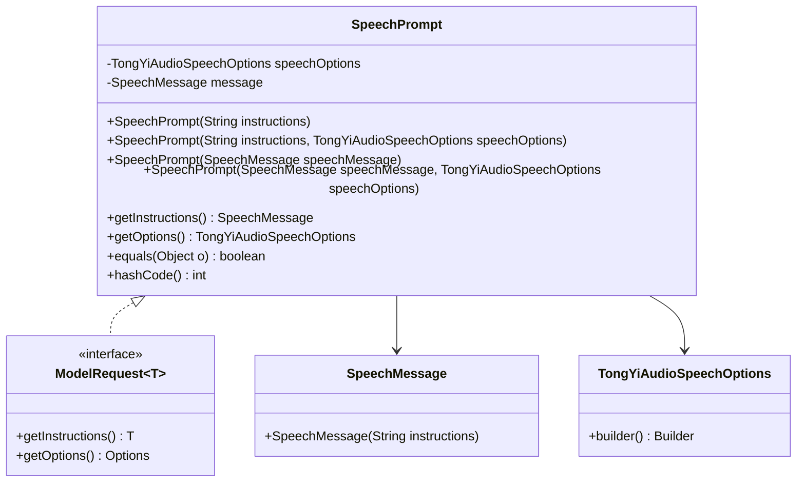
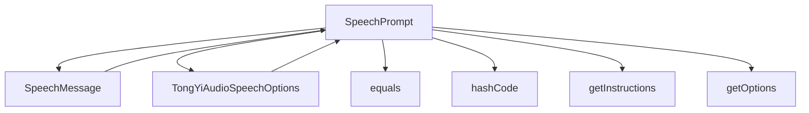

# 基础信息

|      |      |
|------|------|
| 编码语言 | .java |
| 代码路径 | yudao-module-ai/yudao-spring-boot-starter-ai/src/main/java/com/alibaba/cloud/ai/tongyi/audio/speech/api/SpeechPrompt.java |
| 包名 | com.alibaba.cloud.ai.tongyi.audio.speech.api |
| 依赖项 | ['com.alibaba.cloud.ai.tongyi.audio.speech.TongYiAudioSpeechOptions', 'org.springframework.ai.model.ModelRequest', 'java.util.Objects'] |
| 概述说明 | SpeechPrompt类实现了ModelRequest接口，用于处理语音消息请求，包含SpeechMessage和TongYiAudioSpeechOptions属性，提供多种构造函数，实现getInstructions和getOptions方法获取消息和选项，并重写equals和hashCode方法确保对象比较和哈希计算的正确性。 |

# 说明

SpeechPrompt类是一个实现了ModelRequest接口的类，专门用于处理语音消息请求。该类包含两个主要属性：SpeechMessage和TongYiAudioSpeechOptions。SpeechMessage属性用于存储语音消息的内容，而TongYiAudioSpeechOptions属性则用于配置语音消息的处理选项。为了支持不同的初始化需求，SpeechPrompt类提供了多个构造函数，允许开发者在创建对象时以不同的方式初始化这些属性。

在功能实现方面，SpeechPrompt类提供了getInstructions和getOptions方法。getInstructions方法用于获取语音消息的内容，而getOptions方法则用于获取语音消息的处理选项。这些方法使得开发者能够方便地访问和操作语音消息的相关信息。

此外，SpeechPrompt类还重写了equals和hashCode方法。equals方法用于比较两个SpeechPrompt对象是否相等，确保在对象比较时能够正确判断它们的属性是否一致。hashCode方法则用于计算对象的哈希值，确保在哈希表等数据结构中能够正确存储和检索SpeechPrompt对象。通过重写这两个方法，SpeechPrompt类确保了对象比较和哈希计算的正确性，从而提高了代码的健壮性和可靠性。

总的来说，SpeechPrompt类通过实现ModelRequest接口，提供了处理语音消息请求的功能，并通过多个构造函数、getInstructions和getOptions方法以及重写的equals和hashCode方法，确保了类的灵活性和正确性。

# 类列表 Class Summary

| 名称   | 类型  | 说明 |
|-------|------|-------------|
| SpeechPrompt | class | SpeechPrompt类实现了ModelRequest接口，用于处理语音消息请求。它包含SpeechMessage和TongYiAudioSpeechOptions两个主要属性，提供多个构造函数以支持不同初始化方式。类中实现了getInstructions和getOptions方法以获取消息和选项，并重写了equals和hashCode方法以确保对象比较和哈希计算的正确性。 |

## 类 SpeechPrompt

|      |      |
|------|------|
| 访问范围 | public |
| 类型 | class |
| 名称 | SpeechPrompt |
| 说明 | SpeechPrompt类实现了ModelRequest接口，用于处理语音消息请求。它包含SpeechMessage和TongYiAudioSpeechOptions两个主要属性，提供多个构造函数以支持不同初始化方式。类中实现了getInstructions和getOptions方法以获取消息和选项，并重写了equals和hashCode方法以确保对象比较和哈希计算的正确性。 |

### UML类图

### 描述信息：
该UML类图展示了`SpeechPrompt`类实现了`ModelRequest`接口，并依赖于`SpeechMessage`和`TongYiAudioSpeechOptions`类。`SpeechPrompt`类包含多个构造函数和方法，用于处理语音提示的生成和配置。

### 内部方法调用关系图

### 描述信息：
该图展示了`SpeechPrompt`类与其他类和方法之间的调用关系。`SpeechPrompt`类依赖于`SpeechMessage`和`TongYiAudioSpeechOptions`类，并调用了`equals`、`hashCode`、`getInstructions`和`getOptions`方法。这些方法用于处理对象的比较、哈希计算以及获取指令和选项。

### 字段列表 Field List

| 名称  | 类型  | 说明 |
|-------|-------|------|
| message | SpeechMessage | private final SpeechMessage message; 该语句定义了一个私有的、不可变的SpeechMessage类型的变量message，表示一个语音消息对象。 |
| speechOptions | TongYiAudioSpeechOptions | private TongYiAudioSpeechOptions speechOptions; 是一个私有变量，用于存储TongYi音频语音选项的配置信息。 |

### 方法列表 Method List

| 名称  | 类型  | 说明 |
|-------|-------|------|
| getInstructions | SpeechMessage | 该方法重写了父类的getInstructions方法，返回当前对象的message属性作为SpeechMessage类型的指令信息。 |
| getOptions | TongYiAudioSpeechOptions | 该方法返回一个TongYiAudioSpeechOptions对象，即speechOptions。 |
| hashCode | int | 该方法重写了hashCode函数，使用Objects.hash方法计算speechOptions和message的哈希值并返回。 |
| equals | boolean | 该代码重写了equals方法，用于比较两个SpeechPrompt对象是否相等。首先检查是否为同一对象，若是则返回true；然后检查传入对象是否为SpeechPrompt实例，若不是则返回false；最后比较speechOptions和message属性是否相等，返回比较结果。 |

