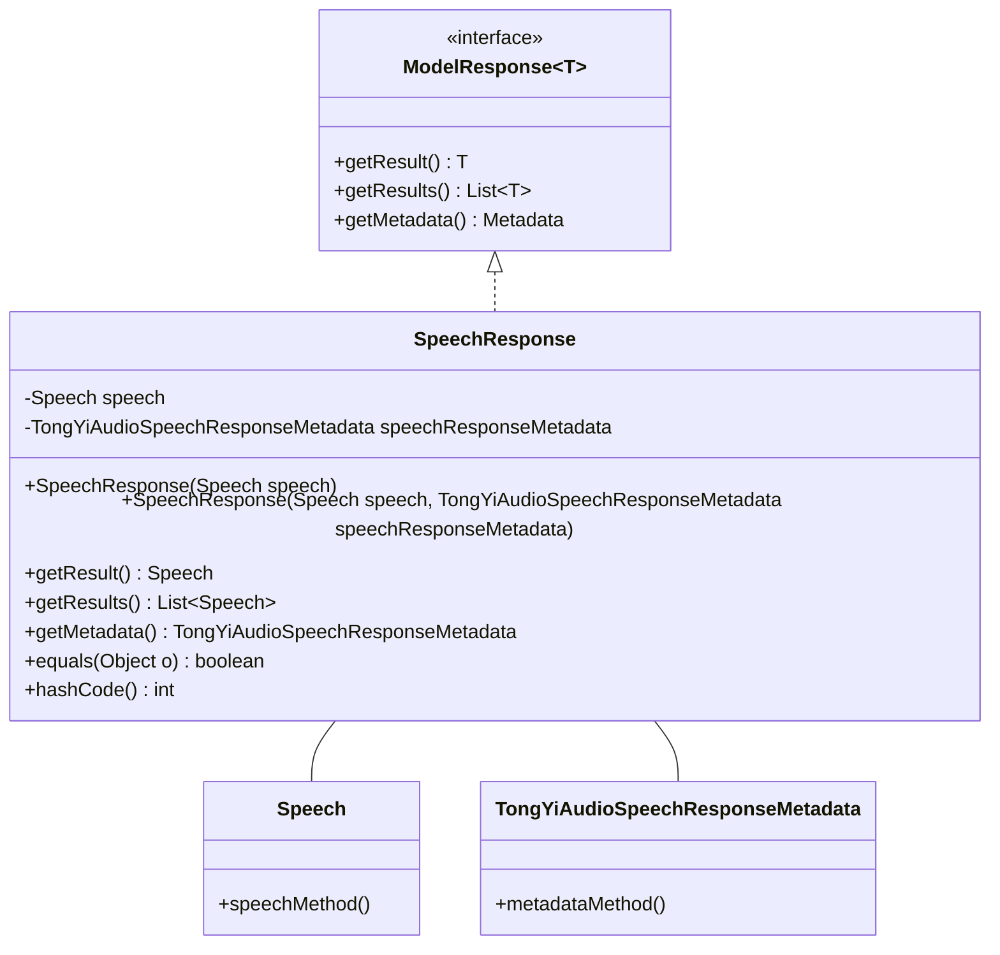
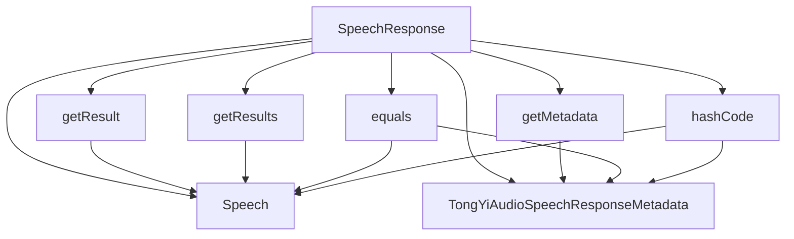

# 基础信息

|      |      |
|------|------|
| 编码语言 | .java |
| 代码路径 | yudao-module-ai/yudao-spring-boot-starter-ai/src/main/java/com/alibaba/cloud/ai/tongyi/audio/speech/api/SpeechResponse.java |
| 包名 | com.alibaba.cloud.ai.tongyi.audio.speech.api |
| 依赖项 | ['com.alibaba.cloud.ai.tongyi.metadata.audio.TongYiAudioSpeechResponseMetadata', 'org.springframework.ai.model.ModelResponse', 'java.util.Collections', 'java.util.List', 'java.util.Objects'] |
| 概述说明 | SpeechResponse类实现了ModelResponse接口，包含Speech对象和TongYiAudioSpeechResponseMetadata元数据，提供两个构造函数分别用于初始化Speech和元数据，并重写了getResult、getResults、getMetadata、equals和hashCode方法以获取结果、元数据及比较对象。 |

# 说明

SpeechResponse类实现了ModelResponse接口，主要用于处理语音响应。该类包含两个主要部分：Speech对象和TongYiAudioSpeechResponseMetadata元数据。Speech对象用于存储语音数据，而TongYiAudioSpeechResponseMetadata元数据则包含了与语音响应相关的附加信息。

为了初始化SpeechResponse类，提供了两个构造函数。第一个构造函数用于初始化Speech对象，第二个构造函数则用于初始化元数据。这两个构造函数使得在创建SpeechResponse实例时，可以根据需要灵活地初始化语音数据或元数据。

此外，SpeechResponse类重写了多个方法，以确保其功能完整且符合接口要求。重写的getResult方法用于获取单个结果，而getResults方法则用于获取多个结果。getMetadata方法用于获取与语音响应相关的元数据。为了支持对象的比较和哈希计算，还重写了equals和hashCode方法。equals方法用于比较两个SpeechResponse对象是否相等，而hashCode方法则用于生成对象的哈希码，以便在哈希表等数据结构中使用。

通过这些方法和构造函数的实现，SpeechResponse类能够有效地管理语音响应数据，并提供必要的接口方法来访问和比较这些数据。

# 类列表 Class Summary

| 名称   | 类型  | 说明 |
|-------|------|-------------|
| SpeechResponse | class | SpeechResponse类实现了ModelResponse接口，包含Speech对象和TongYiAudioSpeechResponseMetadata元数据。提供两个构造函数，分别用于初始化Speech和元数据。重写了getResult、getResults、getMetadata、equals和hashCode方法，用于获取结果、元数据及比较对象。 |

## 类 SpeechResponse

|      |      |
|------|------|
| 访问范围 | public |
| 类型 | class |
| 名称 | SpeechResponse |
| 说明 | SpeechResponse类实现了ModelResponse接口，包含Speech对象和TongYiAudioSpeechResponseMetadata元数据。提供两个构造函数，分别用于初始化Speech和元数据。重写了getResult、getResults、getMetadata、equals和hashCode方法，用于获取结果、元数据及比较对象。 |

### UML类图

### 描述：
该UML类图展示了`SpeechResponse`类实现了`ModelResponse`接口，并包含`Speech`和`TongYiAudioSpeechResponseMetadata`两个类的关联关系。`SpeechResponse`类通过构造函数初始化`Speech`和`TongYiAudioSpeechResponseMetadata`对象，并提供了获取结果和元数据的方法。

### 内部方法调用关系图

### 描述信息：
该图展示了`SpeechResponse`类中各个方法之间的调用关系。`SpeechResponse`类依赖于`Speech`和`TongYiAudioSpeechResponseMetadata`类，并通过`getResult`、`getResults`、`getMetadata`、`equals`和`hashCode`方法与其进行交互。这些方法分别用于获取结果、元数据以及进行对象比较和哈希计算。

### 字段列表 Field List

| 名称  | 类型  | 说明 |
|-------|-------|------|
| speech | Speech | private final Speech speech; 声明了一个私有的、不可变的Speech类型变量speech。 |
| speechResponseMetadata | TongYiAudioSpeechResponseMetadata | private final TongYiAudioSpeechResponseMetadata speechResponseMetadata; 定义了一个私有的、不可变的TongYiAudioSpeechResponseMetadata类型变量，用于存储音频语音响应的元数据。 |

### 方法列表 Method List

| 名称  | 类型  | 说明 |
|-------|-------|------|
| getMetadata | TongYiAudioSpeechResponseMetadata | 该方法返回一个TongYiAudioSpeechResponseMetadata类型的对象，即speechResponseMetadata。 |
| getResult | Speech | 该方法重写了父类的方法，返回一个名为`speech`的Speech对象。 |
| getResults | List<Speech> | 该代码片段重写了`getResults`方法，返回一个包含单个`speech`对象的不可变列表。 |
| hashCode | int | 该代码重写了`hashCode`方法，使用`Objects.hash`方法计算并返回`speech`和`speechResponseMetadata`两个字段的哈希值。 |
| equals | boolean | 该方法重写了equals方法，用于比较两个SpeechResponse对象是否相等。首先检查是否为同一对象，是则返回true；然后检查传入对象是否为SpeechResponse类型，不是则返回false；最后比较两个对象的speech和speechResponseMetadata属性是否相等，返回比较结果。 |

