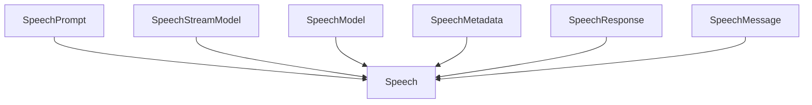

# 基础信息

|      |      |
|------|------|
| 编码语言 | .java |
| 代码路径 | yudao-module-ai/yudao-spring-boot-starter-ai/src/main/java/com/alibaba/cloud/ai/tongyi/audio/speech/api |
| 包名 | com.alibaba.cloud.ai.tongyi.audio.speech.api |
| 概述说明 | SpeechPrompt类实现ModelRequest接口，处理语音消息请求，包含SpeechMessage和TongYiAudioSpeechOptions属性，提供多个构造函数及getInstructions、getOptions方法，重写equals和hashCode确保对象比较和哈希计算正确。SpeechResponse类实现ModelResponse接口，处理语音响应，包含Speech对象和TongYiAudioSpeechResponseMetadata元数据，提供两个构造函数及getResult、getResults、getMetadata方法，重写equals和hashCode。SpeechMessage类封装语音消息文本内容，提供构造函数及文本内容访问方法，重写equals和hashCode。Speech类实现ModelResult<ByteBuffer>接口，处理音频数据及元数据，提供音频数据和元数据访问方法，重写equals、hashCode和toString方法。 |

# 说明

SpeechPrompt类是一个实现了ModelRequest接口的类，专门用于处理语音消息请求。该类包含两个主要属性：SpeechMessage和TongYiAudioSpeechOptions。SpeechMessage属性用于存储语音消息的内容，而TongYiAudioSpeechOptions属性则用于配置语音消息的处理选项。SpeechPrompt类提供了多个构造函数，允许开发者在创建对象时以不同的方式初始化这些属性。此外，该类还提供了getInstructions和getOptions方法，分别用于获取语音消息的内容和处理选项。为了确保对象比较和哈希计算的正确性，SpeechPrompt类重写了equals和hashCode方法，从而提高了代码的健壮性和可靠性。

SpeechResponse类实现了ModelResponse接口，主要用于处理语音响应。该类包含两个主要部分：Speech对象和TongYiAudioSpeechResponseMetadata元数据。Speech对象用于存储语音数据，而TongYiAudioSpeechResponseMetadata元数据则包含了与语音响应相关的附加信息。SpeechResponse类提供了两个构造函数，分别用于初始化Speech对象和元数据。此外，该类重写了getResult、getResults和getMetadata方法，用于获取单个结果、多个结果和元数据。为了支持对象的比较和哈希计算，SpeechResponse类还重写了equals和hashCode方法，确保在哈希表等数据结构中能够正确存储和检索对象。

SpeechMessage类是一个用于封装语音消息文本内容的类。它提供了构造函数来初始化文本内容，并且支持获取和设置文本内容的功能。为了确保对象在比较和哈希计算时的准确性，该类重写了equals和hashCode方法，使得SpeechMessage类能够准确地比较两个对象是否相等，并且在哈希表中能够正确地存储和检索对象。

Speech类实现了ModelResult<ByteBuffer>接口，主要用于处理音频数据及其相关元数据。该类包含两个主要属性：ByteBuffer audio用于存储音频数据，SpeechMetadata speechMetadata用于存储与音频相关的元数据。Speech类提供了获取音频数据和元数据的方法，并支持元数据的设置功能。为了确保对象的比较和字符串表示的准确性，Speech类重写了equals、hashCode和toString方法，使得在比较两个Speech对象时能够基于其音频数据和元数据进行准确的判断，同时在将对象转换为字符串时能够提供清晰且详细的描述。通过这些设计，Speech类能够有效地管理音频数据及其元数据，并确保对象在使用过程中的一致性和可读性。

### 包内部结构视图

### 描述信息：
该Mermaid图展示了`Speech`类与其他相关类之间的调用关系。`SpeechPrompt`、`SpeechStreamModel`、`SpeechModel`、`SpeechMetadata`、`SpeechResponse`和`SpeechMessage`类都调用了`Speech`类，表明`Speech`类在这些类中扮演了核心角色，可能是用于处理语音相关操作的主要接口或服务类。

# 文件列表 File List

| 名称   | 类型  | 说明 |
|-------|------|-------------|
| [Speech.java](Speech.md) | file | `Speech`类实现了`ModelResult<ByteBuffer>`接口，包含音频数据`ByteBuffer audio`和元数据`SpeechMetadata speechMetadata`，提供获取音频和元数据的方法，支持元数据设置，并重写了`equals`、`hashCode`和`toString`方法以确保对象比较和字符串表示的准确性。 |
| [SpeechMessage.java](SpeechMessage.md) | file | SpeechMessage类用于封装语音消息的文本内容，提供构造函数初始化文本，支持获取和设置文本内容，并重写equals和hashCode方法以确保对象比较和哈希计算的准确性。 |
| [SpeechResponse.java](SpeechResponse.md) | file | SpeechResponse类实现了ModelResponse接口，包含Speech对象和TongYiAudioSpeechResponseMetadata元数据，提供两个构造函数分别用于初始化Speech和元数据，并重写了getResult、getResults、getMetadata、equals和hashCode方法以获取结果、元数据及比较对象。 |
| [SpeechMetadata.java](SpeechMetadata.md) | file | 请提供需要总结的具体信息内容，以便我为您生成一个简洁的概要说明。 |
| [SpeechModel.java](SpeechModel.md) | file | 请提供需要总结的具体信息内容，以便我为您生成概要说明。 |
| [SpeechStreamModel.java](SpeechStreamModel.md) | file | 请提供需要总结的具体内容，以便我为您生成一个简洁的概要说明。 |
| [SpeechPrompt.java](SpeechPrompt.md) | file | SpeechPrompt类实现了ModelRequest接口，用于处理语音消息请求，包含SpeechMessage和TongYiAudioSpeechOptions属性，提供多种构造函数，实现getInstructions和getOptions方法获取消息和选项，并重写equals和hashCode方法确保对象比较和哈希计算的正确性。 |

