# 基础信息

|      |      |
|------|------|
| 编码语言 | .java |
| 代码路径 | yudao-module-ai/yudao-spring-boot-starter-ai/src/main/java/com/alibaba/cloud/ai/tongyi/audio/transcription/TongYiAudioTranscriptionModel.java |
| 包名 | com.alibaba.cloud.ai.tongyi.audio.transcription |
| 依赖项 | ['cn.hutool.core.collection.ListUtil', 'com.alibaba.cloud.ai.tongyi.audio.AudioTranscriptionModels', 'com.alibaba.cloud.ai.tongyi.audio.transcription.api.AudioTranscriptionPrompt', 'com.alibaba.cloud.ai.tongyi.audio.transcription.api.AudioTranscriptionResponse', 'com.alibaba.cloud.ai.tongyi.audio.transcription.api.AudioTranscriptionResult', 'com.alibaba.cloud.ai.tongyi.common.exception.TongYiException', 'com.alibaba.cloud.ai.tongyi.metadata.audio.TongYiAudioTranscriptionResponseMetadata', 'com.alibaba.dashscope.audio.asr.transcription', 'org.springframework.ai.model.Model', 'org.springframework.core.io.Resource', 'org.springframework.util.Assert', 'java.io.IOException', 'java.util.ArrayList', 'java.util.Arrays', 'java.util.List', 'java.util.stream.Collectors'] |
| 概述说明 | TongYiAudioTranscriptionModel类提供音频转录功能，支持默认选项和转录API。通过call方法处理转录请求，可合并选项和转换参数。转录流程包括提交请求、等待完成、获取结果及处理异常。 |

# 说明

TongYiAudioTranscriptionModel类是一个用于实现音频转录功能的工具，提供了默认选项和转录API接口。用户可以通过调用该类的call方法来处理音频转录请求。在调用过程中，支持合并选项和转换参数，以便根据具体需求调整转录行为。转录过程分为几个步骤：首先提交转录请求，随后等待转录任务完成，最后获取转录结果。在整个过程中，系统会处理可能出现的异常情况，确保转录任务的稳定性和可靠性。该类的设计旨在为用户提供一个高效且灵活的音频转录解决方案，能够适应不同的应用场景和需求。

# 类列表 Class Summary

| 名称   | 类型  | 说明 |
|-------|------|-------------|
| TongYiAudioTranscriptionModel | class | TongYiAudioTranscriptionModel类实现了音频转录功能，包含默认选项和转录API。通过调用call方法处理音频转录请求，支持合并选项和转换参数。转录过程包括提交请求、等待完成并获取结果，处理异常情况。 |


## 类 TongYiAudioTranscriptionModel

|      |      |
|------|------|
| 访问范围 | public |
| 类型 | class |
| 名称 | TongYiAudioTranscriptionModel |
| 说明 | TongYiAudioTranscriptionModel类实现了音频转录功能，包含默认选项和转录API。通过调用call方法处理音频转录请求，支持合并选项和转换参数。转录过程包括提交请求、等待完成并获取结果，处理异常情况。 |


### UML类图

```mermaid
classDiagram
    class TongYiAudioTranscriptionModel {
        -TongYiAudioTranscriptionOptions defaultOptions
        -Transcription transcription
        +TongYiAudioTranscriptionModel(Transcription transcription)
        +TongYiAudioTranscriptionModel(TongYiAudioTranscriptionOptions defaultOptions, Transcription transcription)
        +call(AudioTranscriptionPrompt prompt) AudioTranscriptionResponse
        +merge(TongYiAudioTranscriptionOptions target) TongYiAudioTranscriptionOptions
        +toTranscriptionParam(TongYiAudioTranscriptionOptions source) TranscriptionParam
    }

    class TongYiAudioTranscriptionOptions {
        +String model
        +String channelId
        +Boolean diarizationEnabled
        +Boolean disfluencyRemovalEnabled
        +Boolean timestampAlignmentEnabled
        +String specialWordFilter
        +Boolean audioEventDetectionEnabled
        +List~String~ fileUrls
        +String phraseId
        +Integer speakerCount
        +TongYiAudioTranscriptionOptions builder()
    }

    class Transcription {
        +asyncCall(TranscriptionParam param) TranscriptionResult
        +wait(TranscriptionQueryParam param) TranscriptionResult
    }

    class TranscriptionParam {
        +String model
        +List~String~ fileUrls
        +String phraseId
        +String channelId
        +Boolean diarizationEnabled
        +Integer speakerCount
        +Boolean disfluencyRemovalEnabled
        +Boolean timestampAlignmentEnabled
        +String specialWordFilter
        +Boolean audioEventDetectionEnabled
        +TranscriptionParam builder()
    }

    class TranscriptionResult {
        +String taskId
        +JsonObject output
        +List~TranscriptionTaskResult~ results
    }

    class TranscriptionTaskResult {
        +String transcriptionUrl
    }

    class AudioTranscriptionPrompt {
        +TongYiAudioTranscriptionOptions options
        +Resource instructions
    }

    class AudioTranscriptionResponse {
        +List~AudioTranscriptionResult~ results
        +TongYiAudioTranscriptionResponseMetadata metadata
    }

    class AudioTranscriptionResult {
        +String transcriptionUrl
    }

    class TongYiAudioTranscriptionResponseMetadata {
        +static from(TranscriptionResult result) TongYiAudioTranscriptionResponseMetadata
    }

    class Model~T, R~ {
        <<interface>>
        +call(T prompt) R
    }

    TongYiAudioTranscriptionModel <|.. Model
    TongYiAudioTranscriptionModel --* TongYiAudioTranscriptionOptions
    TongYiAudioTranscriptionModel --* Transcription
    TranscriptionResult --* TranscriptionTaskResult
    AudioTranscriptionResponse --* AudioTranscriptionResult
    AudioTranscriptionResponse --* TongYiAudioTranscriptionResponseMetadata
    TranscriptionParam --* TongYiAudioTranscriptionOptions
    AudioTranscriptionPrompt --* TongYiAudioTranscriptionOptions
```



### 描述：
该UML类图展示了`TongYiAudioTranscriptionModel`类及其相关类的结构和关系。`TongYiAudioTranscriptionModel`实现了`Model`接口，并依赖于`TongYiAudioTranscriptionOptions`和`Transcription`类。`Transcription`类负责处理音频转录任务，`TranscriptionResult`和`TranscriptionTaskResult`类用于存储转录结果。`AudioTranscriptionPrompt`和`AudioTranscriptionResponse`类分别表示转录请求和响应。


### 内部方法调用关系图

```mermaid
graph TD
    TongYiAudioTranscriptionModel --> call
    call --> merge
    call --> toTranscriptionParam
    call --> transcription.asyncCall
    transcription.asyncCall --> transcription.wait
    transcription.wait --> result.getResults
    result.getResults --> new AudioTranscriptionResponse
    merge --> TongYiAudioTranscriptionOptions.builder
    toTranscriptionParam --> TranscriptionParam.builder
```

### 描述信息：
`TongYiAudioTranscriptionModel` 类通过 `call` 方法处理音频转录请求。`call` 方法调用 `merge` 和 `toTranscriptionParam` 方法来合并选项和构建转录参数。随后，通过 `transcription.asyncCall` 提交转录请求，并通过 `transcription.wait` 等待结果。最终，转录结果被封装为 `AudioTranscriptionResponse` 返回。

### 字段列表 Field List

| 名称  | 类型  | 说明 |
|-------|-------|------|
| transcription | Transcription | private final Transcription transcription; 声明了一个私有的、不可变的Transcription类型的变量transcription。 |
| defaultOptions | TongYiAudioTranscriptionOptions | private final TongYiAudioTranscriptionOptions defaultOptions 定义了一个私有的、不可变的默认音频转录选项对象。 |

### 方法列表 Method List

| 名称  | 类型  | 说明 |
|-------|-------|------|
| merge | TongYiAudioTranscriptionOptions | 该方法用于合并两个TongYiAudioTranscriptionOptions对象，优先使用defaultOptions中的值，若为null则使用target中的值。合并的字段包括模型、通道ID、是否启用语音分离、是否启用不流畅移除、是否启用时间戳对齐、特殊词过滤以及是否启用音频事件检测。最终返回合并后的对象。 |
| toTranscriptionParam | TranscriptionParam | 该方法将TongYiAudioTranscriptionOptions对象转换为TranscriptionParam对象。通过builder模式设置模型、文件URL、短语ID、通道ID、是否启用说话人分离、说话人数、是否启用不流畅词移除、是否启用时间戳对齐、特殊词过滤以及是否启用音频事件检测等参数，最终构建并返回TranscriptionParam对象。 |
| call | AudioTranscriptionResponse | 该方法处理音频转录请求，根据输入的`AudioTranscriptionPrompt`生成转录参数`TranscriptionParam`。若`prompt`包含选项，则合并选项并转换为转录参数；否则使用默认模型和指令URL构建参数。随后提交转录请求并等待完成，获取转录结果后返回`AudioTranscriptionResponse`。若过程中出现异常，抛出`TongYiException`。 |


