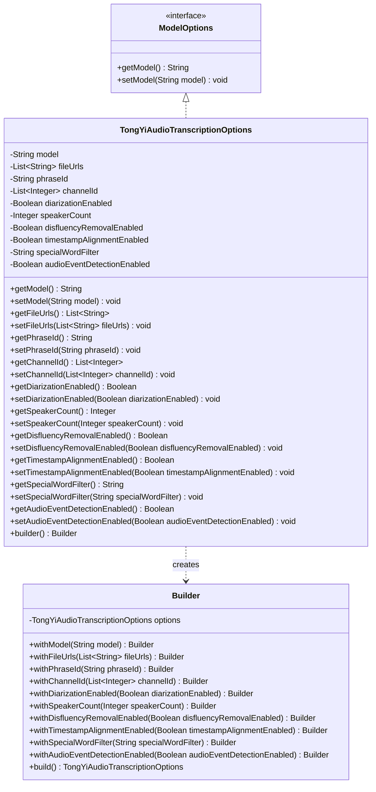
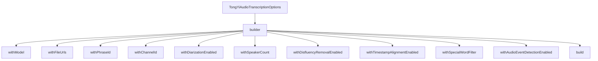

# 基础信息

|      |      |
|------|------|
| 编码语言 | .java |
| 代码路径 | yudao-module-ai/yudao-spring-boot-starter-ai/src/main/java/com/alibaba/cloud/ai/tongyi/audio/transcription/TongYiAudioTranscriptionOptions.java |
| 包名 | com.alibaba.cloud.ai.tongyi.audio.transcription |
| 依赖项 | ['com.alibaba.cloud.ai.tongyi.audio.AudioTranscriptionModels', 'org.springframework.ai.model.ModelOptions', 'java.util.ArrayList', 'java.util.Collections', 'java.util.List'] |
| 概述说明 | TongYiAudioTranscriptionOptions类用于配置音频转录选项，支持模型选择、文件URL、短语ID、声道ID、说话人分离、说话人数、不流畅词移除、时间戳对齐、特殊词过滤和音频事件检测等功能，通过Builder模式灵活构建实例。 |

# 说明

TongYiAudioTranscriptionOptions类是一个用于配置音频转录选项的工具，提供了多种功能以满足不同的转录需求。用户可以通过该类选择不同的模型来进行音频转录，并指定音频文件的URL作为输入源。此外，该类支持设置短语ID和声道ID，以便更精确地处理特定音频片段。为了提升转录的准确性，该类还提供了说话人分离功能，允许用户指定说话人数，从而在多说话人场景中更好地识别和区分不同说话者的内容。为了优化转录结果，用户可以选择移除不流畅的词汇，并对时间戳进行对齐，以确保转录文本与音频的时间轴保持一致。此外，该类还支持特殊词过滤功能，帮助用户过滤掉不需要的词汇或短语。最后，TongYiAudioTranscriptionOptions类还具备音频事件检测功能，能够识别音频中的特定事件或声音。通过Builder模式，用户可以灵活地构建和配置该类的实例，根据具体需求设置各项参数，从而实现高度定制化的音频转录处理。

# 类列表 Class Summary

| 名称   | 类型  | 说明 |
|-------|------|-------------|
| TongYiAudioTranscriptionOptions | class | TongYiAudioTranscriptionOptions类用于配置音频转录选项，包含模型选择、文件URL、短语ID、声道ID、说话人分离、说话人数、不流畅词移除、时间戳对齐、特殊词过滤和音频事件检测等功能。通过Builder模式构建实例，支持灵活设置各项参数。 |

## 类 TongYiAudioTranscriptionOptions

|      |      |
|------|------|
| 访问范围 | public |
| 类型 | class |
| 名称 | TongYiAudioTranscriptionOptions |
| 说明 | TongYiAudioTranscriptionOptions类用于配置音频转录选项，包含模型选择、文件URL、短语ID、声道ID、说话人分离、说话人数、不流畅词移除、时间戳对齐、特殊词过滤和音频事件检测等功能。通过Builder模式构建实例，支持灵活设置各项参数。 |

### UML类图

### 描述：
该UML类图展示了`TongYiAudioTranscriptionOptions`类及其构建器`Builder`的结构。`TongYiAudioTranscriptionOptions`实现了`ModelOptions`接口，并包含多个私有属性和公共的getter/setter方法。`Builder`类用于构建`TongYiAudioTranscriptionOptions`实例，提供了链式调用的方法。

### 内部方法调用关系图

### 描述信息：
该图展示了`TongYiAudioTranscriptionOptions`类与其内部`Builder`类之间的调用关系。`builder`方法用于创建`Builder`实例，而`Builder`类中的各个`with`方法用于设置不同的选项，最后通过`build`方法返回配置好的`TongYiAudioTranscriptionOptions`实例。

### 字段列表 Field List

| 名称  | 类型  | 说明 |
|-------|-------|------|
| timestampAlignmentEnabled = false | Boolean | timestampAlignmentEnabled 是一个布尔类型的私有变量，默认值为 false。 |
| speakerCount = null | Integer | 概要说明：变量speakerCount为私有整数类型，初始值为null。 |
| disfluencyRemovalEnabled = false | Boolean | disfluencyRemovalEnabled 设置为 false，表示未启用不流畅内容移除功能。 |
| phraseId = null | String | private String phraseId = null; 表示定义了一个私有的字符串变量phraseId，并将其初始值设为null。 |
| specialWordFilter = "" | String | private String specialWordFilter = ""; 定义了一个私有字符串变量specialWordFilter，初始值为空字符串。 |
| fileUrls = new ArrayList<>() | List<String> | 代码定义了一个名为`fileUrls`的私有列表变量，用于存储字符串类型的文件URL。该列表初始化为一个新的`ArrayList`实例。 |
| channelId = Collections.singletonList(0) | List<Integer> | 代码定义了一个私有列表变量channelId，初始化为包含单个元素0的不可变列表。 |
| model = AudioTranscriptionModels.Paraformer_V1 | String | 该代码片段定义了一个私有字符串变量`model`，并将其初始化为`AudioTranscriptionModels.Paraformer_V1`，用于指定音频转录模型。 |
| audioEventDetectionEnabled = false | Boolean | 音频事件检测功能当前未启用（audioEventDetectionEnabled = false）。 |
| diarizationEnabled = false | Boolean | 概要说明：该信息描述了一个布尔类型的私有变量`diarizationEnabled`，其初始值设置为`false`，表示某种功能或特性默认未启用。 |

### 方法列表 Method List

| 名称  | 类型  | 说明 |
|-------|-------|------|
| getModel | String | 该方法返回一个字符串类型的模型名称。 |
| getPhraseId | String | 该方法返回一个字符串类型的phraseId值。 |
| getFileUrls | List<String> | 该方法返回一个包含文件URL的字符串列表。 |
| getDisfluencyRemovalEnabled | Boolean | 该方法返回一个布尔值，表示是否启用了不流畅性移除功能。 |
| getSpeakerCount | Integer | 该方法返回一个整数值，表示当前对象的`speakerCount`属性值。 |
| getTimestampAlignmentEnabled | Boolean | 该方法返回一个布尔值，表示时间戳对齐功能是否启用。 |
| getSpecialWordFilter | String | 该方法返回一个名为specialWordFilter的字符串变量。 |
| getChannelId | List<Integer> | 该方法返回一个包含整数类型的列表，表示获取的频道ID。 |
| setModel | void | 该方法用于设置模型的名称，通过传入一个字符串参数来更新当前对象的模型属性。 |
| getAudioEventDetectionEnabled | Boolean | 该方法返回一个布尔值，表示音频事件检测功能是否启用。 |
| getDiarizationEnabled | Boolean | 该方法返回一个布尔值，表示是否启用了语音分割功能。 |
| setPhraseId | void | 该方法用于设置短语ID，通过传入一个字符串类型的参数phraseId，将其赋值给当前对象的phraseId属性。 |
| setChannelId | void | 该方法用于设置通道ID列表，接受一个整数类型的列表作为参数，并将其赋值给类的成员变量channelId。 |
| setSpecialWordFilter | void | 该方法用于设置特殊词汇过滤器，通过传入一个字符串参数来更新类中的特殊词汇过滤器属性。 |
| setDiarizationEnabled | void | 该方法用于设置是否启用语音分离功能，通过传入布尔值参数diarizationEnabled来控制。 |
| setAudioEventDetectionEnabled | void | 该方法用于设置音频事件检测功能的启用状态，通过传入一个布尔值参数来控制是否启用音频事件检测。 |
| setDisfluencyRemovalEnabled | void | 该方法用于设置是否启用不流畅语移除功能，通过传入布尔值参数`disfluencyRemovalEnabled`来控制该功能的开启或关闭。 |
| setSpeakerCount | void | 该方法用于设置扬声器数量，接受一个整数参数speakerCount，并将其赋值给类的成员变量speakerCount。 |
| setTimestampAlignmentEnabled | void | 该方法用于设置时间戳对齐功能的启用状态，通过传入一个布尔值参数来更新类中的`timestampAlignmentEnabled`属性。 |
| setFileUrls | void | 该方法用于设置文件URL列表，接受一个字符串列表作为参数，并将其赋值给类的成员变量fileUrls。 |
| builder | Builder | 该代码片段定义了一个静态方法`builder()`，返回一个新的`Builder`对象实例。该方法用于创建并返回`Builder`类的实例，通常用于构建复杂对象的模式中。 |

