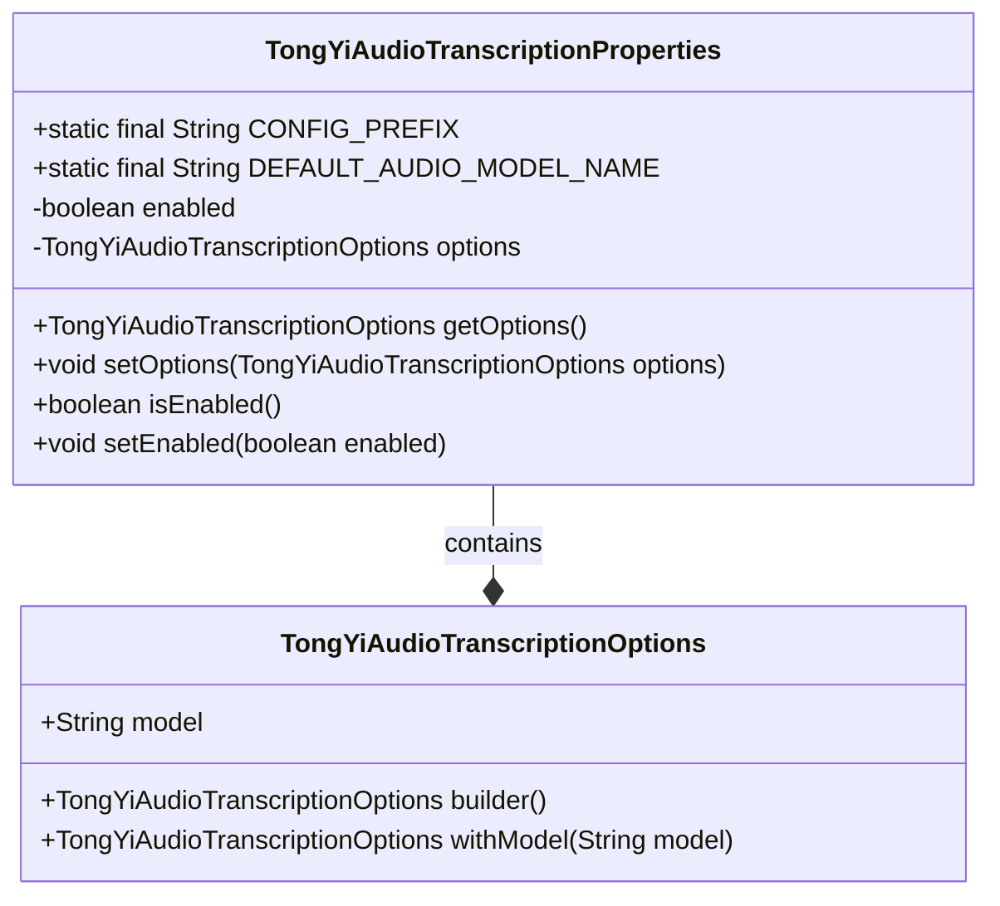
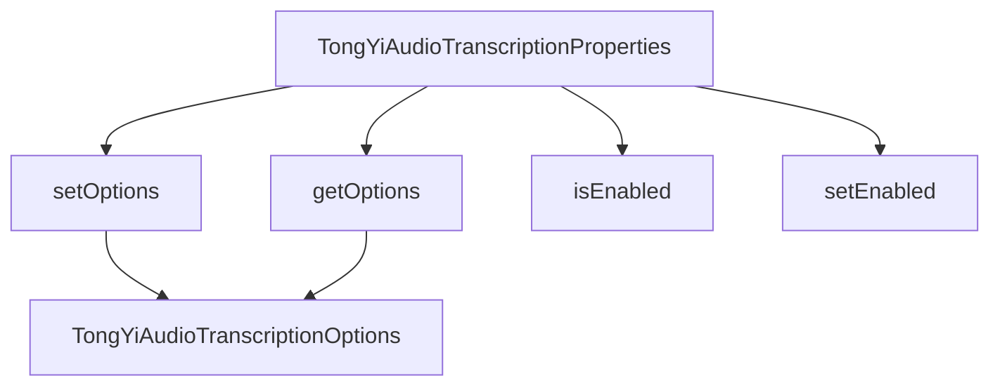

# 基础信息

|      |      |
|------|------|
| 编码语言 | .java |
| 代码路径 | yudao-module-ai/yudao-spring-boot-starter-ai/src/main/java/com/alibaba/cloud/ai/tongyi/audio/transcription/TongYiAudioTranscriptionProperties.java |
| 包名 | com.alibaba.cloud.ai.tongyi.audio.transcription |
| 依赖项 | ['com.alibaba.cloud.ai.tongyi.audio.AudioTranscriptionModels', 'org.springframework.boot.context.properties.ConfigurationProperties', 'org.springframework.boot.context.properties.NestedConfigurationProperty', 'com.alibaba.cloud.ai.tongyi.common.constants.TongYiConstants.SCA_AI_CONFIGURATION'] |
| 概述说明 | TongYiAudioTranscriptionProperties类用于配置Spring Cloud Alibaba AI的音频转录功能，前缀为SCA_AI_CONFIGURATION.audio.transcription。默认使用Paraformer_V1模型，启用状态为true，包含嵌套配置选项TongYiAudioTranscriptionOptions，可通过get/set方法访问和修改。 |

# 说明

TongYiAudioTranscriptionProperties类是用于配置Spring Cloud Alibaba AI中音频转录功能的类，其配置前缀为SCA_AI_CONFIGURATION.audio.transcription。该类默认使用Paraformer_V1模型进行音频转录，并且默认启用状态为true，表示音频转录功能在默认情况下是开启的。此外，该类还包含一个嵌套的配置选项TongYiAudioTranscriptionOptions，该选项可以通过get和set方法进行访问和修改，以便用户根据具体需求对音频转录功能进行进一步的定制和调整。通过这种方式，用户可以灵活地配置和管理音频转录功能，以满足不同的应用场景和需求。

# 类列表 Class Summary

| 名称   | 类型  | 说明 |
|-------|------|-------------|
| TongYiAudioTranscriptionProperties | class | TongYiAudioTranscriptionProperties类用于配置Spring Cloud Alibaba AI的音频转录功能，前缀为SCA_AI_CONFIGURATION.audio.transcription。默认使用Paraformer_V1模型，启用状态为true，包含嵌套配置选项TongYiAudioTranscriptionOptions，可通过get/set方法访问和修改。 |

## 类 TongYiAudioTranscriptionProperties

|      |      |
|------|------|
| 访问范围 | @ConfigurationProperties(TongYiAudioTranscriptionProperties.CONFIG_PREFIX);public |
| 类型 | class |
| 名称 | TongYiAudioTranscriptionProperties |
| 说明 | TongYiAudioTranscriptionProperties类用于配置Spring Cloud Alibaba AI的音频转录功能，前缀为SCA_AI_CONFIGURATION.audio.transcription。默认使用Paraformer_V1模型，启用状态为true，包含嵌套配置选项TongYiAudioTranscriptionOptions，可通过get/set方法访问和修改。 |

### UML类图

### 描述信息：
该UML类图展示了`TongYiAudioTranscriptionProperties`类及其与`TongYiAudioTranscriptionOptions`类的关系。`TongYiAudioTranscriptionProperties`类包含配置前缀、默认音频模型名称、启用标志以及嵌套的配置选项。`TongYiAudioTranscriptionOptions`类用于构建和设置音频转录选项。

### 内部方法调用关系图

### 描述信息：
该图展示了`TongYiAudioTranscriptionProperties`类中的方法调用关系。`TongYiAudioTranscriptionProperties`类通过`getOptions`和`setOptions`方法与`TongYiAudioTranscriptionOptions`类进行交互，同时提供了`isEnabled`和`setEnabled`方法来管理音频转录功能的启用状态。

### 字段列表 Field List

| 名称  | 类型  | 说明 |
|-------|-------|------|
| enabled = true | boolean | 该代码定义了一个私有布尔变量enabled，并初始化为true。 |
| DEFAULT_AUDIO_MODEL_NAME = AudioTranscriptionModels.Paraformer_V1 | String | public static final String DEFAULT_AUDIO_MODEL_NAME 被定义为 AudioTranscriptionModels.Paraformer_V1，表示默认音频转录模型名称为 Paraformer_V1。 |
| CONFIG_PREFIX = SCA_AI_CONFIGURATION + "audio.transcription" | String | 该代码定义了一个静态常量`CONFIG_PREFIX`，其值为`SCA_AI_CONFIGURATION`与字符串`"audio.transcription"`的连接结果，用于配置音频转录相关设置。 |
| options = TongYiAudioTranscriptionOptions
			.builder().withModel(DEFAULT_AUDIO_MODEL_NAME).build() | TongYiAudioTranscriptionOptions | 该代码片段展示了在Java中使用嵌套配置属性，通过`TongYiAudioTranscriptionOptions`类的构建器模式初始化一个音频转录选项对象，并设置了默认的音频模型名称。 |

### 方法列表 Method List

| 名称  | 类型  | 说明 |
|-------|-------|------|
| getOptions | TongYiAudioTranscriptionOptions | 该方法返回当前对象的音频转录选项配置。 |
| setOptions | void | 该方法用于设置语音转写选项，通过传入的TongYiAudioTranscriptionOptions对象来更新当前选项。 |
| isEnabled | boolean | 该方法返回一个布尔值，表示当前对象是否启用，通过返回成员变量`enabled`的值来确定状态。 |
| setEnabled | void | 该方法用于设置一个布尔类型的属性`enabled`，通过传入的参数`enabled`来更新对象的`enabled`状态。 |

