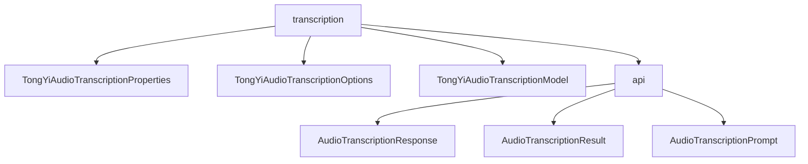

# 基础信息

|      |      |
|------|------|
| 编码语言 | .java |
| 代码路径 | yudao-module-ai/yudao-spring-boot-starter-ai/src/main/java/com/alibaba/cloud/ai/tongyi/audio/transcription |
| 包名 | com.alibaba.cloud.ai.tongyi.audio.transcription |
| 概述说明 | TongYiAudioTranscriptionProperties类用于配置Spring Cloud Alibaba AI中的音频转录功能，默认启用并使用Paraformer_V1模型，支持通过TongYiAudioTranscriptionOptions进行定制。AudioTranscriptionResponse类处理音频转录响应，包含转录结果列表和元数据，提供多种访问方法。AudioTranscriptionResult类管理转录结果，包含文本内容和元数据，支持对象比较和哈希值生成。AudioTranscriptionPrompt类处理音频转录请求，支持音频资源和转录选项的配置。TongYiAudioTranscriptionOptions类提供多种转录配置选项，如模型选择、说话人分离、时间戳对齐等，支持高度定制化。TongYiAudioTranscriptionModel类实现音频转录功能，支持请求处理、异常处理和结果获取，适应不同应用场景。 |

# 说明

TongYiAudioTranscriptionProperties类是Spring Cloud Alibaba AI中用于配置音频转录功能的类，其配置前缀为SCA_AI_CONFIGURATION.audio.transcription。默认情况下，该类使用Paraformer_V1模型进行音频转录，并且默认启用状态为true。该类还包含一个嵌套的配置选项TongYiAudioTranscriptionOptions，用户可以通过get和set方法对其进行访问和修改，以便根据具体需求定制音频转录功能。

AudioTranscriptionResponse类实现了ModelResponse<AudioTranscriptionResult>接口，用于处理音频转录的响应数据。该类包含一个AudioTranscriptionResult列表和一个TongYiAudioTranscriptionResponseMetadata元数据对象。AudioTranscriptionResult列表存储多个音频转录的结果，而TongYiAudioTranscriptionResponseMetadata元数据提供了请求状态、时间戳等额外信息。该类提供了构造函数和方法，方便用户创建和操作包含转录结果和元数据的响应对象。

AudioTranscriptionResult类实现了ModelResult<String>接口，用于处理音频转录的结果。该类包含文本内容和转录元数据，并提供了获取文本内容和元数据的方法。此外，该类重写了equals和hashCode方法，以便在集合中进行对象比较和存储。

AudioTranscriptionPrompt类实现了ModelRequest<Resource>接口，用于处理音频转录请求。该类包含audioResource和transcriptionOptions两个属性，分别用于存储音频资源和转录配置选项。该类提供了两个构造函数和两个方法，支持灵活的初始化和访问方式，使得音频转录请求的处理更加灵活和可控。

TongYiAudioTranscriptionOptions类用于配置音频转录选项，提供了多种功能以满足不同的转录需求。用户可以选择不同的模型、指定音频文件的URL、设置短语ID和声道ID、启用说话人分离、移除不流畅词汇、对齐时间戳、过滤特殊词以及检测音频事件。通过Builder模式，用户可以灵活地构建和配置该类的实例，实现高度定制化的音频转录处理。

TongYiAudioTranscriptionModel类提供了默认选项和转录API接口，用户可以通过调用call方法处理音频转录请求。转录过程包括提交请求、等待任务完成和获取结果，系统会处理异常情况，确保转录任务的稳定性和可靠性。该类的设计旨在为用户提供一个高效且灵活的音频转录解决方案，适应不同的应用场景和需求。

### 包内部结构视图

### 描述信息：
该图展示了`transcription`文件夹与其子文件夹`api`以及相关Java文件之间的调用关系。`transcription`文件夹包含三个Java文件：`TongYiAudioTranscriptionProperties`、`TongYiAudioTranscriptionOptions`和`TongYiAudioTranscriptionModel`，同时它还调用了`api`文件夹中的三个Java文件：`AudioTranscriptionResponse`、`AudioTranscriptionResult`和`AudioTranscriptionPrompt`。

# 文件列表 File List

| 名称   | 类型  | 说明 |
|-------|------|-------------|
| [TongYiAudioTranscriptionModel.java](TongYiAudioTranscriptionModel.md) | file | TongYiAudioTranscriptionModel类提供音频转录功能，支持默认选项和转录API。通过call方法处理转录请求，可合并选项和转换参数。转录流程包括提交请求、等待完成、获取结果及处理异常。 |
| [TongYiAudioTranscriptionOptions.java](TongYiAudioTranscriptionOptions.md) | file | TongYiAudioTranscriptionOptions类用于配置音频转录选项，支持模型选择、文件URL、短语ID、声道ID、说话人分离、说话人数、不流畅词移除、时间戳对齐、特殊词过滤和音频事件检测等功能，通过Builder模式灵活构建实例。 |
| [TongYiAudioTranscriptionProperties.java](TongYiAudioTranscriptionProperties.md) | file | TongYiAudioTranscriptionProperties类用于配置Spring Cloud Alibaba AI的音频转录功能，前缀为SCA_AI_CONFIGURATION.audio.transcription。默认使用Paraformer_V1模型，启用状态为true，包含嵌套配置选项TongYiAudioTranscriptionOptions，可通过get/set方法访问和修改。 |
| [api](api/_package.md) | folder | `AudioTranscriptionResponse`类处理音频转录响应数据，包含`AudioTranscriptionResult`列表和`TongYiAudioTranscriptionResponseMetadata`元数据，提供访问和操作方法。`AudioTranscriptionResult`类管理音频转录结果，包含文本内容和元数据，提供获取和比较功能。`AudioTranscriptionPrompt`类处理音频转录请求，包含音频资源和转录选项，提供灵活初始化和访问方法。这些类共同为音频转录提供了结构化和功能完善的解决方案。 |

