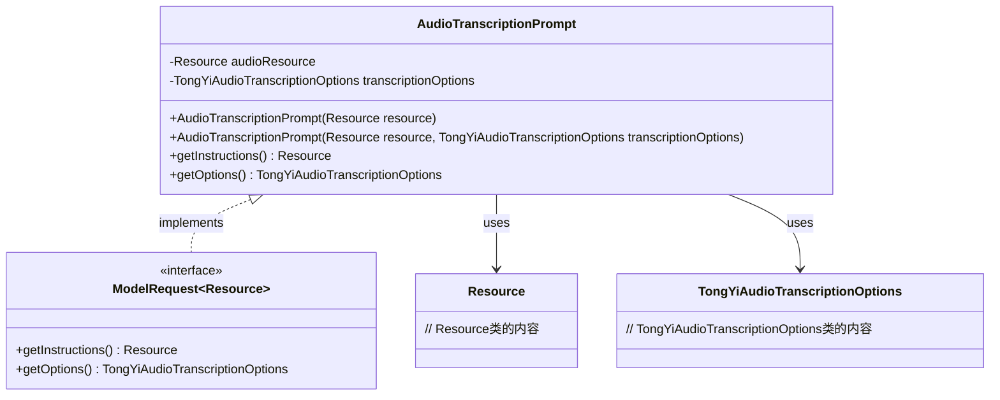
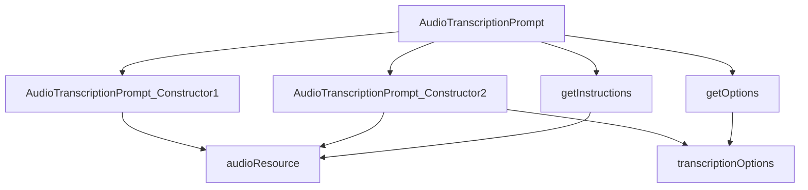

# 基础信息

|      |      |
|------|------|
| 编码语言 | .java |
| 代码路径 | yudao-module-ai/yudao-spring-boot-starter-ai/src/main/java/com/alibaba/cloud/ai/tongyi/audio/transcription/api/AudioTranscriptionPrompt.java |
| 包名 | com.alibaba.cloud.ai.tongyi.audio.transcription.api |
| 依赖项 | ['com.alibaba.cloud.ai.tongyi.audio.transcription.TongYiAudioTranscriptionOptions', 'org.springframework.ai.model.ModelRequest', 'org.springframework.core.io.Resource'] |
| 概述说明 | `AudioTranscriptionPrompt`类实现`ModelRequest<Resource>`接口，包含`audioResource`和`transcriptionOptions`属性。提供两个构造函数，分别初始化`audioResource`或同时初始化`audioResource`和`transcriptionOptions`。类实现`getInstructions`和`getOptions`方法，分别返回`audioResource`和`transcriptionOptions`。 |

# 说明

`AudioTranscriptionPrompt`类是一个实现了`ModelRequest<Resource>`接口的类，主要用于处理音频转录相关的请求。该类包含两个主要属性：`audioResource`和`transcriptionOptions`。`audioResource`属性用于存储音频资源，而`transcriptionOptions`属性则用于存储转录过程中所需的配置选项。

为了提供灵活的初始化方式，`AudioTranscriptionPrompt`类提供了两个构造函数。第一个构造函数仅用于初始化`audioResource`属性，适用于不需要额外转录选项的场景。第二个构造函数则同时初始化`audioResource`和`transcriptionOptions`属性，适用于需要指定转录选项的场景。

此外，`AudioTranscriptionPrompt`类还实现了两个方法：`getInstructions`和`getOptions`。`getInstructions`方法用于返回`audioResource`属性，即获取当前音频资源。`getOptions`方法则用于返回`transcriptionOptions`属性，即获取当前转录选项。这两个方法为外部调用者提供了访问类内部属性的途径，使得音频转录请求的处理更加灵活和可控。

总的来说，`AudioTranscriptionPrompt`类通过其属性和方法的设计，提供了一个结构化的方式来管理和处理音频转录请求，既支持基本的音频资源处理，也支持复杂的转录选项配置。

# 类列表 Class Summary

| 名称   | 类型  | 说明 |
|-------|------|-------------|
| AudioTranscriptionPrompt | class | `AudioTranscriptionPrompt`类实现`ModelRequest<Resource>`接口，包含`audioResource`和`transcriptionOptions`两个属性。类提供两个构造函数，分别用于初始化`audioResource`或同时初始化`audioResource`和`transcriptionOptions`。类还实现了`getInstructions`和`getOptions`方法，分别返回`audioResource`和`transcriptionOptions`。 |

## 类 AudioTranscriptionPrompt

|      |      |
|------|------|
| 访问范围 | public |
| 类型 | class |
| 名称 | AudioTranscriptionPrompt |
| 说明 | `AudioTranscriptionPrompt`类实现`ModelRequest<Resource>`接口，包含`audioResource`和`transcriptionOptions`两个属性。类提供两个构造函数，分别用于初始化`audioResource`或同时初始化`audioResource`和`transcriptionOptions`。类还实现了`getInstructions`和`getOptions`方法，分别返回`audioResource`和`transcriptionOptions`。 |

### UML类图

### 描述信息：
该UML类图展示了`AudioTranscriptionPrompt`类实现了`ModelRequest`接口，并依赖于`Resource`和`TongYiAudioTranscriptionOptions`类。`AudioTranscriptionPrompt`类包含两个私有属性和两个构造函数，分别用于初始化音频资源和转录选项。

### 内部方法调用关系图

### 描述信息：
该图展示了`AudioTranscriptionPrompt`类中方法之间的调用关系。类包含两个构造函数，分别初始化`audioResource`和`transcriptionOptions`。`getInstructions`方法返回`audioResource`，而`getOptions`方法返回`transcriptionOptions`。图中清晰地展示了这些方法如何与类属性交互。

### 字段列表 Field List

| 名称  | 类型  | 说明 |
|-------|-------|------|
| audioResource | Resource | 音频资源对象，用于存储和管理音频文件。 |
| transcriptionOptions | TongYiAudioTranscriptionOptions | private TongYiAudioTranscriptionOptions transcriptionOptions; 是一个私有变量，用于存储音频转录的配置选项。 |

### 方法列表 Method List

| 名称  | 类型  | 说明 |
|-------|-------|------|
| getInstructions | Resource | 该方法重写了父类的`getInstructions`方法，返回一个`audioResource`资源对象。 |
| getOptions | TongYiAudioTranscriptionOptions | 该方法返回一个TongYiAudioTranscriptionOptions对象，表示当前的转录选项。 |

