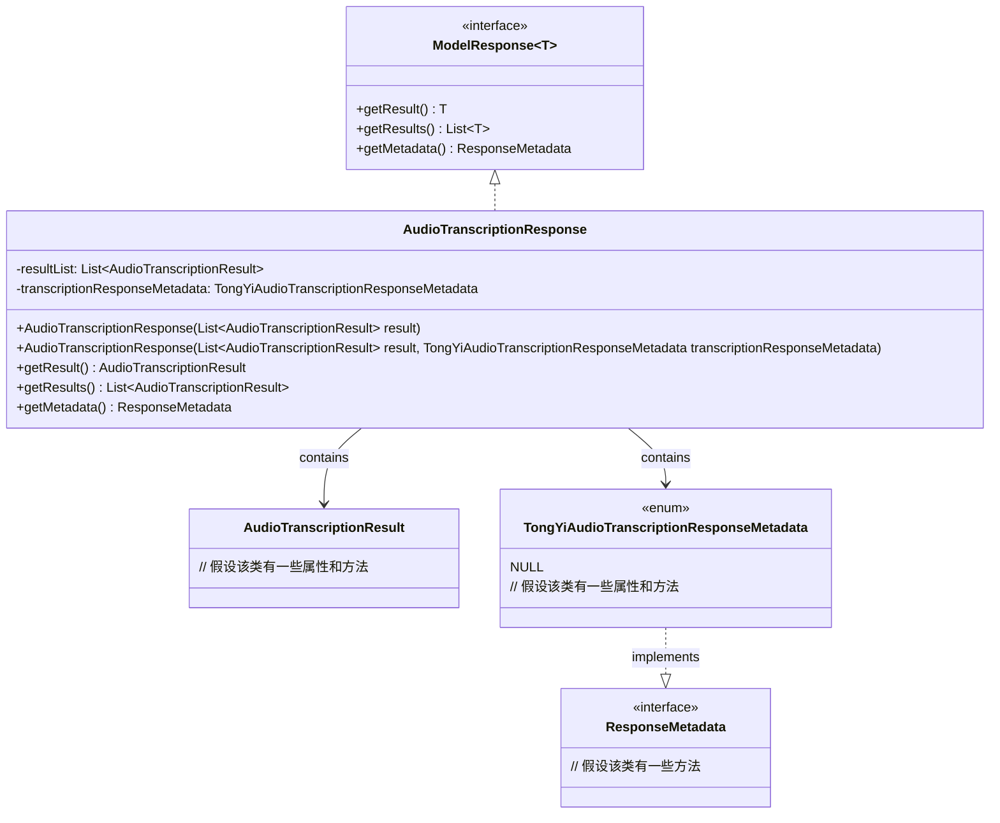
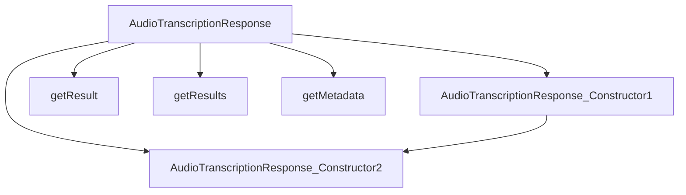

# 基础信息

|      |      |
|------|------|
| 编码语言 | .java |
| 代码路径 | yudao-module-ai/yudao-spring-boot-starter-ai/src/main/java/com/alibaba/cloud/ai/tongyi/audio/transcription/api/AudioTranscriptionResponse.java |
| 包名 | com.alibaba.cloud.ai.tongyi.audio.transcription.api |
| 依赖项 | ['com.alibaba.cloud.ai.tongyi.metadata.audio.TongYiAudioTranscriptionResponseMetadata', 'org.springframework.ai.model.ModelResponse', 'org.springframework.ai.model.ResponseMetadata', 'java.util.List'] |
| 概述说明 | `AudioTranscriptionResponse`类实现了`ModelResponse<AudioTranscriptionResult>`接口，包含`AudioTranscriptionResult`列表和`TongYiAudioTranscriptionResponseMetadata`元数据。构造函数支持初始化结果列表和元数据，并提供获取单个结果、结果列表和元数据的方法。 |

# 说明

`AudioTranscriptionResponse`类是一个实现了`ModelResponse<AudioTranscriptionResult>`接口的类，主要用于处理音频转录的响应数据。该类包含两个主要部分：一个`AudioTranscriptionResult`列表和一个`TongYiAudioTranscriptionResponseMetadata`元数据对象。`AudioTranscriptionResult`列表用于存储多个音频转录的结果，而`TongYiAudioTranscriptionResponseMetadata`元数据则提供了与响应相关的额外信息，如请求状态、时间戳等。

该类提供了构造函数，允许在初始化时传入`AudioTranscriptionResult`列表和`TongYiAudioTranscriptionResponseMetadata`元数据对象，从而方便地创建包含转录结果和元数据的响应对象。此外，`AudioTranscriptionResponse`类还提供了多个方法来访问和操作这些数据。例如，可以通过方法获取单个转录结果、获取整个转录结果列表，以及获取元数据对象。这些方法使得用户能够灵活地处理和分析音频转录的响应数据。

总的来说，`AudioTranscriptionResponse`类通过封装转录结果和元数据，并提供了便捷的访问方法，为音频转录的响应处理提供了一个结构化和功能完善的解决方案。

# 类列表 Class Summary

| 名称   | 类型  | 说明 |
|-------|------|-------------|
| AudioTranscriptionResponse | class | `AudioTranscriptionResponse`类实现了`ModelResponse<AudioTranscriptionResult>`接口，包含一个`AudioTranscriptionResult`列表和`TongYiAudioTranscriptionResponseMetadata`元数据。构造函数支持初始化结果列表和元数据，提供获取单个结果、结果列表和元数据的方法。 |

## 类 AudioTranscriptionResponse

|      |      |
|------|------|
| 访问范围 | public |
| 类型 | class |
| 名称 | AudioTranscriptionResponse |
| 说明 | `AudioTranscriptionResponse`类实现了`ModelResponse<AudioTranscriptionResult>`接口，包含一个`AudioTranscriptionResult`列表和`TongYiAudioTranscriptionResponseMetadata`元数据。构造函数支持初始化结果列表和元数据，提供获取单个结果、结果列表和元数据的方法。 |

### UML类图

### 描述信息：
该UML类图展示了`AudioTranscriptionResponse`类实现了`ModelResponse`接口，并包含`AudioTranscriptionResult`和`TongYiAudioTranscriptionResponseMetadata`类的实例。`TongYiAudioTranscriptionResponseMetadata`是一个枚举类，实现了`ResponseMetadata`接口。

### 内部方法调用关系图

### 描述信息：
该图展示了`AudioTranscriptionResponse`类中的方法调用关系。`AudioTranscriptionResponse`类有两个构造函数，分别调用另一个构造函数进行初始化。此外，该类还包含三个方法：`getResult`、`getResults`和`getMetadata`，分别用于获取单个结果、结果列表和元数据。

### 字段列表 Field List

| 名称  | 类型  | 说明 |
|-------|-------|------|
| resultList | List<AudioTranscriptionResult> | 该信息描述了一个私有列表变量`resultList`，其类型为`AudioTranscriptionResult`，用于存储音频转录结果。 |
| transcriptionResponseMetadata | TongYiAudioTranscriptionResponseMetadata | private TongYiAudioTranscriptionResponseMetadata transcriptionResponseMetadata; 包含音频转录响应的元数据信息。 |

### 方法列表 Method List

| 名称  | 类型  | 说明 |
|-------|-------|------|
| getResult | AudioTranscriptionResult | 该方法返回结果列表中的第一个音频转录结果。 |
| getResults | List<AudioTranscriptionResult> | 该方法返回一个包含音频转录结果的列表，列表类型为`AudioTranscriptionResult`，具体返回值为`resultList`。 |
| getMetadata | ResponseMetadata | 该方法返回当前对象的转录响应元数据，即`transcriptionResponseMetadata`。 |

