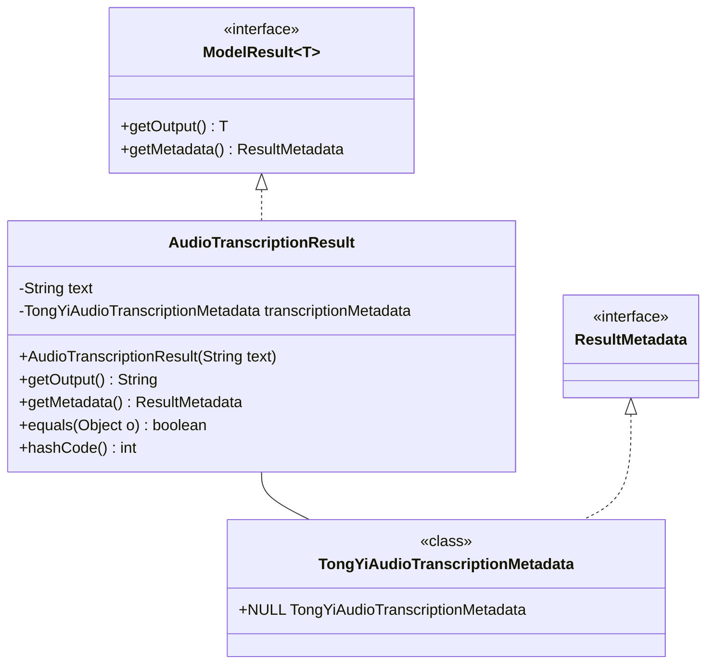
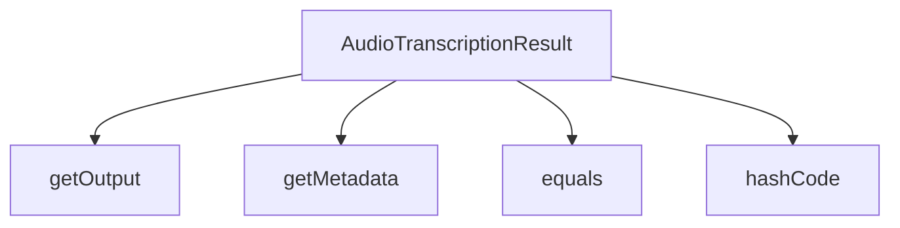

# 基础信息

|      |      |
|------|------|
| 编码语言 | .java |
| 代码路径 | yudao-module-ai/yudao-spring-boot-starter-ai/src/main/java/com/alibaba/cloud/ai/tongyi/audio/transcription/api/AudioTranscriptionResult.java |
| 包名 | com.alibaba.cloud.ai.tongyi.audio.transcription.api |
| 依赖项 | ['com.alibaba.cloud.ai.tongyi.metadata.audio.TongYiAudioTranscriptionMetadata', 'org.springframework.ai.model.ModelResult', 'org.springframework.ai.model.ResultMetadata', 'java.util.Objects'] |
| 概述说明 | `AudioTranscriptionResult`类实现了`ModelResult<String>`接口，包含文本内容和转录元数据。构造函数初始化文本，`getOutput`返回文本，`getMetadata`返回元数据或默认值。重写了`equals`和`hashCode`方法，用于比较对象相等性和生成哈希值。 |

# 说明

`AudioTranscriptionResult`类是一个实现了`ModelResult<String>`接口的类，主要用于处理音频转录的结果。该类包含两个主要部分：文本内容和转录元数据。在构造函数中，文本内容被初始化，并且可以通过`getOutput`方法来获取该文本内容。此外，`getMetadata`方法用于返回转录的元数据，如果元数据不存在，则返回默认值。为了确保对象之间的比较和哈希值的生成，`AudioTranscriptionResult`类还重写了`equals`和`hashCode`方法。这些方法用于比较两个对象是否相等，并生成相应的哈希值，以便在集合中使用时能够正确地进行对象比较和存储。通过这些功能，`AudioTranscriptionResult`类能够有效地管理和操作音频转录的结果数据。

# 类列表 Class Summary

| 名称   | 类型  | 说明 |
|-------|------|-------------|
| AudioTranscriptionResult | class | `AudioTranscriptionResult`类实现了`ModelResult<String>`接口，包含文本内容和转录元数据。构造函数初始化文本，`getOutput`返回文本，`getMetadata`返回元数据或默认值。重写了`equals`和`hashCode`方法，用于比较对象相等性和生成哈希值。 |

## 类 AudioTranscriptionResult

|      |      |
|------|------|
| 访问范围 | public |
| 类型 | class |
| 名称 | AudioTranscriptionResult |
| 说明 | `AudioTranscriptionResult`类实现了`ModelResult<String>`接口，包含文本内容和转录元数据。构造函数初始化文本，`getOutput`返回文本，`getMetadata`返回元数据或默认值。重写了`equals`和`hashCode`方法，用于比较对象相等性和生成哈希值。 |

### UML类图

### 描述信息：
该UML类图展示了`AudioTranscriptionResult`类实现了`ModelResult<String>`接口，并包含一个`TongYiAudioTranscriptionMetadata`类的关联关系。`AudioTranscriptionResult`类包含文本和元数据属性，并实现了接口中的方法。`TongYiAudioTranscriptionMetadata`类实现了`ResultMetadata`接口，并提供了一个`NULL`常量。

### 内部方法调用关系图

### 描述信息：
该图展示了`AudioTranscriptionResult`类中的方法调用关系。`AudioTranscriptionResult`类实现了`ModelResult<String>`接口，并包含了`getOutput`、`getMetadata`、`equals`和`hashCode`方法。这些方法分别用于获取输出文本、元数据、比较对象以及生成哈希码。

### 字段列表 Field List

| 名称  | 类型  | 说明 |
|-------|-------|------|
| text | String | private String text; 是一个Java类中的私有字符串类型变量声明，用于存储文本数据。 |
| transcriptionMetadata | TongYiAudioTranscriptionMetadata | TongYiAudioTranscriptionMetadata 包含音频转录的元数据信息，用于描述转录过程中的关键属性和配置。 |

### 方法列表 Method List

| 名称  | 类型  | 说明 |
|-------|-------|------|
| hashCode | int | 该方法重写了hashCode()，使用Objects.hash()方法计算并返回text和transcriptionMetadata两个字段的哈希值。 |
| getOutput | String | 该方法重写了父类的`getOutput`方法，直接返回当前对象的`text`属性值。 |
| getMetadata | ResultMetadata | 该方法返回转录元数据，如果转录元数据不为空则返回该元数据，否则返回默认的空元数据对象。 |
| equals | boolean | 该代码重写了equals方法，用于比较两个AudioTranscriptionResult对象是否相等。首先检查对象是否为同一实例，若是则返回true；若对象为null或类不同则返回false。最后比较对象的text和transcriptionMetadata属性是否相等。 |

