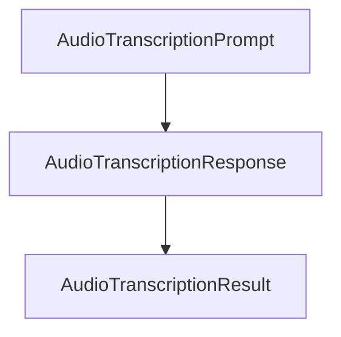

# 基础信息

|      |      |
|------|------|
| 编码语言 | .java |
| 代码路径 | yudao-module-ai/yudao-spring-boot-starter-ai/src/main/java/com/alibaba/cloud/ai/tongyi/audio/transcription/api |
| 包名 | com.alibaba.cloud.ai.tongyi.audio.transcription.api |
| 概述说明 | `AudioTranscriptionResponse`类处理音频转录响应数据，包含`AudioTranscriptionResult`列表和`TongYiAudioTranscriptionResponseMetadata`元数据，提供访问和操作方法。`AudioTranscriptionResult`类管理音频转录结果，包含文本内容和元数据，提供获取和比较功能。`AudioTranscriptionPrompt`类处理音频转录请求，包含音频资源和转录选项，提供灵活初始化和访问方法。这些类共同为音频转录提供了结构化和功能完善的解决方案。 |

# 说明

`AudioTranscriptionResponse`类是一个实现了`ModelResponse<AudioTranscriptionResult>`接口的类，主要用于处理音频转录的响应数据。该类包含两个主要部分：一个`AudioTranscriptionResult`列表和一个`TongYiAudioTranscriptionResponseMetadata`元数据对象。`AudioTranscriptionResult`列表用于存储多个音频转录的结果，而`TongYiAudioTranscriptionResponseMetadata`元数据则提供了与响应相关的额外信息，如请求状态、时间戳等。该类提供了构造函数，允许在初始化时传入`AudioTranscriptionResult`列表和`TongYiAudioTranscriptionResponseMetadata`元数据对象，从而方便地创建包含转录结果和元数据的响应对象。此外，`AudioTranscriptionResponse`类还提供了多个方法来访问和操作这些数据，例如获取单个转录结果、获取整个转录结果列表，以及获取元数据对象。这些方法使得用户能够灵活地处理和分析音频转录的响应数据。

`AudioTranscriptionResult`类是一个实现了`ModelResult<String>`接口的类，主要用于处理音频转录的结果。该类包含两个主要部分：文本内容和转录元数据。在构造函数中，文本内容被初始化，并且可以通过`getOutput`方法来获取该文本内容。此外，`getMetadata`方法用于返回转录的元数据，如果元数据不存在，则返回默认值。为了确保对象之间的比较和哈希值的生成，`AudioTranscriptionResult`类还重写了`equals`和`hashCode`方法。这些方法用于比较两个对象是否相等，并生成相应的哈希值，以便在集合中使用时能够正确地进行对象比较和存储。通过这些功能，`AudioTranscriptionResult`类能够有效地管理和操作音频转录的结果数据。

`AudioTranscriptionPrompt`类是一个实现了`ModelRequest<Resource>`接口的类，主要用于处理音频转录相关的请求。该类包含两个主要属性：`audioResource`和`transcriptionOptions`。`audioResource`属性用于存储音频资源，而`transcriptionOptions`属性则用于存储转录过程中所需的配置选项。为了提供灵活的初始化方式，`AudioTranscriptionPrompt`类提供了两个构造函数。第一个构造函数仅用于初始化`audioResource`属性，适用于不需要额外转录选项的场景。第二个构造函数则同时初始化`audioResource`和`transcriptionOptions`属性，适用于需要指定转录选项的场景。此外，`AudioTranscriptionPrompt`类还实现了两个方法：`getInstructions`和`getOptions`。`getInstructions`方法用于返回`audioResource`属性，即获取当前音频资源。`getOptions`方法则用于返回`transcriptionOptions`属性，即获取当前转录选项。这两个方法为外部调用者提供了访问类内部属性的途径，使得音频转录请求的处理更加灵活和可控。

总的来说，`AudioTranscriptionResponse`类通过封装转录结果和元数据，并提供了便捷的访问方法，为音频转录的响应处理提供了一个结构化和功能完善的解决方案。`AudioTranscriptionResult`类则通过其文本内容和元数据的管理，以及对象比较和哈希值的生成，有效地处理了音频转录的结果数据。`AudioTranscriptionPrompt`类通过其属性和方法的设计，提供了一个结构化的方式来管理和处理音频转录请求，既支持基本的音频资源处理，也支持复杂的转录选项配置。

### 包内部结构视图

### 描述信息：
该Mermaid图展示了`AudioTranscriptionResponse`、`AudioTranscriptionResult`和`AudioTranscriptionPrompt`三个类之间的调用关系。`AudioTranscriptionPrompt`调用`AudioTranscriptionResponse`，而`AudioTranscriptionResponse`又调用`AudioTranscriptionResult`，形成了一个清晰的调用链。

# 文件列表 File List

| 名称   | 类型  | 说明 |
|-------|------|-------------|
| [AudioTranscriptionPrompt.java](AudioTranscriptionPrompt.md) | file | `AudioTranscriptionPrompt`类实现`ModelRequest<Resource>`接口，包含`audioResource`和`transcriptionOptions`属性。提供两个构造函数，分别初始化`audioResource`或同时初始化`audioResource`和`transcriptionOptions`。类实现`getInstructions`和`getOptions`方法，分别返回`audioResource`和`transcriptionOptions`。 |
| [AudioTranscriptionResult.java](AudioTranscriptionResult.md) | file | `AudioTranscriptionResult`类实现了`ModelResult<String>`接口，包含文本内容和转录元数据。构造函数初始化文本，`getOutput`返回文本，`getMetadata`返回元数据或默认值。重写了`equals`和`hashCode`方法，用于比较对象相等性和生成哈希值。 |
| [AudioTranscriptionResponse.java](AudioTranscriptionResponse.md) | file | `AudioTranscriptionResponse`类实现了`ModelResponse<AudioTranscriptionResult>`接口，包含`AudioTranscriptionResult`列表和`TongYiAudioTranscriptionResponseMetadata`元数据。构造函数支持初始化结果列表和元数据，并提供获取单个结果、结果列表和元数据的方法。 |

