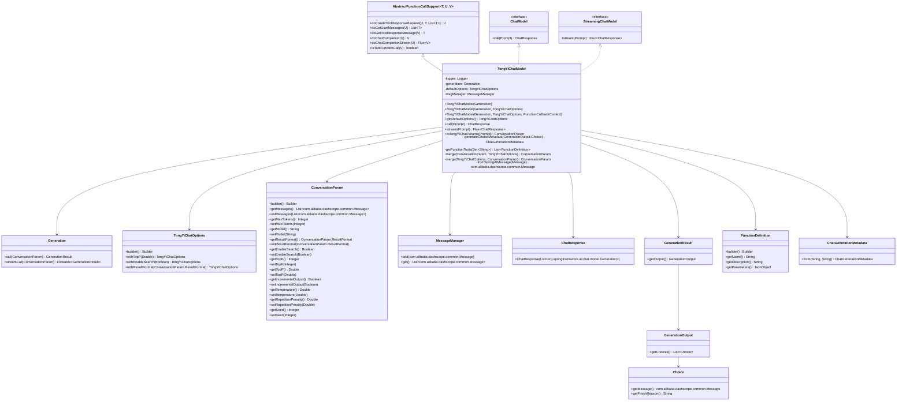

# 基础信息

|      |      |
|------|------|
| 编码语言 | .java |
| 代码路径 | yudao-module-ai/yudao-spring-boot-starter-ai/src/main/java/com/alibaba/cloud/ai/tongyi/chat/TongYiChatModel.java |
| 包名 | com.alibaba.cloud.ai.tongyi.chat |
| 依赖项 | ['cn.hutool.core.collection.ListUtil', 'com.alibaba.cloud.ai.tongyi.common.exception.TongYiException', 'com.alibaba.dashscope.aigc.conversation.ConversationParam', 'com.alibaba.dashscope.aigc.generation.Generation', 'com.alibaba.dashscope.aigc.generation.GenerationOutput', 'com.alibaba.dashscope.aigc.generation.GenerationResult', 'com.alibaba.dashscope.common.MessageManager', 'com.alibaba.dashscope.common.Role', 'com.alibaba.dashscope.exception.InputRequiredException', 'com.alibaba.dashscope.exception.NoApiKeyException', 'com.alibaba.dashscope.tools.FunctionDefinition', 'com.alibaba.dashscope.tools.ToolCallBase', 'com.alibaba.dashscope.tools.ToolCallFunction', 'com.alibaba.dashscope.utils.ApiKeywords', 'com.alibaba.dashscope.utils.JsonUtils', 'io.reactivex.Flowable', 'org.slf4j.Logger', 'org.slf4j.LoggerFactory', 'org.springframework.ai.chat.messages.Message', 'org.springframework.ai.chat.metadata.ChatGenerationMetadata', 'org.springframework.ai.chat.model.ChatModel', 'org.springframework.ai.chat.model.ChatResponse', 'org.springframework.ai.chat.model.StreamingChatModel', 'org.springframework.ai.chat.prompt.ChatOptions', 'org.springframework.ai.chat.prompt.Prompt', 'org.springframework.ai.model.ModelOptionsUtils', 'org.springframework.ai.model.function.AbstractFunctionCallSupport', 'org.springframework.ai.model.function.FunctionCallbackContext', 'org.springframework.beans.factory.annotation.Autowired', 'org.springframework.util.CollectionUtils', 'reactor.core.publisher.Flux', 'reactor.core.scheduler.Schedulers', 'java.util.HashSet', 'java.util.List', 'java.util.Objects', 'java.util.Set'] |
| 概述说明 | TongYiChatModel是基于DashScope的聊天模型，支持流式和非流式响应，通过TongYiChatOptions配置参数如topP、enableSearch等，处理用户消息生成响应。模型支持函数回调，处理工具调用和生成元数据，通过合并默认和运行时选项灵活调整参数，适用于多种聊天场景。 |

# 说明

TongYiChatModel是一个基于DashScope生成客户端的聊天模型，具备流式和非流式聊天响应的能力。该模型通过TongYiChatOptions配置参数，包括topP、enableSearch等，以处理用户消息并生成相应的聊天响应。TongYiChatModel支持函数回调功能，能够处理工具调用和生成元数据，增强了其灵活性和功能性。通过合并默认选项和运行时选项，模型能够根据具体需求灵活调整参数，适用于多种不同的聊天场景。这种设计使得TongYiChatModel在处理复杂对话和多样化需求时表现出色，能够满足不同用户和应用场景的需求。

# 类列表 Class Summary

| 名称   | 类型  | 说明 |
|-------|------|-------------|
| TongYiChatModel | class | TongYiChatModel是一个基于DashScope生成客户端的聊天模型，支持流式和非流式聊天响应。它通过TongYiChatOptions配置模型参数，如topP、enableSearch等，并处理用户消息生成聊天响应。模型支持函数回调，能够处理工具调用和生成元数据。通过合并默认选项和运行时选项，模型可以灵活调整参数，适用于多种聊天场景。 |


## 类 TongYiChatModel

|      |      |
|------|------|
| 访问范围 | public |
| 类型 | class |
| 名称 | TongYiChatModel |
| 说明 | TongYiChatModel是一个基于DashScope生成客户端的聊天模型，支持流式和非流式聊天响应。它通过TongYiChatOptions配置模型参数，如topP、enableSearch等，并处理用户消息生成聊天响应。模型支持函数回调，能够处理工具调用和生成元数据。通过合并默认选项和运行时选项，模型可以灵活调整参数，适用于多种聊天场景。 |


### UML类图



### 描述信息：
该UML类图展示了`TongYiChatModel`类的结构及其与相关类和接口的关系。`TongYiChatModel`继承自`AbstractFunctionCallSupport`并实现了`ChatModel`和`StreamingChatModel`接口。它依赖于`Generation`、`TongYiChatOptions`、`MessageManager`等类来完成聊天功能。类图中还展示了`TongYiChatModel`如何通过`ConversationParam`和`GenerationResult`等类来处理聊天请求和响应。


### 内部方法调用关系图

```mermaid
graph TD
    TongYiChatModel --> call
    TongYiChatModel --> stream
    TongYiChatModel --> toTongYiChatParams
    TongYiChatModel --> generateChoiceMetadata
    TongYiChatModel --> getFunctionTools
    TongYiChatModel --> merge
    TongYiChatModel --> fromSpringAIMessage
    TongYiChatModel --> doCreateToolResponseRequest
    TongYiChatModel --> doGetUserMessages
    TongYiChatModel --> doGetToolResponseMessage
    TongYiChatModel --> doChatCompletion
    TongYiChatModel --> doChatCompletionStream
    TongYiChatModel --> isToolFunctionCall
    call --> toTongYiChatParams
    call --> callWithFunctionSupport
    call --> generateChoiceMetadata
    stream --> toTongYiChatParams
    stream --> generation.streamCall
    toTongYiChatParams --> fromSpringAIMessage
    toTongYiChatParams --> merge
    toTongYiChatParams --> getFunctionTools
    merge --> merge
    doCreateToolResponseRequest --> doGetUserMessages
    doCreateToolResponseRequest --> doGetToolResponseMessage
    doChatCompletion --> generation.call
    doChatCompletionStream --> generation.streamCall
```

### 描述信息：
该图展示了`TongYiChatModel`类中各个方法之间的调用关系。`call`和`stream`是主要的外部调用方法，它们依赖于`toTongYiChatParams`来生成请求参数，并通过`generation.call`和`generation.streamCall`与外部服务交互。其他方法如`merge`、`generateChoiceMetadata`等则用于辅助处理和生成响应数据。

### 字段列表 Field List

| 名称  | 类型  | 说明 |
|-------|-------|------|
| defaultOptions | TongYiChatOptions | private TongYiChatOptions defaultOptions 是一个私有变量，用于存储默认的聊天选项设置。 |
| msgManager | MessageManager | 代码片段中使用了Spring框架的@Autowired注解，自动注入了一个名为msgManager的MessageManager类型的私有变量。 |
| generation | Generation | private final Generation generation; 声明了一个私有的、不可变的Generation类型变量generation。 |
| logger = LoggerFactory.getLogger(TongYiChatModel.class) | Logger | private static final Logger logger = LoggerFactory.getLogger(TongYiChatModel.class); 这行代码定义了一个静态的、不可变的日志记录器实例，用于TongYiChatModel类的日志记录。 |

### 方法列表 Method List

| 名称  | 类型  | 说明 |
|-------|-------|------|
| doChatCompletionStream | Flux<GenerationResult> | 该方法用于处理聊天完成请求的流式调用。首先尝试调用`generation.streamCall(request)`生成结果流，若捕获到`NoApiKeyException`或`InputRequiredException`异常，则记录警告并抛出`TongYiException`。最终将结果流转换为`Flux`类型返回。 |
| getDefaultOptions | TongYiChatOptions | `public TongYiChatOptions getDefaultOptions()` 方法返回当前对象的 `defaultOptions` 属性值。 |
| generateChoiceMetadata | ChatGenerationMetadata | 该方法生成聊天生成元数据，通过传入的生成输出选项获取完成原因和消息内容，并返回包含这些信息的元数据对象。 |
| doChatCompletion | GenerationResult | 该方法用于处理聊天完成请求，调用生成方法并返回结果。若遇到无API密钥或输入缺失异常，则抛出运行时异常。 |
| doGetUserMessages | List<com.alibaba.dashscope.common.Message> | 该代码片段重写了`doGetUserMessages`方法，用于从`ConversationParam`类型的请求对象中获取用户消息列表并返回。方法直接调用`request.getMessages()`来获取消息列表。 |
| fromSpringAIMessage | com.alibaba.dashscope.common.Message | 该方法将Spring AI的Message对象转换为Dashscope的Message对象，根据消息类型（USER、SYSTEM、ASSISTANT）设置对应的角色和内容，若消息类型未知则抛出异常。 |
| call | ChatResponse | 该方法通过将输入的Prompt转换为TongYiChat参数，设置用户角色和内容，调用TongYi模型进行对话生成，并将结果转换为ChatResponse返回。过程中记录了日志并管理消息上下文。 |
| getFunctionTools | List<FunctionDefinition> | 该方法通过传入的函数名称集合，解析对应的函数回调，并将其转换为函数定义列表。每个函数定义包含名称、描述和参数，参数通过将输入类型模式转换为JSON对象生成。最终返回包含所有函数定义的列表。 |
| toTongYiChatParams | ConversationParam | 该方法将Prompt对象转换为ConversationParam对象，处理消息、模型设置、结果格式等参数，并合并默认选项和运行时选项。同时，处理函数回调配置，生成工具列表并设置到请求参数中，最终返回配置好的ConversationParam对象。 |
| doGetToolResponseMessage | com.alibaba.dashscope.common.Message | 该方法重写了父类的`doGetToolResponseMessage`方法，用于处理生成结果并构建助手消息。它从响应中提取第一条消息内容，创建一个新的助手消息对象，并将提取的工具调用信息设置到该消息中，最后返回构建的助手消息。 |
| isToolFunctionCall | boolean | 该方法用于判断生成结果是否为工具函数调用。首先检查响应及其输出选项是否为空，若为空则返回false。然后获取第一个选项，检查其是否为空或完成原因为空，若为空则返回false。最后判断完成原因是否为工具调用，若是则返回true，否则返回false。 |
| merge | ConversationParam | 该方法合并两个对话参数对象。若第一个参数为空，则返回第二个参数。否则，创建一个新对象，继承第二个参数的消息，并合并第一个参数的模型、最大令牌数、停止字符串、温度、topK等设置。最终返回合并后的参数对象。 |
| stream | Flux<ChatResponse> | 该方法通过调用外部API生成聊天响应流。首先将输入提示转换为通义聊天参数，然后调用生成流接口获取结果。若出现API密钥缺失或输入异常，记录警告并抛出异常。最后将生成结果转换为Flux流，提取内容并封装为ChatResponse对象，使用并行调度器发布。 |
| doCreateToolResponseRequest | ConversationParam | 该方法处理工具调用响应请求，遍历响应消息中的工具调用，检查是否为函数调用。若函数名未注册回调则抛出异常，否则调用注册的回调函数并获取响应，将响应添加到对话历史中。最后构建并返回新的对话参数，合并先前请求的配置。 |
| merge | ConversationParam | 该方法合并两个参数对象`tongYiParams`和`scaChatParams`，优先使用`tongYiParams`中的非空值，若为空则使用`scaChatParams`中的值。合并内容包括`messages`、`maxTokens`、`model`、`resultFormat`、`enableSearch`、`topK`、`topP`、`incrementalOutput`、`temperature`、`repetitionPenalty`和`seed`。若`scaChatParams`为空，则直接返回`tongYiParams`。 |


