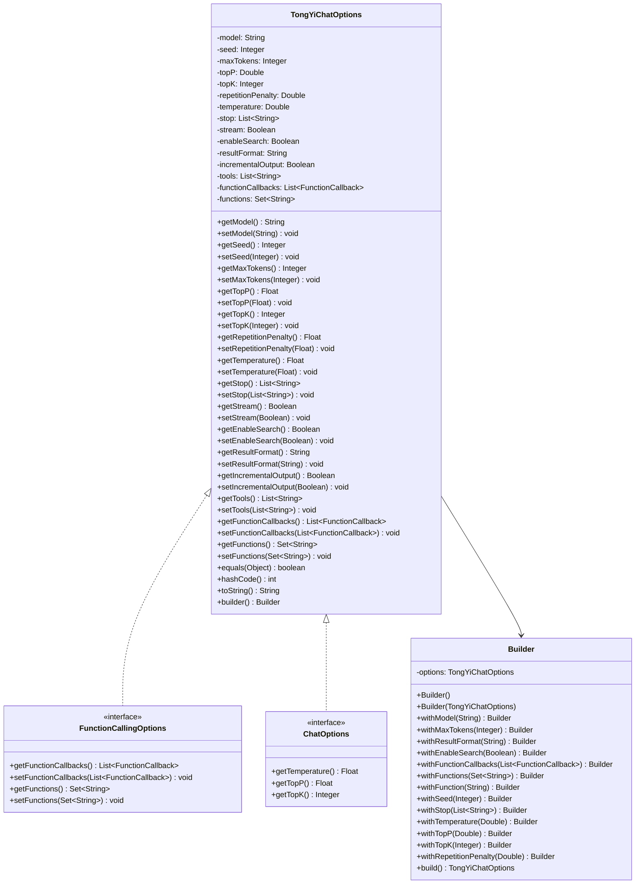

# 基础信息

|      |      |
|------|------|
| 编码语言 | .java |
| 代码路径 | yudao-module-ai/yudao-spring-boot-starter-ai/src/main/java/com/alibaba/cloud/ai/tongyi/chat/TongYiChatOptions.java |
| 包名 | com.alibaba.cloud.ai.tongyi.chat |
| 依赖项 | ['com.alibaba.dashscope.aigc.generation.Generation', 'com.alibaba.dashscope.aigc.generation.GenerationParam', 'org.springframework.ai.chat.prompt.ChatOptions', 'org.springframework.ai.model.function.FunctionCallback', 'org.springframework.ai.model.function.FunctionCallingOptions', 'org.springframework.util.Assert', 'java.util'] |
| 概述说明 | TongYiChatOptions类用于配置聊天模型的生成参数，涵盖模型选择、随机种子、最大生成token数、采样方法、重复惩罚、温度控制、停止条件、流式输出、互联网搜索、结果格式、增量输出、工具调用等。支持Builder模式设置参数，并提供equals、hashCode和toString方法。 |

# 说明

TongYiChatOptions类是一个用于配置聊天模型生成参数的类，提供了多种参数选项以控制模型的生成行为。这些参数包括模型选择、随机种子、最大生成token数、采样方法、重复惩罚、温度控制、停止条件、流式输出、互联网搜索、结果格式、增量输出和工具调用等。通过这些参数，用户可以精细调整模型的输出，以满足不同的应用场景和需求。

模型选择允许用户指定使用的具体模型，随机种子用于控制生成的随机性，确保结果的可重复性。最大生成token数限制了生成文本的长度，防止生成过长或不相关的内容。采样方法决定了模型如何从可能的输出中选择结果，而重复惩罚则用于减少生成文本中的重复内容。温度控制参数影响生成文本的多样性和创造性，较高的温度值会增加输出的随机性，而较低的温度值则会使输出更加确定和保守。

停止条件允许用户设置生成文本的终止条件，例如达到特定的token或句子数量。流式输出支持逐步生成文本，适用于需要实时反馈的场景。互联网搜索功能使模型能够访问外部信息源，增强生成内容的准确性和相关性。结果格式参数允许用户指定输出的格式，如纯文本、JSON等。增量输出功能支持在生成过程中逐步返回部分结果，适用于需要逐步处理生成内容的场景。工具调用功能则允许模型在生成过程中调用外部工具或服务，以增强其功能。

TongYiChatOptions类支持通过Builder模式进行参数设置，这种方式使得参数的配置更加灵活和直观。此外，该类还提供了equals、hashCode和toString方法，方便对象的比较、哈希计算和字符串表示。通过这些功能，TongYiChatOptions类为用户提供了一个强大且灵活的工具，用于配置和控制聊天模型的生成行为。

# 类列表 Class Summary

| 名称   | 类型  | 说明 |
|-------|------|-------------|
| TongYiChatOptions | class | TongYiChatOptions类用于配置聊天模型的生成参数，包括模型选择、随机种子、最大生成token数、采样方法、重复惩罚、温度控制、停止条件、流式输出、互联网搜索、结果格式、增量输出、工具调用等。支持通过Builder模式进行参数设置，并提供equals、hashCode和toString方法。 |


## 类 TongYiChatOptions

|      |      |
|------|------|
| 访问范围 | public |
| 类型 | class |
| 名称 | TongYiChatOptions |
| 说明 | TongYiChatOptions类用于配置聊天模型的生成参数，包括模型选择、随机种子、最大生成token数、采样方法、重复惩罚、温度控制、停止条件、流式输出、互联网搜索、结果格式、增量输出、工具调用等。支持通过Builder模式进行参数设置，并提供equals、hashCode和toString方法。 |


### UML类图



### 描述信息：
该UML类图展示了`TongYiChatOptions`类及其与`FunctionCallingOptions`和`ChatOptions`接口的实现关系。`TongYiChatOptions`类包含多个属性和方法，用于控制模型的生成行为。`Builder`类用于构建`TongYiChatOptions`对象，支持链式调用。


### 内部方法调用关系图

```mermaid
graph TD
    TongYiChatOptions --> getTemperature
    TongYiChatOptions --> setTemperature
    TongYiChatOptions --> getTopP
    TongYiChatOptions --> setTopP
    TongYiChatOptions --> getTopK
    TongYiChatOptions --> setTopK
    TongYiChatOptions --> getModel
    TongYiChatOptions --> setModel
    TongYiChatOptions --> getSeed
    TongYiChatOptions --> setSeed
    TongYiChatOptions --> getMaxTokens
    TongYiChatOptions --> setMaxTokens
    TongYiChatOptions --> getRepetitionPenalty
    TongYiChatOptions --> setRepetitionPenalty
    TongYiChatOptions --> getStop
    TongYiChatOptions --> setStop
    TongYiChatOptions --> getStream
    TongYiChatOptions --> setStream
    TongYiChatOptions --> getEnableSearch
    TongYiChatOptions --> setEnableSearch
    TongYiChatOptions --> getIncrementalOutput
    TongYiChatOptions --> setIncrementalOutput
    TongYiChatOptions --> getTools
    TongYiChatOptions --> setTools
    TongYiChatOptions --> getFunctionCallbacks
    TongYiChatOptions --> setFunctionCallbacks
    TongYiChatOptions --> getFunctions
    TongYiChatOptions --> setFunctions
    TongYiChatOptions --> equals
    TongYiChatOptions --> hashCode
    TongYiChatOptions --> toString
    TongYiChatOptions --> builder
    Builder --> withModel
    Builder --> withMaxTokens
    Builder --> withResultFormat
    Builder --> withEnableSearch
    Builder --> withFunctionCallbacks
    Builder --> withFunctions
    Builder --> withFunction
    Builder --> withSeed
    Builder --> withStop
    Builder --> withTemperature
    Builder --> withTopP
    Builder --> withTopK
    Builder --> withRepetitionPenalty
    Builder --> build
```

### 描述信息：
该图展示了`TongYiChatOptions`类与其内部方法之间的调用关系。`TongYiChatOptions`类包含了多个用于配置聊天模型的方法，如设置模型、种子、最大令牌数等。`Builder`类则提供了链式调用的方式来设置这些参数。图中清晰地展示了各个方法之间的调用关系，帮助理解类的结构和工作流程。

### 字段列表 Field List

| 名称  | 类型  | 说明 |
|-------|-------|------|
| topP = 0.8 | Double | topP参数设置为0.8，用于控制生成文本的多样性和准确性。 |
| stream = false | Boolean | stream 是一个布尔类型的私有变量，默认值为 false。 |
| seed = 1234 | Integer | seed变量为私有整数类型，初始值为1234。 |
| stop | List<String> | 该信息包含一个私有的字符串列表变量，命名为“stop”。 |
| topK | Integer | topK参数用于指定返回结果的数量上限，控制输出内容的数量。 |
| model = Generation.Models.QWEN_TURBO | String | 该信息描述了一个私有字符串变量`model`，其值为`Generation.Models.QWEN_TURBO`，表示模型类型为QWEN_TURBO。 |
| temperature = 0.85 | Double | 温度参数设置为0.85，用于控制模型生成文本的多样性和创造性。 |
| maxTokens = 1500 | Integer | private Integer maxTokens = 1500; 表示最大令牌数设置为1500。 |
| tools | List<String> | 该信息描述了一个私有变量`tools`，其类型为`List<String>`，表示一个字符串列表。 |
| repetitionPenalty = 1.1 | Double | 参数repetitionPenalty设置为1.1，用于控制生成文本时避免重复内容的惩罚力度。 |
| enableSearch = false | Boolean | 该信息表明一个布尔类型的变量 `enableSearch` 被设置为 `false`，表示搜索功能当前未启用。 |
| incrementalOutput = false | Boolean | 该信息描述了一个布尔类型的私有变量`incrementalOutput`，其初始值为`false`，表示默认情况下不启用增量输出。 |
| resultFormat = GenerationParam.ResultFormat.MESSAGE | String | 该信息描述了一个私有字符串变量resultFormat，其值设置为GenerationParam.ResultFormat.MESSAGE，用于定义结果的格式。 |
| functions = new HashSet<>() | Set<String> | 该代码定义了一个名为`functions`的私有集合变量，使用`HashSet`来存储字符串类型的数据，确保集合中的元素唯一且无序。 |
| functionCallbacks = new ArrayList<>() | List<FunctionCallback> | 代码定义了一个名为`functionCallbacks`的私有列表变量，用于存储`FunctionCallback`类型的对象，初始化为一个新的`ArrayList`实例。 |

### 方法列表 Method List

| 名称  | 类型  | 说明 |
|-------|-------|------|
| setTemperature | void | 该方法接受一个Float类型的温度参数，并将其转换为double类型后赋值给类的temperature属性。 |
| getFunctions | Set<String> | 该方法返回一个包含所有功能的字符串集合。 |
| getMaxTokens | Integer | 该方法返回一个整数类型的最大值令牌数，具体值由变量maxTokens决定。 |
| getTools | List<String> | 该方法返回一个包含工具名称的字符串列表。 |
| setMaxTokens | void | 该方法用于设置最大令牌数，通过接收一个整数参数并将其赋值给类的成员变量maxTokens。 |
| getModel | String | 该方法返回一个字符串类型的模型名称。 |
| getTopK | Integer | 该方法返回当前对象的topK属性值，类型为Integer。 |
| getSeed | Integer | 该方法返回一个整数类型的种子值。 |
| setModel | void | 该方法用于设置模型名称，通过传入字符串参数`model`并将其赋值给类的成员变量`this.model`。 |
| getStop | List<String> | 该方法返回一个包含字符串的列表，列表名为stop。 |
| getResultFormat | String | 该方法返回一个字符串类型的变量resultFormat，用于获取结果格式。 |
| getEnableSearch | Boolean | 该方法返回一个布尔值，表示搜索功能是否启用。 |
| setSeed | void | 该方法用于设置种子值，接受一个整数参数并将其赋值给类的成员变量seed。 |
| getTopP | Float | 该方法重写了父类的getTopP方法，返回当前对象的topP属性的浮点数值。 |
| getIncrementalOutput | Boolean | 该方法返回一个布尔值，表示是否启用增量输出功能。 |
| setStream | void | 该方法用于设置流状态，接受一个布尔类型参数stream，并将其赋值给当前对象的stream属性。 |
| getStream | Boolean | 该方法返回一个布尔类型的值，表示流的状态。 |
| setResultFormat | void | 该方法用于设置结果格式，通过传入的字符串参数`resultFormat`来更新类中的`resultFormat`属性。 |
| setTopK | void | 该方法用于设置topK的值，通过传入一个Integer类型的参数topK，将其赋值给类的成员变量this.topK。 |
| setRepetitionPenalty | void | 该方法用于设置重复惩罚值，将传入的Float类型参数转换为Double类型并赋值给类中的repetitionPenalty变量。 |
| builder | Builder | 该代码片段定义了一个静态方法`builder()`，用于返回一个新的`Builder`对象实例。 |
| setStop | void | 该方法用于设置一个字符串列表作为停止条件，通过传入的`stop`参数更新类中的`stop`属性。 |
| setTools | void | 该方法用于设置工具列表，接受一个字符串类型的列表作为参数，并将其赋值给类的工具属性。 |
| getTemperature | Float | 该方法重写了父类的getTemperature方法，返回当前对象的temperature属性的浮点数值。 |
| setEnableSearch | void | 该方法用于设置搜索功能的启用状态，通过传入一个布尔值参数来更新`enableSearch`变量的值。 |
| setTopP | void | 该方法 `setTopP` 接受一个 `Float` 类型的参数 `topP`，并将其转换为 `double` 类型后赋值给类中的 `topP` 变量。 |
| getRepetitionPenalty | Float | 该方法返回一个浮点数值，表示重复惩罚的数值。通过调用`repetitionPenalty.floatValue()`，将`repetitionPenalty`对象转换为浮点数并返回。 |
| setFunctionCallbacks | void | 该方法用于设置函数回调列表，将传入的`functionCallbacks`参数赋值给当前对象的`functionCallbacks`属性。 |
| setIncrementalOutput | void | 该方法用于设置增量输出状态，通过传入布尔值参数`incrementalOutput`来更新对象的`incrementalOutput`属性。 |
| setFunctions | void | 该方法用于设置功能集合，将传入的字符串集合赋值给类的成员变量functions。 |
| getFunctionCallbacks | List<FunctionCallback> | 该方法返回一个包含所有函数回调的列表，具体实现是通过返回当前对象的`functionCallbacks`属性来完成。 |
| toString | String | TongYiChatOptions包含模型、种子、最大令牌数、topP、topK、重复惩罚、温度、停止条件、流式输出、搜索启用、结果格式、增量输出、工具、函数回调和函数等配置参数。 |
| hashCode | int | 该方法重写了hashCode方法，使用Objects.hash计算包括model、seed、maxTokens、topP、topK、repetitionPenalty、temperature、stop、stream、enableSearch、resultFormat、incrementalOutput、tools、functionCallbacks和functions在内的多个字段的哈希值。 |
| equals | boolean | equals方法用于比较TongYiChatOptions对象的相等性，首先检查对象是否相同或为空，然后比较类类型，最后逐一比较model、seed、maxTokens、topP、topK、repetitionPenalty、temperature、stop、stream、enableSearch、resultFormat、incrementalOutput、tools、functionCallbacks和functions等属性是否相等。 |


