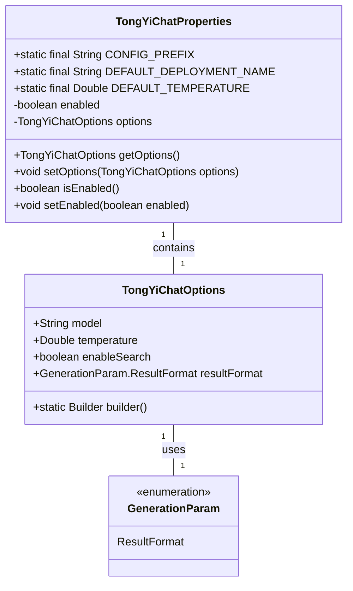
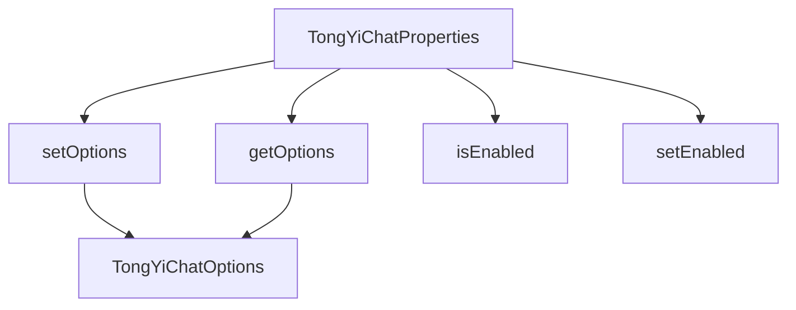

# 基础信息

|      |      |
|------|------|
| 编码语言 | .java |
| 代码路径 | yudao-module-ai/yudao-spring-boot-starter-ai/src/main/java/com/alibaba/cloud/ai/tongyi/chat/TongYiChatProperties.java |
| 包名 | com.alibaba.cloud.ai.tongyi.chat |
| 依赖项 | ['com.alibaba.dashscope.aigc.generation.Generation', 'com.alibaba.dashscope.aigc.generation.GenerationParam', 'org.springframework.boot.context.properties.ConfigurationProperties', 'org.springframework.boot.context.properties.NestedConfigurationProperty', 'com.alibaba.cloud.ai.tongyi.common.constants.TongYiConstants.SCA_AI_CONFIGURATION'] |
| 概述说明 | TongYiChatProperties类用于配置Spring Cloud Alibaba AI中的通义千问聊天客户端，包含配置前缀、默认模型（QWEN_TURBO）、默认温度值（0.8）及启用状态（默认true）。通过TongYiChatOptions可设置模型、温度、搜索功能及结果格式等参数。 |

# 说明

TongYiChatProperties类是用于配置Spring Cloud Alibaba AI中的通义千问聊天客户端的工具。该类定义了配置的前缀，并提供了默认的模型、温度值以及启用状态的设置。默认情况下，模型设置为QWEN_TURBO，温度值为0.8，启用状态为true。通过TongYiChatOptions，用户可以进一步设置模型的参数，包括模型类型、温度值、搜索功能以及结果的格式等。这些配置项允许开发者根据具体需求调整聊天客户端的行为，从而优化用户体验和功能表现。

# 类列表 Class Summary

| 名称   | 类型  | 说明 |
|-------|------|-------------|
| TongYiChatProperties | class | TongYiChatProperties类用于配置Spring Cloud Alibaba AI中的通义千问聊天客户端，包含配置前缀、默认模型（QWEN_TURBO）、默认温度值（0.8）及启用状态（默认true）。通过TongYiChatOptions设置模型、温度、搜索功能及结果格式等参数。 |

## 类 TongYiChatProperties

|      |      |
|------|------|
| 访问范围 | @ConfigurationProperties(TongYiChatProperties.CONFIG_PREFIX);public |
| 类型 | class |
| 名称 | TongYiChatProperties |
| 说明 | TongYiChatProperties类用于配置Spring Cloud Alibaba AI中的通义千问聊天客户端，包含配置前缀、默认模型（QWEN_TURBO）、默认温度值（0.8）及启用状态（默认true）。通过TongYiChatOptions设置模型、温度、搜索功能及结果格式等参数。 |

### UML类图

### 描述信息：
该UML类图展示了`TongYiChatProperties`类及其与`TongYiChatOptions`和`GenerationParam`类的关系。`TongYiChatProperties`类包含配置属性，如`enabled`和`options`，并通过`TongYiChatOptions`类设置模型参数。`GenerationParam`枚举类用于定义结果格式。

### 内部方法调用关系图

### 描述信息：
该图展示了`TongYiChatProperties`类中的方法调用关系。`TongYiChatProperties`类通过`getOptions`和`setOptions`方法与`TongYiChatOptions`类进行交互，同时提供了`isEnabled`和`setEnabled`方法来管理启用状态。这些方法共同协作，确保配置属性的正确设置和获取。

### 字段列表 Field List

| 名称  | 类型  | 说明 |
|-------|-------|------|
| enabled = true | boolean | 私有布尔变量enabled初始值为true。 |
| DEFAULT_TEMPERATURE = 0.8 | Double | private static final Double DEFAULT_TEMPERATURE = 0.8; 定义了一个私有的静态常量DEFAULT_TEMPERATURE，其值为0.8，类型为Double。 |
| options = TongYiChatOptions.builder()
			.withModel(DEFAULT_DEPLOYMENT_NAME)
			.withTemperature(DEFAULT_TEMPERATURE)
			.withEnableSearch(true)
			.withResultFormat(GenerationParam.ResultFormat.MESSAGE)
			.build() | TongYiChatOptions | 该代码段定义了一个名为`TongYiChatOptions`的配置类，通过构建器模式设置了默认模型名称、温度参数、启用搜索功能以及结果格式为消息格式。 |
| DEFAULT_DEPLOYMENT_NAME = Generation.Models.QWEN_TURBO | String | public static final String DEFAULT_DEPLOYMENT_NAME = Generation.Models.QWEN_TURBO; 定义了一个常量DEFAULT_DEPLOYMENT_NAME，其值为Generation.Models.QWEN_TURBO。 |
| CONFIG_PREFIX = SCA_AI_CONFIGURATION + "chat" | String | 该代码定义了一个静态常量`CONFIG_PREFIX`，其值为`SCA_AI_CONFIGURATION`与字符串`"chat"`的连接结果，用于配置前缀。 |

### 方法列表 Method List

| 名称  | 类型  | 说明 |
|-------|-------|------|
| getOptions | TongYiChatOptions | 该方法返回当前对象的`options`属性，类型为`TongYiChatOptions`。 |
| setOptions | void | 该方法用于设置TongYiChatOptions对象，将其赋值给当前实例的options属性。 |
| isEnabled | boolean | 方法 `isEnabled()` 返回布尔值 `enabled`，表示当前对象是否启用。 |
| setEnabled | void | 该方法用于设置一个布尔类型的变量`enabled`，通过传入的参数`enabled`来更新当前对象的`enabled`状态。 |

