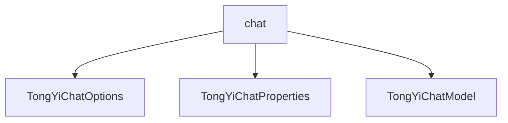

# 基础信息

|      |      |
|------|------|
| 编码语言 | .java |
| 代码路径 | yudao-module-ai/yudao-spring-boot-starter-ai/src/main/java/com/alibaba/cloud/ai/tongyi/chat |
| 包名 | com.alibaba.cloud.ai.tongyi.chat |
| 概述说明 | TongYiChatOptions类用于配置聊天模型生成参数，包括模型选择、随机种子、最大生成token数、采样方法、重复惩罚、温度控制、停止条件、流式输出、互联网搜索、结果格式、增量输出和工具调用等，支持Builder模式设置。TongYiChatProperties类用于配置Spring Cloud Alibaba AI中的通义千问聊天客户端，提供默认模型、温度值和启用状态设置。TongYiChatModel基于DashScope生成客户端，支持流式和非流式聊天响应，通过TongYiChatOptions配置参数，具备函数回调功能，适用于多种聊天场景。 |

# 说明

TongYiChatOptions类是一个用于配置聊天模型生成参数的类，提供了多种参数选项以控制模型的生成行为。这些参数包括模型选择、随机种子、最大生成token数、采样方法、重复惩罚、温度控制、停止条件、流式输出、互联网搜索、结果格式、增量输出和工具调用等。通过这些参数，用户可以精细调整模型的输出，以满足不同的应用场景和需求。模型选择允许用户指定使用的具体模型，随机种子用于控制生成的随机性，确保结果的可重复性。最大生成token数限制了生成文本的长度，防止生成过长或不相关的内容。采样方法决定了模型如何从可能的输出中选择结果，而重复惩罚则用于减少生成文本中的重复内容。温度控制参数影响生成文本的多样性和创造性，较高的温度值会增加输出的随机性，而较低的温度值则会使输出更加确定和保守。停止条件允许用户设置生成文本的终止条件，例如达到特定的token或句子数量。流式输出支持逐步生成文本，适用于需要实时反馈的场景。互联网搜索功能使模型能够访问外部信息源，增强生成内容的准确性和相关性。结果格式参数允许用户指定输出的格式，如纯文本、JSON等。增量输出功能支持在生成过程中逐步返回部分结果，适用于需要逐步处理生成内容的场景。工具调用功能则允许模型在生成过程中调用外部工具或服务，以增强其功能。TongYiChatOptions类支持通过Builder模式进行参数设置，这种方式使得参数的配置更加灵活和直观。此外，该类还提供了equals、hashCode和toString方法，方便对象的比较、哈希计算和字符串表示。通过这些功能，TongYiChatOptions类为用户提供了一个强大且灵活的工具，用于配置和控制聊天模型的生成行为。

TongYiChatProperties类是用于配置Spring Cloud Alibaba AI中的通义千问聊天客户端的工具。该类定义了配置的前缀，并提供了默认的模型、温度值以及启用状态的设置。默认情况下，模型设置为QWEN_TURBO，温度值为0.8，启用状态为true。通过TongYiChatOptions，用户可以进一步设置模型的参数，包括模型类型、温度值、搜索功能以及结果的格式等。这些配置项允许开发者根据具体需求调整聊天客户端的行为，从而优化用户体验和功能表现。

TongYiChatModel是一个基于DashScope生成客户端的聊天模型，具备流式和非流式聊天响应的能力。该模型通过TongYiChatOptions配置参数，包括topP、enableSearch等，以处理用户消息并生成相应的聊天响应。TongYiChatModel支持函数回调功能，能够处理工具调用和生成元数据，增强了其灵活性和功能性。通过合并默认选项和运行时选项，模型能够根据具体需求灵活调整参数，适用于多种不同的聊天场景。这种设计使得TongYiChatModel在处理复杂对话和多样化需求时表现出色，能够满足不同用户和应用场景的需求。

### 包内部结构视图

### 描述信息：
该Mermaid图展示了`chat`文件夹下的三个Java文件之间的调用关系。`TongYiChatOptions`、`TongYiChatProperties`和`TongYiChatModel`这三个类都位于`chat`文件夹下，它们之间可能存在调用关系或依赖关系。图中清晰地展示了这些文件与文件夹的层级关系。

# 文件列表 File List

| 名称   | 类型  | 说明 |
|-------|------|-------------|
| [TongYiChatModel.java](TongYiChatModel.md) | file | TongYiChatModel是基于DashScope的聊天模型，支持流式和非流式响应，通过TongYiChatOptions配置参数如topP、enableSearch等，处理用户消息生成响应。模型支持函数回调，处理工具调用和生成元数据，通过合并默认和运行时选项灵活调整参数，适用于多种聊天场景。 |
| [TongYiChatProperties.java](TongYiChatProperties.md) | file | TongYiChatProperties类用于配置Spring Cloud Alibaba AI中的通义千问聊天客户端，包含配置前缀、默认模型（QWEN_TURBO）、默认温度值（0.8）及启用状态（默认true）。通过TongYiChatOptions可设置模型、温度、搜索功能及结果格式等参数。 |
| [TongYiChatOptions.java](TongYiChatOptions.md) | file | TongYiChatOptions类用于配置聊天模型的生成参数，涵盖模型选择、随机种子、最大生成token数、采样方法、重复惩罚、温度控制、停止条件、流式输出、互联网搜索、结果格式、增量输出、工具调用等。支持Builder模式设置参数，并提供equals、hashCode和toString方法。 |

