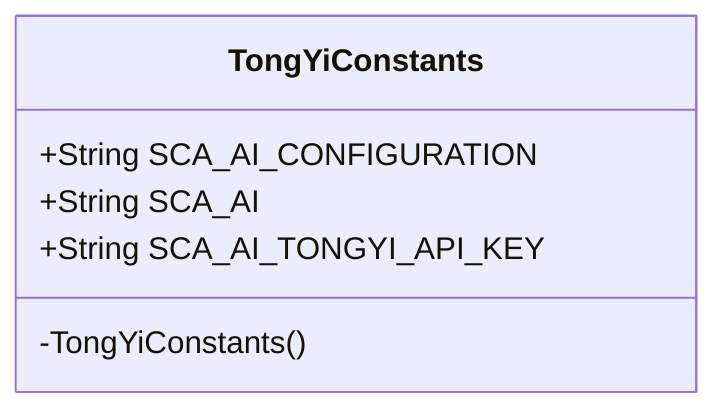
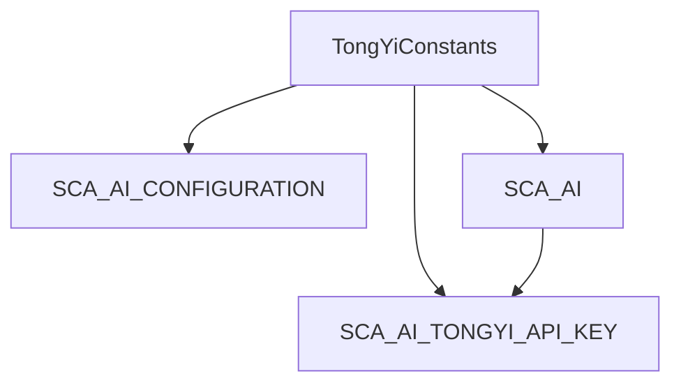

# 基础信息

|      |      |
|------|------|
| 编码语言 | .java |
| 代码路径 | yudao-module-ai/yudao-spring-boot-starter-ai/src/main/java/com/alibaba/cloud/ai/tongyi/common/constants/TongYiConstants.java |
| 包名 | com.alibaba.cloud.ai.tongyi.common.constants |
| 依赖项 | [] |
| 概述说明 | TongYiConstants类定义了Spring Cloud Alibaba AI的配置和常量前缀，包括"spring.cloud.ai.tongyi."和"SPRING_CLOUD_ALIBABA_"，并提供了TongYi AI API密钥的环境变量名称"SPRING_CLOUD_ALIBABA_TONGYI_API_KEY"。 |

# 说明

TongYiConstants类是一个用于定义Spring Cloud Alibaba AI配置和常量的类。该类主要包含两个关键前缀：配置前缀和常量前缀。配置前缀为"spring.cloud.ai.tongyi."，用于在Spring Cloud Alibaba AI的配置文件中标识与TongYi AI相关的配置项。常量前缀为"SPRING_CLOUD_ALIBABA_"，用于在代码中标识与Spring Cloud Alibaba相关的常量。此外，该类还提供了一个特定的环境变量名称"SPRING_CLOUD_ALIBABA_TONGYI_API_KEY"，用于存储TongYi AI的API密钥。这个环境变量名称可以在应用程序的配置中使用，以便在运行时动态获取TongYi AI的API密钥。通过这些配置和常量，开发者可以方便地在Spring Cloud Alibaba AI项目中集成和使用TongYi AI服务。

# 类列表 Class Summary

| 名称   | 类型  | 说明 |
|-------|------|-------------|
| TongYiConstants | class | TongYiConstants类定义了Spring Cloud Alibaba AI的配置和常量前缀，包括配置前缀"spring.cloud.ai.tongyi."和常量前缀"SPRING_CLOUD_ALIBABA_"，并提供了TongYi AI API密钥的环境变量名称"SPRING_CLOUD_ALIBABA_TONGYI_API_KEY"。 |

## 类 TongYiConstants

|      |      |
|------|------|
| 访问范围 | public final |
| 类型 | class |
| 名称 | TongYiConstants |
| 说明 | TongYiConstants类定义了Spring Cloud Alibaba AI的配置和常量前缀，包括配置前缀"spring.cloud.ai.tongyi."和常量前缀"SPRING_CLOUD_ALIBABA_"，并提供了TongYi AI API密钥的环境变量名称"SPRING_CLOUD_ALIBABA_TONGYI_API_KEY"。 |

### UML类图

### 描述：
该UML类图展示了一个名为`TongYiConstants`的类，它是一个公共的最终类，包含三个公共的静态常量。类中定义了一个私有构造函数，防止外部实例化。常量用于存储Spring Cloud Alibaba AI的配置前缀、常量前缀以及TongYi AI的API密钥环境变量名称。

### 内部方法调用关系图

### 描述信息：
该图展示了`TongYiConstants`类中各个常量之间的调用关系。`SCA_AI_CONFIGURATION`、`SCA_AI`和`SCA_AI_TONGYI_API_KEY`都是`TongYiConstants`类的静态常量。其中，`SCA_AI_TONGYI_API_KEY`依赖于`SCA_AI`的值进行定义。

### 字段列表 Field List

| 名称  | 类型  | 说明 |
|-------|-------|------|
| SCA_AI_TONGYI_API_KEY = SCA_AI + "TONGYI_API_KEY" | String | 该代码定义了一个静态常量字符串SCA_AI_TONGYI_API_KEY，其值为SCA_AI与"TONGYI_API_KEY"的拼接结果。 |
| SCA_AI_CONFIGURATION = "spring.cloud.ai.tongyi." | String | public static final String SCA_AI_CONFIGURATION = "spring.cloud.ai.tongyi."; 定义了一个静态常量字符串，用于配置Spring Cloud AI与通义相关的设置。 |
| SCA_AI = "SPRING_CLOUD_ALIBABA_" | String | 该代码定义了一个名为SCA_AI的公共静态常量字符串，其值为"SPRING_CLOUD_ALIBABA_"，用于标识或引用Spring Cloud Alibaba相关的内容。 |

### 方法列表 Method List

| 名称  | 类型  | 说明 |
|-------|-------|------|

