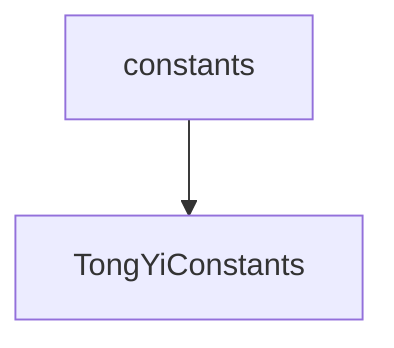

# 基础信息

|      |      |
|------|------|
| 编码语言 | .java |
| 代码路径 | yudao-module-ai/yudao-spring-boot-starter-ai/src/main/java/com/alibaba/cloud/ai/tongyi/common/constants |
| 包名 | com.alibaba.cloud.ai.tongyi.common.constants |
| 概述说明 | TongYiConstants类定义了Spring Cloud Alibaba AI的配置和常量前缀，包括"spring.cloud.ai.tongyi."和"SPRING_CLOUD_ALIBABA_"，并提供了TongYi AI API密钥的环境变量名称"SPRING_CLOUD_ALIBABA_TONGYI_API_KEY"。 |

# 说明

TongYiConstants类是一个用于定义Spring Cloud Alibaba AI配置和常量的类。该类主要包含两个关键前缀：配置前缀和常量前缀。配置前缀为"spring.cloud.ai.tongyi."，用于在Spring Cloud Alibaba AI的配置文件中标识与TongYi AI相关的配置项。常量前缀为"SPRING_CLOUD_ALIBABA_"，用于在代码中标识与Spring Cloud Alibaba相关的常量。此外，该类还提供了一个特定的环境变量名称"SPRING_CLOUD_ALIBABA_TONGYI_API_KEY"，用于存储TongYi AI的API密钥。这个环境变量名称可以在应用程序的配置中使用，以便在运行时动态获取TongYi AI的API密钥。通过这些配置和常量，开发者可以方便地在Spring Cloud Alibaba AI项目中集成和使用TongYi AI服务。

### 包内部结构视图

### 描述信息：
该Mermaid图展示了`constants`文件夹与`TongYiConstants.java`文件之间的调用关系。`constants`文件夹包含`TongYiConstants.java`文件，后者可能定义了与TongYi AI相关的常量。这种关系清晰地映射了文件与文件夹之间的层级结构。

# 文件列表 File List

| 名称   | 类型  | 说明 |
|-------|------|-------------|
| [TongYiConstants.java](TongYiConstants.md) | file | TongYiConstants类定义了Spring Cloud Alibaba AI的配置和常量前缀，包括"spring.cloud.ai.tongyi."和"SPRING_CLOUD_ALIBABA_"，并提供了TongYi AI API密钥的环境变量名称"SPRING_CLOUD_ALIBABA_TONGYI_API_KEY"。 |

