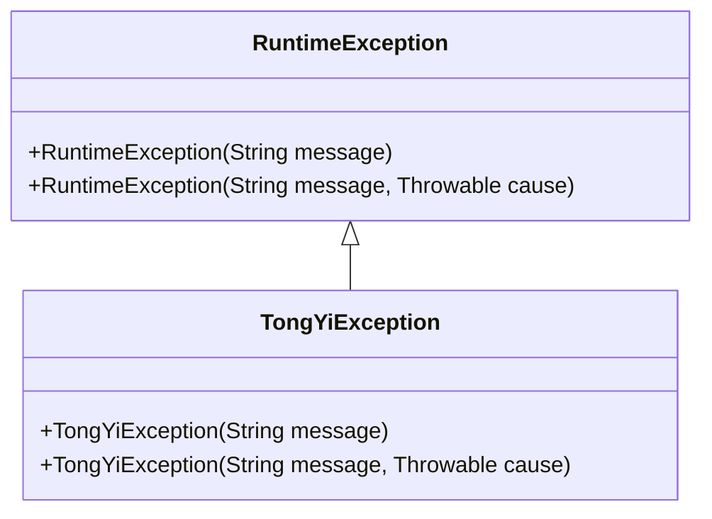
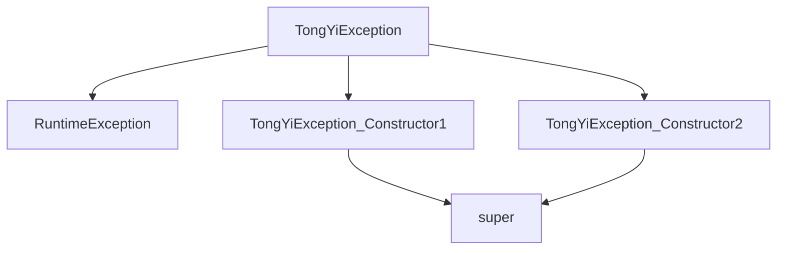

# 基础信息

|      |      |
|------|------|
| 编码语言 | .java |
| 代码路径 | yudao-module-ai/yudao-spring-boot-starter-ai/src/main/java/com/alibaba/cloud/ai/tongyi/common/exception/TongYiException.java |
| 包名 | com.alibaba.cloud.ai.tongyi.common.exception |
| 依赖项 | [] |
| 概述说明 | TongYiException 是继承自 RuntimeException 的自定义异常类，提供两个构造函数：一个接受字符串消息参数，另一个接受字符串消息和 Throwable 原因参数，用于传递异常信息和原因。 |

# 说明

TongYiException 是一个自定义的异常类，它继承自 Java 中的 RuntimeException 类。这个异常类提供了两个构造函数，以便在抛出异常时能够传递相关的异常信息。第一个构造函数接受一个字符串参数，用于指定异常的消息内容。第二个构造函数则接受两个参数：一个字符串消息和一个 Throwable 对象，前者用于描述异常的具体信息，后者则用于传递导致该异常的根本原因。通过这两个构造函数，TongYiException 类能够灵活地处理不同的异常场景，并提供详细的错误信息和原因，从而帮助开发者更好地理解和调试代码中的问题。

# 类列表 Class Summary

| 名称   | 类型  | 说明 |
|-------|------|-------------|
| TongYiException | class | TongYiException 是一个继承自 RuntimeException 的自定义异常类，包含两个构造函数：一个接受字符串消息参数，另一个接受字符串消息和 Throwable 原因参数，用于传递异常信息和原因。 |

## 类 TongYiException

|      |      |
|------|------|
| 访问范围 | public |
| 类型 | class |
| 名称 | TongYiException |
| 说明 | TongYiException 是一个继承自 RuntimeException 的自定义异常类，包含两个构造函数：一个接受字符串消息参数，另一个接受字符串消息和 Throwable 原因参数，用于传递异常信息和原因。 |

### UML类图

描述：该UML类图展示了一个继承关系，`TongYiException`类继承自`RuntimeException`类。`TongYiException`类有两个构造函数，分别接受一个字符串消息和一个字符串消息与异常原因。

### 内部方法调用关系图

### 描述信息：
该图展示了`TongYiException`类与其构造函数之间的调用关系。`TongYiException`继承自`RuntimeException`，并有两个构造函数，分别调用父类的`super`方法来初始化异常信息。

### 字段列表 Field List

| 名称  | 类型  | 说明 |
|-------|-------|------|

### 方法列表 Method List

| 名称  | 类型  | 说明 |
|-------|-------|------|

