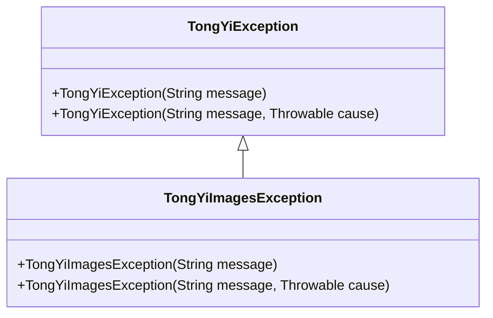
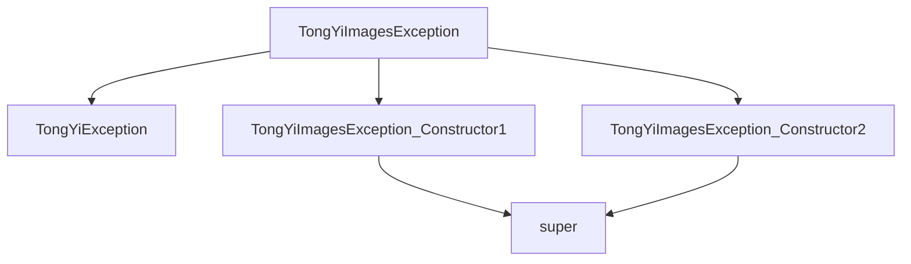

# 基础信息

|      |      |
|------|------|
| 编码语言 | .java |
| 代码路径 | yudao-module-ai/yudao-spring-boot-starter-ai/src/main/java/com/alibaba/cloud/ai/tongyi/common/exception/TongYiImagesException.java |
| 包名 | com.alibaba.cloud.ai.tongyi.common.exception |
| 依赖项 | [] |
| 概述说明 | TongYiImagesException类继承自TongYiException，提供两种构造函数：一种接受字符串消息参数，另一种接受字符串消息和Throwable原因参数，均调用父类构造函数进行初始化。 |

# 说明

TongYiImagesException类是从TongYiException类继承而来的，主要用于处理与图像相关的异常情况。该类提供了两种构造函数，以便在不同的异常场景中进行灵活的使用。第一种构造函数接受一个字符串消息作为参数，该消息通常用于描述异常的具体情况或原因。第二种构造函数除了接受字符串消息外，还接受一个Throwable类型的参数，该参数表示导致异常的原始原因或底层异常。这两种构造函数在初始化时都会调用父类TongYiException的构造函数，以确保异常对象能够正确地继承父类的属性和行为。通过这种方式，TongYiImagesException类不仅能够提供详细的异常信息，还能够保留导致异常的原始上下文，从而帮助开发者更好地理解和处理异常情况。

# 类列表 Class Summary

| 名称   | 类型  | 说明 |
|-------|------|-------------|
| TongYiImagesException | class | TongYiImagesException类继承自TongYiException，提供了两种构造函数：一种接受字符串消息参数，另一种接受字符串消息和Throwable原因参数，均调用父类构造函数进行初始化。 |

## 类 TongYiImagesException

|      |      |
|------|------|
| 访问范围 | public |
| 类型 | class |
| 名称 | TongYiImagesException |
| 说明 | TongYiImagesException类继承自TongYiException，提供了两种构造函数：一种接受字符串消息参数，另一种接受字符串消息和Throwable原因参数，均调用父类构造函数进行初始化。 |

### UML类图

### 描述信息：
该UML类图展示了`TongYiImagesException`类继承自`TongYiException`类。`TongYiImagesException`类有两个构造函数，分别接受`String`类型的消息和`String`消息与`Throwable`类型的异常原因。继承关系通过`<|--`表示，表明`TongYiImagesException`是`TongYiException`的子类。

### 内部方法调用关系图

### 描述信息：
`TongYiImagesException` 类继承自 `TongYiException`，并包含两个构造函数。第一个构造函数调用父类的单参数构造函数，第二个构造函数调用父类的双参数构造函数。图中清晰地展示了类之间的继承关系以及构造函数的调用路径。

### 字段列表 Field List

| 名称  | 类型  | 说明 |
|-------|-------|------|

### 方法列表 Method List

| 名称  | 类型  | 说明 |
|-------|-------|------|

