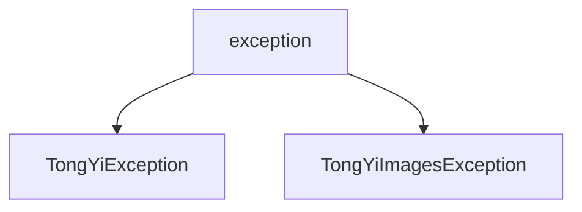

# 基础信息

|      |      |
|------|------|
| 编码语言 | .java |
| 代码路径 | yudao-module-ai/yudao-spring-boot-starter-ai/src/main/java/com/alibaba/cloud/ai/tongyi/common/exception |
| 包名 | com.alibaba.cloud.ai.tongyi.common.exception |
| 概述说明 | TongYiException 是一个继承自 Java RuntimeException 的自定义异常类，提供两个构造函数：一个接受字符串消息，另一个接受字符串消息和 Throwable 对象，用于传递异常信息和根本原因。TongYiImagesException 继承自 TongYiException，专门处理图像相关异常，同样提供两种构造函数，调用父类构造函数以继承属性和行为，帮助开发者更好地理解和处理异常情况。 |

# 说明

TongYiException 是一个自定义的异常类，继承自 Java 的 RuntimeException 类。该类提供了两个构造函数，用于在抛出异常时传递相关的异常信息。第一个构造函数接受一个字符串参数，用于指定异常的消息内容。第二个构造函数接受两个参数：一个字符串消息和一个 Throwable 对象，前者用于描述异常的具体信息，后者用于传递导致该异常的根本原因。通过这两个构造函数，TongYiException 类能够灵活处理不同的异常场景，并提供详细的错误信息和原因，帮助开发者更好地理解和调试代码中的问题。

TongYiImagesException 类是从 TongYiException 类继承而来的，专门用于处理与图像相关的异常情况。该类同样提供了两种构造函数，以便在不同的异常场景中灵活使用。第一种构造函数接受一个字符串消息作为参数，用于描述异常的具体情况或原因。第二种构造函数除了接受字符串消息外，还接受一个 Throwable 类型的参数，表示导致异常的原始原因或底层异常。这两种构造函数在初始化时都会调用父类 TongYiException 的构造函数，以确保异常对象能够正确继承父类的属性和行为。通过这种方式，TongYiImagesException 类不仅能够提供详细的异常信息，还能保留导致异常的原始上下文，帮助开发者更好地理解和处理异常情况。

### 包内部结构视图

### 描述信息：
该Mermaid图展示了`exception`文件夹下的两个Java文件之间的调用关系。`TongYiException.java`和`TongYiImagesException.java`都是从`exception`文件夹中调用的异常类，分别处理不同的异常情况。

# 文件列表 File List

| 名称   | 类型  | 说明 |
|-------|------|-------------|
| [TongYiImagesException.java](TongYiImagesException.md) | file | TongYiImagesException类继承自TongYiException，提供两种构造函数：一种接受字符串消息参数，另一种接受字符串消息和Throwable原因参数，均调用父类构造函数进行初始化。 |
| [TongYiException.java](TongYiException.md) | file | TongYiException 是继承自 RuntimeException 的自定义异常类，提供两个构造函数：一个接受字符串消息参数，另一个接受字符串消息和 Throwable 原因参数，用于传递异常信息和原因。 |

