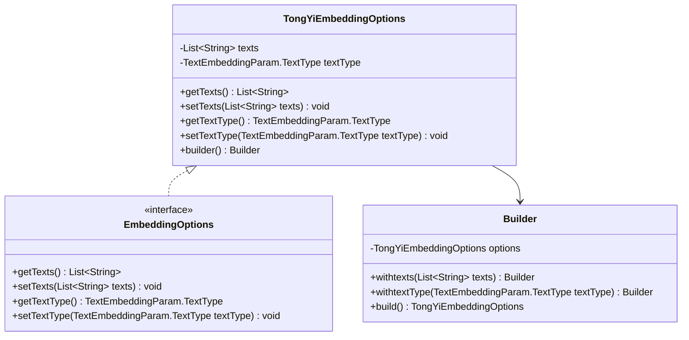
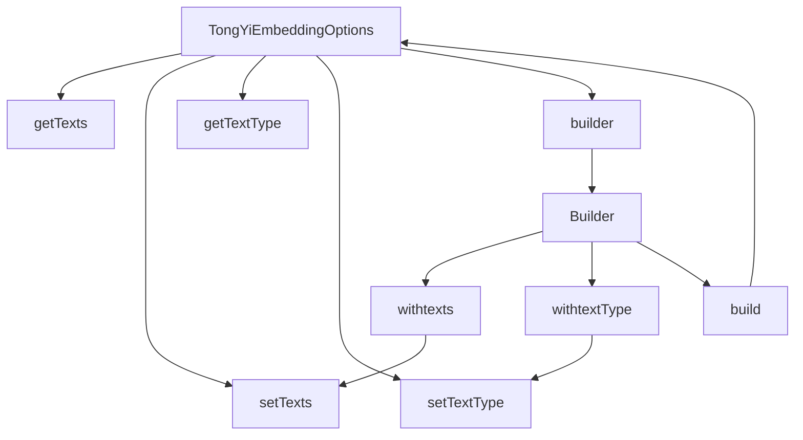

# 基础信息

|      |      |
|------|------|
| 编码语言 | .java |
| 代码路径 | yudao-module-ai/yudao-spring-boot-starter-ai/src/main/java/com/alibaba/cloud/ai/tongyi/embedding/TongYiEmbeddingOptions.java |
| 包名 | com.alibaba.cloud.ai.tongyi.embedding |
| 依赖项 | ['com.alibaba.dashscope.embeddings.TextEmbeddingParam', 'org.springframework.ai.embedding.EmbeddingOptions', 'java.util.List'] |
| 概述说明 | TongYiEmbeddingOptions类用于配置文本嵌入选项，包含文本列表和文本类型属性，提供getter和setter方法。通过Builder模式创建实例，支持链式调用设置文本和文本类型，最终返回配置好的TongYiEmbeddingOptions对象。 |

# 说明

TongYiEmbeddingOptions类用于设置文本嵌入的相关选项，主要包含两个关键属性：文本列表和文本类型。文本列表用于存储待处理的文本数据，而文本类型则用于指定这些文本的类别或格式。为了便于操作和管理，该类提供了getter和setter方法，允许用户获取和设置这些属性的值。通过Builder模式，用户可以灵活地创建TongYiEmbeddingOptions的实例，并支持链式调用以设置文本和文本类型。这种设计使得配置过程更加直观和便捷，最终返回一个配置好的TongYiEmbeddingOptions对象，供后续的文本嵌入处理使用。

# 类列表 Class Summary

| 名称   | 类型  | 说明 |
|-------|------|-------------|
| TongYiEmbeddingOptions | class | TongYiEmbeddingOptions类用于设置文本嵌入选项，包含文本列表和文本类型属性，提供getter和setter方法。通过Builder模式创建实例，支持链式调用设置文本和文本类型，最终返回配置好的TongYiEmbeddingOptions对象。 |

## 类 TongYiEmbeddingOptions

|      |      |
|------|------|
| 访问范围 | public final |
| 类型 | class |
| 名称 | TongYiEmbeddingOptions |
| 说明 | TongYiEmbeddingOptions类用于设置文本嵌入选项，包含文本列表和文本类型属性，提供getter和setter方法。通过Builder模式创建实例，支持链式调用设置文本和文本类型，最终返回配置好的TongYiEmbeddingOptions对象。 |

### UML类图

### 描述信息：
该UML类图展示了`TongYiEmbeddingOptions`类实现了`EmbeddingOptions`接口，并包含一个内部类`Builder`用于构建`TongYiEmbeddingOptions`对象。`TongYiEmbeddingOptions`类包含两个私有属性和对应的getter/setter方法，`Builder`类提供了链式调用的方法来设置属性并构建对象。

### 内部方法调用关系图

### 描述信息：
该图展示了`TongYiEmbeddingOptions`类及其内部`Builder`类之间的方法调用关系。`TongYiEmbeddingOptions`类提供了获取和设置`texts`和`textType`的方法，并通过`builder()`方法创建`Builder`实例。`Builder`类通过`withtexts`和`withtextType`方法设置属性，并通过`build`方法返回配置好的`TongYiEmbeddingOptions`实例。

### 字段列表 Field List

| 名称  | 类型  | 说明 |
|-------|-------|------|
| textType | TextEmbeddingParam.TextType | private TextEmbeddingParam.TextType textType; 是一个私有变量，用于定义文本嵌入参数中的文本类型。 |
| texts | List<String> | 该信息描述了一个私有变量`texts`，其类型为`List<String>`，表示一个存储字符串的列表。 |

### 方法列表 Method List

| 名称  | 类型  | 说明 |
|-------|-------|------|
| getTexts | List<String> | 该方法返回一个字符串列表，名称为`texts`。 |
| getTextType | TextEmbeddingParam.TextType | 该方法返回文本类型，具体返回值为textType。 |
| setTexts | void | 该方法用于设置文本列表，接受一个字符串列表作为参数，并将其赋值给类的成员变量texts。 |
| setTextType | void | 该方法用于设置文本类型，通过传入TextEmbeddingParam.TextType类型的参数textType来更新当前对象的textType属性。 |
| builder | Builder | `public static Builder builder()` 方法用于创建一个新的 `Builder` 实例，通常用于构建对象或配置复杂数据结构。 |

