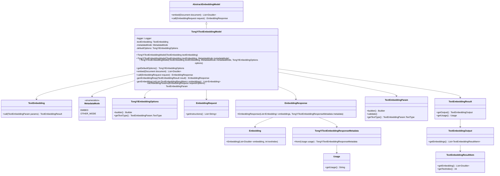

# 基础信息

|      |      |
|------|------|
| 编码语言 | .java |
| 代码路径 | yudao-module-ai/yudao-spring-boot-starter-ai/src/main/java/com/alibaba/cloud/ai/tongyi/embedding/TongYiTextEmbeddingModel.java |
| 包名 | com.alibaba.cloud.ai.tongyi.embedding |
| 依赖项 | ['cn.hutool.core.collection.ListUtil', 'com.alibaba.cloud.ai.tongyi.common.exception.TongYiException', 'com.alibaba.cloud.ai.tongyi.metadata.TongYiTextEmbeddingResponseMetadata', 'com.alibaba.dashscope.embeddings.TextEmbedding', 'com.alibaba.dashscope.embeddings.TextEmbeddingParam', 'com.alibaba.dashscope.embeddings.TextEmbeddingResult', 'com.alibaba.dashscope.embeddings.TextEmbeddingResultItem', 'com.alibaba.dashscope.exception.InputRequiredException', 'com.alibaba.dashscope.exception.NoApiKeyException', 'org.slf4j.Logger', 'org.slf4j.LoggerFactory', 'org.springframework.ai.document.Document', 'org.springframework.ai.document.MetadataMode', 'org.springframework.ai.embedding.AbstractEmbeddingModel', 'org.springframework.ai.embedding.Embedding', 'org.springframework.ai.embedding.EmbeddingRequest', 'org.springframework.ai.embedding.EmbeddingResponse', 'org.springframework.util.Assert', 'java.util.List', 'java.util.stream.Collectors'] |
| 概述说明 | TongYiTextEmbeddingModel继承自AbstractEmbeddingModel，用于文本嵌入任务，包含TextEmbedding客户端、MetadataMode和TongYiEmbeddingOptions配置。通过构造函数初始化属性，提供embed和call方法生成嵌入结果，包含参数验证和响应生成逻辑，建议通过代码设置模型参数以保持灵活性。 |

# 说明

TongYiTextEmbeddingModel类是一个用于处理文本嵌入任务的类，它继承自AbstractEmbeddingModel。该类包含多个关键组件，包括TextEmbedding客户端、MetadataMode和TongYiEmbeddingOptions配置。这些组件通过构造函数进行初始化，确保在创建类的实例时能够正确设置这些属性。TongYiTextEmbeddingModel类提供了两个主要方法：embed和call。embed方法用于生成文本嵌入结果，而call方法则负责调用嵌入过程并返回结果。类中还包含了参数验证和响应生成的逻辑，确保输入参数的合法性和输出结果的准确性。为了保持灵活性，建议通过代码直接设置模型参数，而不是使用yml配置文件。这种方式使得模型参数的调整更加灵活和直接，便于在不同场景下进行定制和优化。

# 类列表 Class Summary

| 名称   | 类型  | 说明 |
|-------|------|-------------|
| TongYiTextEmbeddingModel | class | TongYiTextEmbeddingModel类继承自AbstractEmbeddingModel，用于处理文本嵌入任务。它包含TextEmbedding客户端、MetadataMode和TongYiEmbeddingOptions配置。通过构造函数初始化这些属性，并提供embed和call方法生成文本嵌入结果。类中还包括参数验证和响应生成逻辑，建议通过代码设置模型参数，避免使用yml配置以保持灵活性。 |


## 类 TongYiTextEmbeddingModel

|      |      |
|------|------|
| 访问范围 | public |
| 类型 | class |
| 名称 | TongYiTextEmbeddingModel |
| 说明 | TongYiTextEmbeddingModel类继承自AbstractEmbeddingModel，用于处理文本嵌入任务。它包含TextEmbedding客户端、MetadataMode和TongYiEmbeddingOptions配置。通过构造函数初始化这些属性，并提供embed和call方法生成文本嵌入结果。类中还包括参数验证和响应生成逻辑，建议通过代码设置模型参数，避免使用yml配置以保持灵活性。 |


### UML类图



### 描述：
该UML类图展示了`TongYiTextEmbeddingModel`类的结构及其与相关类的关系。`TongYiTextEmbeddingModel`继承自`AbstractEmbeddingModel`，并依赖于`TextEmbedding`、`MetadataMode`、`TongYiEmbeddingOptions`等类。该类通过`TextEmbedding`调用嵌入服务，并处理嵌入请求和响应。


### 内部方法调用关系图

```mermaid
graph TD
    TongYiTextEmbeddingModel --> embed
    TongYiTextEmbeddingModel --> call
    TongYiTextEmbeddingModel --> genEmbeddingResp
    TongYiTextEmbeddingModel --> genEmbeddingList
    TongYiTextEmbeddingModel --> toEmbeddingParams
    embed --> call
    call --> toEmbeddingParams
    call --> genEmbeddingResp
    genEmbeddingResp --> genEmbeddingList
```

### 描述信息：
该图展示了`TongYiTextEmbeddingModel`类中方法之间的调用关系。`embed`方法调用`call`方法，`call`方法进一步调用`toEmbeddingParams`和`genEmbeddingResp`方法，而`genEmbeddingResp`方法又调用`genEmbeddingList`方法。这些方法共同协作，完成文本嵌入的处理和响应生成。

### 字段列表 Field List

| 名称  | 类型  | 说明 |
|-------|-------|------|
| metadataMode | MetadataMode | private final MetadataMode metadataMode; 声明了一个私有的、不可变的MetadataMode类型的变量metadataMode。 |
| textEmbedding | TextEmbedding | private final TextEmbedding textEmbedding; 声明了一个私有的、不可变的TextEmbedding类型变量textEmbedding。 |
| defaultOptions | TongYiEmbeddingOptions | private final TongYiEmbeddingOptions defaultOptions; 定义了一个私有的、不可变的TongYiEmbeddingOptions类型的默认选项变量。 |
| logger = LoggerFactory.getLogger(TongYiTextEmbeddingModel.class) | Logger | private final Logger logger = LoggerFactory.getLogger(TongYiTextEmbeddingModel.class); 这行代码创建了一个私有的、不可变的Logger实例，用于记录TongYiTextEmbeddingModel类的日志信息。 |

### 方法列表 Method List

| 名称  | 类型  | 说明 |
|-------|-------|------|
| embed | List<Double> | 该方法接收一个文档对象，通过调用嵌入请求生成嵌入结果，提取并返回嵌入输出列表。 |
| genEmbeddingResp | EmbeddingResponse | 该方法生成一个EmbeddingResponse对象，包含从TextEmbeddingResult中提取的嵌入列表和从使用情况生成的元数据。 |
| call | EmbeddingResponse | 该方法处理嵌入请求，将请求转换为嵌入参数并记录日志，调用文本嵌入服务处理参数，捕获无API密钥异常并抛出自定义异常，最后生成并返回嵌入响应。 |
| toEmbeddingParams | TextEmbeddingParam | 该方法将EmbeddingRequest对象转换为TextEmbeddingParam对象，设置文本、文本类型（默认为DOCUMENT）和模型（text-embedding-v1），并进行参数验证，若验证失败则抛出TongYiException异常，最后返回生成的TextEmbeddingParam对象。 |
| getDefaultOptions | TongYiEmbeddingOptions | 该方法返回默认的TongYiEmbeddingOptions对象，通过调用getDefaultOptions()方法获取。 |
| genEmbeddingList | List<Embedding> | 该方法将`TextEmbeddingResultItem`列表转换为`Embedding`列表，通过流处理将每个`TextEmbeddingResultItem`对象的`embedding`和`textIndex`属性映射到新的`Embedding`对象中，并最终收集为列表返回。 |


