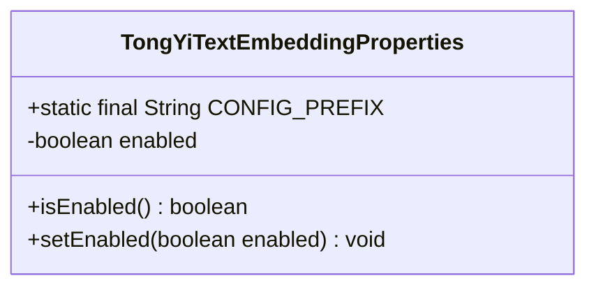
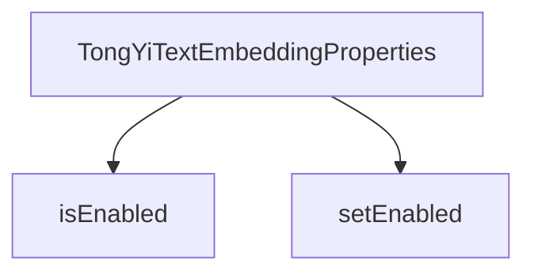

# 基础信息

|      |      |
|------|------|
| 编码语言 | .java |
| 代码路径 | yudao-module-ai/yudao-spring-boot-starter-ai/src/main/java/com/alibaba/cloud/ai/tongyi/embedding/TongYiTextEmbeddingProperties.java |
| 包名 | com.alibaba.cloud.ai.tongyi.embedding |
| 依赖项 | ['org.springframework.boot.context.properties.ConfigurationProperties', 'com.alibaba.cloud.ai.tongyi.common.constants.TongYiConstants.SCA_AI_CONFIGURATION'] |
| 概述说明 | TongYiTextEmbeddingProperties类用于配置文本嵌入属性，前缀为SCA_AI_CONFIGURATION + "embedding"，默认启用状态为true，并提供enabled属性的getter和setter方法。 |

# 说明

TongYiTextEmbeddingProperties类用于配置文本嵌入的相关属性。该类的配置前缀为SCA_AI_CONFIGURATION加上"embedding"，表明其属于文本嵌入功能的配置部分。默认情况下，该功能处于启用状态，即enabled属性的默认值为true。为了便于管理和调整该功能的启用状态，类中提供了enabled属性的getter和setter方法，允许用户通过编程方式获取或修改该属性的值。这种设计使得文本嵌入功能的启用状态可以根据实际需求进行灵活调整，同时也确保了配置的便捷性和可维护性。

# 类列表 Class Summary

| 名称   | 类型  | 说明 |
|-------|------|-------------|
| TongYiTextEmbeddingProperties | class | TongYiTextEmbeddingProperties类用于配置文本嵌入属性，前缀为SCA_AI_CONFIGURATION + "embedding"，默认启用状态为true，提供enabled属性的getter和setter方法。 |

## 类 TongYiTextEmbeddingProperties

|      |      |
|------|------|
| 访问范围 | @ConfigurationProperties(TongYiTextEmbeddingProperties.CONFIG_PREFIX);public |
| 类型 | class |
| 名称 | TongYiTextEmbeddingProperties |
| 说明 | TongYiTextEmbeddingProperties类用于配置文本嵌入属性，前缀为SCA_AI_CONFIGURATION + "embedding"，默认启用状态为true，提供enabled属性的getter和setter方法。 |

### UML类图

### 描述信息：
该UML类图展示了一个名为`TongYiTextEmbeddingProperties`的类，该类包含一个静态常量`CONFIG_PREFIX`和一个私有布尔属性`enabled`。类中提供了`isEnabled()`和`setEnabled()`方法用于访问和修改`enabled`属性。

### 内部方法调用关系图

### 描述信息：
该图展示了`TongYiTextEmbeddingProperties`类中的两个方法`isEnabled`和`setEnabled`之间的调用关系。`TongYiTextEmbeddingProperties`类通过`isEnabled`方法获取`enabled`属性的状态，并通过`setEnabled`方法设置`enabled`属性的值。这两个方法共同管理`enabled`属性的状态。

### 字段列表 Field List

| 名称  | 类型  | 说明 |
|-------|-------|------|
| enabled = true | boolean | 私有布尔变量enabled初始值为true。 |
| CONFIG_PREFIX = SCA_AI_CONFIGURATION + "embedding" | String | 该代码定义了一个静态常量字符串`CONFIG_PREFIX`，其值为`SCA_AI_CONFIGURATION`与字符串`"embedding"`的拼接结果，用于配置嵌入相关的设置。 |

### 方法列表 Method List

| 名称  | 类型  | 说明 |
|-------|-------|------|
| setEnabled | void | 该方法用于设置一个布尔类型的`enabled`属性，通过传入的`enabled`参数来更新该属性的值。 |
| isEnabled | boolean | 该方法返回一个布尔值，表示当前对象是否启用。通过返回`this.enabled`的值来确定状态。 |

