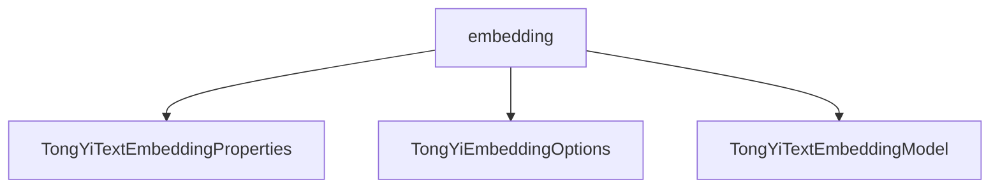

# 基础信息

|      |      |
|------|------|
| 编码语言 | .java |
| 代码路径 | yudao-module-ai/yudao-spring-boot-starter-ai/src/main/java/com/alibaba/cloud/ai/tongyi/embedding |
| 包名 | com.alibaba.cloud.ai.tongyi.embedding |
| 概述说明 | TongYiTextEmbeddingProperties类用于配置文本嵌入功能，默认启用，提供enabled属性的getter和setter方法以便灵活调整。TongYiEmbeddingOptions类通过Builder模式设置文本列表和类型，支持链式调用，便于配置。TongYiTextEmbeddingModel类继承自AbstractEmbeddingModel，包含TextEmbedding客户端、MetadataMode和TongYiEmbeddingOptions等组件，提供embed和call方法处理文本嵌入，建议通过代码直接设置模型参数以保持灵活性。 |

# 说明

TongYiTextEmbeddingProperties类用于配置文本嵌入的相关属性，其配置前缀为SCA_AI_CONFIGURATION加上"embedding"，表明其属于文本嵌入功能的配置部分。默认情况下，该功能处于启用状态，即enabled属性的默认值为true。为了便于管理和调整该功能的启用状态，类中提供了enabled属性的getter和setter方法，允许用户通过编程方式获取或修改该属性的值。这种设计使得文本嵌入功能的启用状态可以根据实际需求进行灵活调整，同时也确保了配置的便捷性和可维护性。

TongYiEmbeddingOptions类用于设置文本嵌入的相关选项，主要包含两个关键属性：文本列表和文本类型。文本列表用于存储待处理的文本数据，而文本类型则用于指定这些文本的类别或格式。为了便于操作和管理，该类提供了getter和setter方法，允许用户获取和设置这些属性的值。通过Builder模式，用户可以灵活地创建TongYiEmbeddingOptions的实例，并支持链式调用以设置文本和文本类型。这种设计使得配置过程更加直观和便捷，最终返回一个配置好的TongYiEmbeddingOptions对象，供后续的文本嵌入处理使用。

TongYiTextEmbeddingModel类是一个用于处理文本嵌入任务的类，它继承自AbstractEmbeddingModel。该类包含多个关键组件，包括TextEmbedding客户端、MetadataMode和TongYiEmbeddingOptions配置。这些组件通过构造函数进行初始化，确保在创建类的实例时能够正确设置这些属性。TongYiTextEmbeddingModel类提供了两个主要方法：embed和call。embed方法用于生成文本嵌入结果，而call方法则负责调用嵌入过程并返回结果。类中还包含了参数验证和响应生成的逻辑，确保输入参数的合法性和输出结果的准确性。为了保持灵活性，建议通过代码直接设置模型参数，而不是使用yml配置文件。这种方式使得模型参数的调整更加灵活和直接，便于在不同场景下进行定制和优化。

### 包内部结构视图

### 描述信息：
该Mermaid图展示了`embedding`文件夹下的三个Java文件之间的调用关系。`embedding`文件夹包含了`TongYiTextEmbeddingProperties.java`、`TongYiEmbeddingOptions.java`和`TongYiTextEmbeddingModel.java`三个文件，它们之间可能存在属性配置、选项设置和模型调用的依赖关系。

# 文件列表 File List

| 名称   | 类型  | 说明 |
|-------|------|-------------|
| [TongYiTextEmbeddingModel.java](TongYiTextEmbeddingModel.md) | file | TongYiTextEmbeddingModel继承自AbstractEmbeddingModel，用于文本嵌入任务，包含TextEmbedding客户端、MetadataMode和TongYiEmbeddingOptions配置。通过构造函数初始化属性，提供embed和call方法生成嵌入结果，包含参数验证和响应生成逻辑，建议通过代码设置模型参数以保持灵活性。 |
| [TongYiEmbeddingOptions.java](TongYiEmbeddingOptions.md) | file | TongYiEmbeddingOptions类用于配置文本嵌入选项，包含文本列表和文本类型属性，提供getter和setter方法。通过Builder模式创建实例，支持链式调用设置文本和文本类型，最终返回配置好的TongYiEmbeddingOptions对象。 |
| [TongYiTextEmbeddingProperties.java](TongYiTextEmbeddingProperties.md) | file | TongYiTextEmbeddingProperties类用于配置文本嵌入属性，前缀为SCA_AI_CONFIGURATION + "embedding"，默认启用状态为true，并提供enabled属性的getter和setter方法。 |

