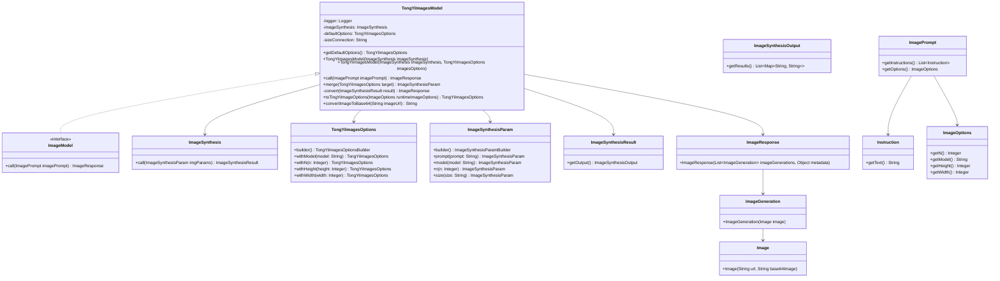

# 基础信息

|      |      |
|------|------|
| 编码语言 | .java |
| 代码路径 | yudao-module-ai/yudao-spring-boot-starter-ai/src/main/java/com/alibaba/cloud/ai/tongyi/image/TongYiImagesModel.java |
| 包名 | com.alibaba.cloud.ai.tongyi.image |
| 依赖项 | ['com.alibaba.cloud.ai.tongyi.common.exception.TongYiImagesException', 'com.alibaba.dashscope.aigc.imagesynthesis.ImageSynthesis', 'com.alibaba.dashscope.aigc.imagesynthesis.ImageSynthesisParam', 'com.alibaba.dashscope.aigc.imagesynthesis.ImageSynthesisResult', 'com.alibaba.dashscope.exception.NoApiKeyException', 'org.slf4j.Logger', 'org.slf4j.LoggerFactory', 'org.springframework.ai.image', 'org.springframework.util.Assert', 'java.io.ByteArrayOutputStream', 'java.net.URL', 'java.util.Base64', 'java.util.stream.Collectors', 'com.alibaba.cloud.ai.tongyi.metadata.TongYiImagesResponseMetadata.from'] |
| 概述说明 | TongYiImagesModel类实现ImageModel接口，用于调用通义图像生成服务。类包含默认图像选项、图像合成API等属性，通过构造函数初始化。提供获取默认选项、调用图像生成服务、合并图像选项、转换图像合成结果及将图像URL转为Base64编码的方法。 |

# 说明

TongYiImagesModel类是一个实现了ImageModel接口的类，专门用于调用通义图像生成服务。该类包含多个关键属性和方法，以确保图像生成和处理的高效性。首先，类中定义了默认图像选项、图像合成API以及图像大小连接符等属性，这些属性在图像生成过程中起到重要作用。通过构造函数，类在初始化时会设置图像合成API和默认选项，确保后续操作的基础配置正确无误。

类提供了获取默认选项的方法，方便用户在使用时快速获取预设的图像生成参数。核心功能之一是call方法，该方法用于调用图像生成服务，处理用户提供的图像提示，并返回生成的图像响应。此外，merge方法用于合并用户自定义的图像选项与默认选项，确保生成图像时能够灵活调整参数。convert方法则负责将图像合成结果转换为标准的图像响应格式，便于后续处理和使用。

为了方便图像数据的传输和存储，类还提供了一个工具方法，用于将图像URL转换为Base64编码格式。这一功能在处理图像数据时非常实用，尤其是在需要将图像嵌入到其他系统或应用中时。通过这些方法和属性，TongYiImagesModel类为用户提供了一个全面且灵活的工具，用于高效调用通义图像生成服务并处理生成的图像数据。

# 类列表 Class Summary

| 名称   | 类型  | 说明 |
|-------|------|-------------|
| TongYiImagesModel | class | TongYiImagesModel类实现了ImageModel接口，用于调用通义图像生成服务。类中包含默认图像选项、图像合成API、图像大小连接符等属性。通过构造函数初始化图像合成API和默认选项，提供获取默认选项的方法。call方法用于调用图像生成服务，处理图像提示并返回图像响应。merge方法用于合并图像选项，convert方法将图像合成结果转换为图像响应。此外，还提供了将图像URL转换为Base64编码的工具方法。 |


## 类 TongYiImagesModel

|      |      |
|------|------|
| 访问范围 | public |
| 类型 | class |
| 名称 | TongYiImagesModel |
| 说明 | TongYiImagesModel类实现了ImageModel接口，用于调用通义图像生成服务。类中包含默认图像选项、图像合成API、图像大小连接符等属性。通过构造函数初始化图像合成API和默认选项，提供获取默认选项的方法。call方法用于调用图像生成服务，处理图像提示并返回图像响应。merge方法用于合并图像选项，convert方法将图像合成结果转换为图像响应。此外，还提供了将图像URL转换为Base64编码的工具方法。 |


### UML类图



### 描述信息：
该UML类图展示了`TongYiImagesModel`类及其相关类的结构和关系。`TongYiImagesModel`实现了`ImageModel`接口，并通过`ImageSynthesis`类调用图像生成服务。类图中包含了多个类，如`TongYiImagesOptions`、`ImageSynthesisParam`、`ImageResponse`等，展示了它们之间的依赖、关联和实现关系。


### 内部方法调用关系图

```mermaid
graph TD
    TongYiImagesModel --> getDefaultOptions
    TongYiImagesModel --> TongYiImagesModel[ImageSynthesis imageSynthesis]
    TongYiImagesModel --> TongYiImagesModel[ImageSynthesis imageSynthesis, TongYiImagesOptions imagesOptions]
    TongYiImagesModel --> call[ImagePrompt imagePrompt]
    call --> merge[TongYiImagesOptions target]
    call --> toTingYiImageOptions[ImageOptions runtimeImageOptions]
    call --> convert[ImageSynthesisResult result]
    convert --> convertImageToBase64[String imageUrl]
```

### 描述信息：
该图展示了`TongYiImagesModel`类中方法之间的调用关系。`TongYiImagesModel`类通过构造函数初始化，并提供了`call`方法来调用图像生成服务。`call`方法内部调用了`merge`、`toTingYiImageOptions`和`convert`方法，其中`convert`方法进一步调用了`convertImageToBase64`方法来完成图像到Base64的转换。

### 字段列表 Field List

| 名称  | 类型  | 说明 |
|-------|-------|------|
| sizeConnection = "*" | String | private final String sizeConnection = "*"; 定义了一个私有的、不可变的字符串常量sizeConnection，其值为"*"。 |
| imageSynthesis | ImageSynthesis | 该代码段定义了一个私有且不可变的`ImageSynthesis`类型的变量`imageSynthesis`，用于图像合成操作。 |
| logger = LoggerFactory.getLogger(TongYiImagesModel.class) | Logger | 代码片段定义了一个名为`logger`的私有常量，使用`LoggerFactory.getLogger`方法获取`TongYiImagesModel`类的日志记录器实例。 |
| defaultOptions | TongYiImagesOptions | private TongYiImagesOptions defaultOptions; 定义了一个私有的TongYiImagesOptions类型的默认选项变量。 |

### 方法列表 Method List

| 名称  | 类型  | 说明 |
|-------|-------|------|
| getDefaultOptions | TongYiImagesOptions | `public TongYiImagesOptions getDefaultOptions()` 方法返回当前对象的 `defaultOptions` 属性值。 |
| convertImageToBase64 | String | 该方法通过URL获取图像数据，将其读取为字节数组，并使用Base64编码将图像转换为Base64字符串。处理完成后关闭输入输出流，返回编码后的字符串。 |
| convert | ImageResponse | 该方法将图像合成结果转换为图像响应对象。它遍历结果中的每个条目，将图像路径转换为Base64编码，并创建图像对象。最后，将所有生成的图像收集到列表中，返回包含这些图像和原始结果的图像响应对象。 |
| merge | ImageSynthesisParam | 该方法合并两个图像合成参数对象，优先使用当前对象的默认值，若为空则使用目标对象的值。合并内容包括模型、生成数量、图像尺寸，并将提示设置为空字符串，最终返回合并后的参数对象。 |
| toTingYiImageOptions | TongYiImagesOptions | 该方法将`ImageOptions`对象转换为`TongYiImagesOptions`对象，通过检查`runtimeImageOptions`中的`n`、`model`、`height`和`width`属性，若不为空则将其值设置到`TongYiImagesOptions`的构建器中，最后返回构建的`TongYiImagesOptions`对象。 |
| call | ImageResponse | 该方法处理图像生成请求，首先从输入中提取提示文本并构建图像合成参数。如果存在默认选项或输入选项，则合并到参数中。设置提示文本后，调用图像合成接口生成图像。若发生无API密钥异常，记录错误并抛出异常。最后，将合成结果转换为响应格式返回。 |


