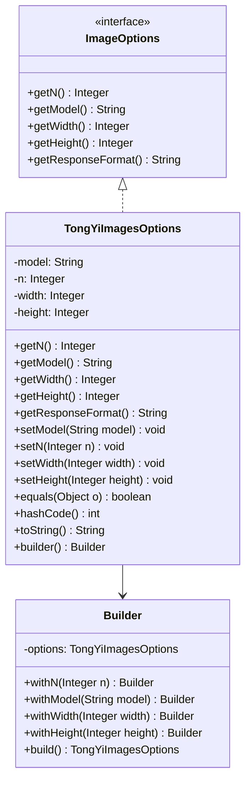

# 基础信息

|      |      |
|------|------|
| 编码语言 | .java |
| 代码路径 | yudao-module-ai/yudao-spring-boot-starter-ai/src/main/java/com/alibaba/cloud/ai/tongyi/image/TongYiImagesOptions.java |
| 包名 | com.alibaba.cloud.ai.tongyi.image |
| 依赖项 | ['com.alibaba.cloud.ai.tongyi.common.exception.TongYiImagesException', 'com.alibaba.dashscope.aigc.imagesynthesis.ImageSynthesis', 'org.springframework.ai.image.ImageOptions', 'java.util.Objects'] |
| 概述说明 | TongYiImagesOptions类用于配置图像生成参数，包含模型名称（默认wanx-v1）、生成数量、宽度（默认1024）和高度（默认1024）。提供getter、setter、equals、hashCode和toString方法，支持Builder模式和链式调用设置参数。 |

# 说明

TongYiImagesOptions类是一个用于配置图像生成参数的类，提供了多种参数设置选项。默认情况下，该类的模型名称设置为"wanx-v1"，生成图像的宽度和高度均默认为1024像素。用户可以通过该类设置生成图像的数量，并且可以通过getter和setter方法来获取或修改这些参数。此外，该类还支持equals、hashCode和toString方法，以便进行对象比较、哈希计算和字符串表示。为了简化对象的创建和配置过程，TongYiImagesOptions类采用了Builder模式，允许用户通过链式调用的方式设置参数，从而使得代码更加简洁和易读。通过这种方式，用户可以灵活地配置图像生成的各项参数，满足不同的需求。

# 类列表 Class Summary

| 名称   | 类型  | 说明 |
|-------|------|-------------|
| TongYiImagesOptions | class | TongYiImagesOptions类用于配置图像生成参数，包括模型名称（默认wanx-v1）、生成图像数量、宽度（默认1024）和高度（默认1024）。提供getter和setter方法，支持equals、hashCode和toString方法。通过Builder模式构建对象，允许链式调用设置参数。 |


## 类 TongYiImagesOptions

|      |      |
|------|------|
| 访问范围 | public |
| 类型 | class |
| 名称 | TongYiImagesOptions |
| 说明 | TongYiImagesOptions类用于配置图像生成参数，包括模型名称（默认wanx-v1）、生成图像数量、宽度（默认1024）和高度（默认1024）。提供getter和setter方法，支持equals、hashCode和toString方法。通过Builder模式构建对象，允许链式调用设置参数。 |


### UML类图



### 描述信息：
该UML类图展示了`TongYiImagesOptions`类及其内部类`Builder`的结构。`TongYiImagesOptions`实现了`ImageOptions`接口，并包含多个属性和方法用于设置和获取图像生成选项。`Builder`类用于构建`TongYiImagesOptions`对象，支持链式调用。


### 内部方法调用关系图

```mermaid
graph TD
    TongYiImagesOptions --> getN
    TongYiImagesOptions --> getModel
    TongYiImagesOptions --> getWidth
    TongYiImagesOptions --> getHeight
    TongYiImagesOptions --> getResponseFormat
    TongYiImagesOptions --> setModel
    TongYiImagesOptions --> setN
    TongYiImagesOptions --> setWidth
    TongYiImagesOptions --> setHeight
    TongYiImagesOptions --> equals
    TongYiImagesOptions --> hashCode
    TongYiImagesOptions --> toString
    TongYiImagesOptions --> builder
    Builder --> withN
    Builder --> withModel
    Builder --> withWidth
    Builder --> withHeight
    Builder --> build
```

### 描述信息：
该图展示了`TongYiImagesOptions`类及其内部`Builder`类的方法调用关系。`TongYiImagesOptions`类包含多个getter和setter方法，用于获取和设置图像生成的参数，如模型、数量、宽度和高度。`Builder`类提供了链式调用的方法，用于构建`TongYiImagesOptions`对象。

### 字段列表 Field List

| 名称  | 类型  | 说明 |
|-------|-------|------|
| n | Integer | 概要说明：定义一个私有的整数类型变量n。 |
| model = ImageSynthesis.Models.WANX_V1 | String | 该代码定义了一个私有字符串变量`model`，并将其初始化为`ImageSynthesis.Models.WANX_V1`，用于指定图像合成的模型版本。 |
| height = 1024 | Integer | 该信息描述了一个私有整数变量height，其值为1024。 |
| width = 1024 | Integer | private Integer width = 1024; 定义了一个私有整数变量width，初始值为1024。 |

### 方法列表 Method List

| 名称  | 类型  | 说明 |
|-------|-------|------|
| setHeight | void | 该方法用于设置高度值，接受一个整数参数并将其赋值给对象的height属性。 |
| getWidth | Integer | 该方法重写了父类的getWidth方法，返回当前对象的width属性值。 |
| getN | Integer | 该方法重写了父类的getN方法，返回当前对象的n属性值。 |
| getHeight | Integer | 该方法重写了父类的`getHeight`方法，返回当前对象的`height`属性值。 |
| setN | void | 该方法用于设置一个整数类型的变量n，通过传入的参数n来更新类中的成员变量this.n。 |
| setWidth | void | 该方法用于设置宽度属性，接受一个整数参数并将其赋值给类的宽度变量。 |
| getModel | String | 该方法重写了父类的getModel方法，返回当前对象的model属性值。 |
| setModel | void | 该方法用于设置模型属性，接受一个字符串参数并将其赋值给类的模型变量。 |
| builder | Builder | `public static Builder builder()` 方法用于创建一个新的 `Builder` 实例，通常用于构建复杂对象的构造模式。 |
| getResponseFormat | String | 该方法`getResponseFormat`未实现，调用时会抛出`TongYiImagesException`异常，提示“unimplemented!”。 |
| hashCode | int | 该代码片段重写了`hashCode`方法，使用`Objects.hash`方法计算并返回基于`model`、`n`、`width`和`height`四个属性的哈希值。 |
| toString | String | 该代码片段重写了`toString`方法，用于生成`TongYiImagesOptions`对象的字符串表示。内容包括模型名称（model）、数量（n）、宽度（width）和高度（height），格式为`TongYiImagesOptions{model='模型名', n=数量, width=宽度, height=高度}`。 |
| equals | boolean | 该方法重写了equals方法，用于比较两个TongYiImagesOptions对象是否相等。首先检查是否为同一对象，是则返回true；若对象为空或类不同则返回false。最后比较model、n、width和height属性是否相等，全部相等则返回true，否则返回false。 |


