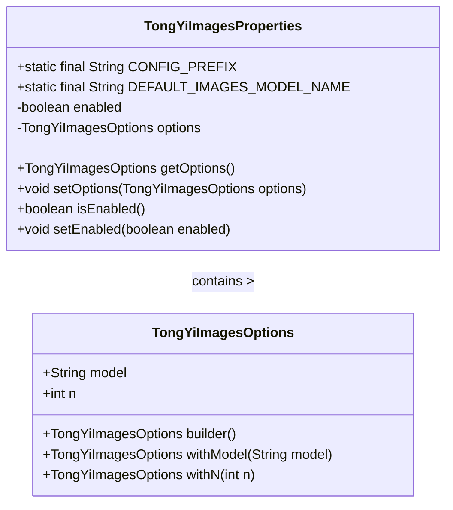
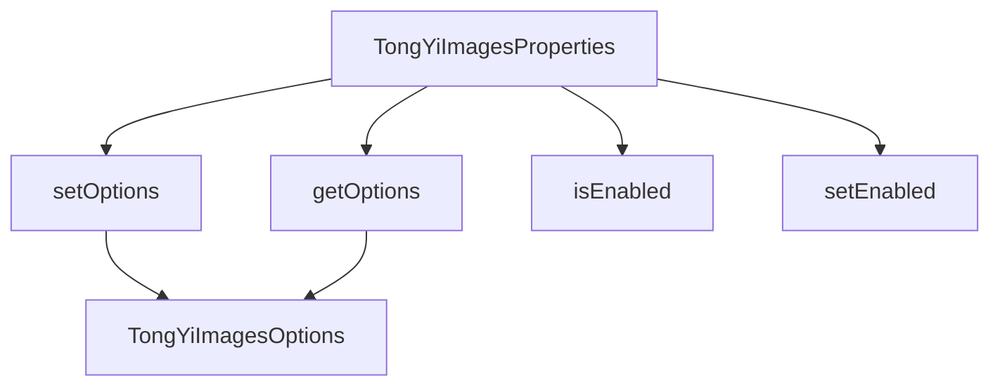

# 基础信息

|      |      |
|------|------|
| 编码语言 | .java |
| 代码路径 | yudao-module-ai/yudao-spring-boot-starter-ai/src/main/java/com/alibaba/cloud/ai/tongyi/image/TongYiImagesProperties.java |
| 包名 | com.alibaba.cloud.ai.tongyi.image |
| 依赖项 | ['com.alibaba.dashscope.aigc.imagesynthesis.ImageSynthesis', 'org.springframework.boot.context.properties.ConfigurationProperties', 'org.springframework.boot.context.properties.NestedConfigurationProperty', 'com.alibaba.cloud.ai.tongyi.common.constants.TongYiConstants.SCA_AI_CONFIGURATION'] |
| 概述说明 | TongYiImagesProperties类用于配置Spring Cloud Alibaba AI的图像生成功能，包含配置前缀、默认模型名称（WANX_V1）、启用状态（默认为true）及选项设置（模型和生成数量）。 |

# 说明

TongYiImagesProperties类是Spring Cloud Alibaba AI框架中用于配置图像生成功能的一个关键类。该类主要负责管理与图像生成相关的各种配置参数，确保用户能够灵活地调整和优化图像生成的行为。首先，该类定义了配置的前缀，这意味着在应用程序的配置文件中，所有与图像生成相关的属性都可以通过该前缀进行统一管理和访问。其次，TongYiImagesProperties类设定了默认的模型名称，即WANX_V1。这个默认模型是框架推荐使用的图像生成模型，用户可以根据需要选择其他模型，但如果没有特别指定，系统将自动使用WANX_V1模型进行图像生成。此外，该类的启用状态默认为true，这意味着在默认情况下，图像生成功能是开启的，用户可以通过配置将其关闭。最后，TongYiImagesProperties类还提供了一些选项设置，主要包括模型选择和生成数量。用户可以通过这些选项来指定使用哪个模型进行图像生成，以及每次生成图像的数量。这些配置选项使得用户能够根据具体需求灵活调整图像生成的行为，从而满足不同的应用场景和需求。总的来说，TongYiImagesProperties类通过其丰富的配置选项和灵活的默认设置，为Spring Cloud Alibaba AI中的图像生成功能提供了强大的支持。

# 类列表 Class Summary

| 名称   | 类型  | 说明 |
|-------|------|-------------|
| TongYiImagesProperties | class | TongYiImagesProperties类用于配置Spring Cloud Alibaba AI中的图像生成功能，包含配置前缀、默认模型名称、启用状态及选项设置。默认模型为WANX_V1，启用状态默认为true，选项包括模型和生成数量。 |

## 类 TongYiImagesProperties

|      |      |
|------|------|
| 访问范围 | @ConfigurationProperties(TongYiImagesProperties.CONFIG_PREFIX);public |
| 类型 | class |
| 名称 | TongYiImagesProperties |
| 说明 | TongYiImagesProperties类用于配置Spring Cloud Alibaba AI中的图像生成功能，包含配置前缀、默认模型名称、启用状态及选项设置。默认模型为WANX_V1，启用状态默认为true，选项包括模型和生成数量。 |

### UML类图

### 描述信息：
该UML类图展示了`TongYiImagesProperties`类及其嵌套的`TongYiImagesOptions`类之间的关系。`TongYiImagesProperties`类包含配置前缀、默认模型名称、启用标志以及嵌套的`TongYiImagesOptions`对象。`TongYiImagesOptions`类用于配置模型和生成数量。

### 内部方法调用关系图

### 描述信息：
该图展示了`TongYiImagesProperties`类中的方法调用关系。`TongYiImagesProperties`类通过`getOptions`和`setOptions`方法与`TongYiImagesOptions`类进行交互，同时提供了`isEnabled`和`setEnabled`方法来管理启用状态。这些方法共同构成了类的基本功能结构。

### 字段列表 Field List

| 名称  | 类型  | 说明 |
|-------|-------|------|
| enabled = true | boolean | 私有布尔变量enabled初始值为true。 |
| CONFIG_PREFIX = SCA_AI_CONFIGURATION + "images" | String | 该代码定义了一个静态常量字符串`CONFIG_PREFIX`，其值为`SCA_AI_CONFIGURATION`与`"images"`拼接而成，用于配置图像相关的路径或前缀。 |
| DEFAULT_IMAGES_MODEL_NAME = ImageSynthesis.Models.WANX_V1 | String | public static final String DEFAULT_IMAGES_MODEL_NAME = ImageSynthesis.Models.WANX_V1; 定义了一个名为DEFAULT_IMAGES_MODEL_NAME的公共静态常量，其值为ImageSynthesis.Models.WANX_V1，用于指定默认的图像合成模型名称。 |
| options = TongYiImagesOptions.builder()
			.withModel(DEFAULT_IMAGES_MODEL_NAME)
			.withN(1)
			.build() | TongYiImagesOptions | 该代码片段展示了一个名为`TongYiImagesOptions`的配置类，通过`NestedConfigurationProperty`注解进行嵌套配置。默认使用`DEFAULT_IMAGES_MODEL_NAME`模型，并设置生成图像的数量为1。 |

### 方法列表 Method List

| 名称  | 类型  | 说明 |
|-------|-------|------|
| getOptions | TongYiImagesOptions | `getOptions` 方法返回当前对象的 `options` 属性值。 |
| setOptions | void | 该方法用于设置TongYiImagesOptions对象，将其赋值给当前类的options属性。 |
| isEnabled | boolean | 该方法返回一个布尔值，表示当前对象是否启用，通过返回成员变量`enabled`的值来确定状态。 |
| setEnabled | void | 该方法用于设置一个布尔类型的变量`enabled`，通过传入的参数`enabled`来更新当前对象的`enabled`状态。 |

