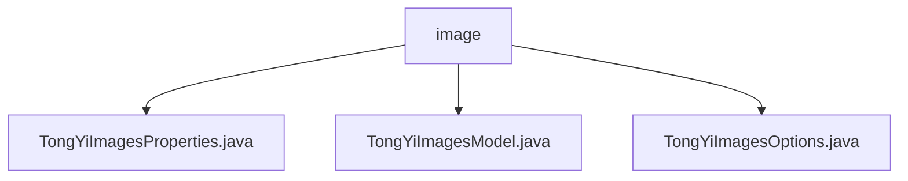

# 基础信息

|      |      |
|------|------|
| 编码语言 | .java |
| 代码路径 | yudao-module-ai/yudao-spring-boot-starter-ai/src/main/java/com/alibaba/cloud/ai/tongyi/image |
| 包名 | com.alibaba.cloud.ai.tongyi.image |
| 概述说明 | TongYiImagesProperties类是Spring Cloud Alibaba AI框架中用于配置图像生成功能的关键类，管理图像生成的配置参数，包括前缀、默认模型WANX_V1、启用状态及模型选择和生成数量等选项。TongYiImagesModel类实现了ImageModel接口，用于调用通义图像生成服务，包含默认图像选项、图像合成API等属性，提供call、merge、convert等方法处理图像生成和响应。TongYiImagesOptions类用于配置图像生成参数，默认模型为"wanx-v1"，支持设置图像大小、数量等，采用Builder模式简化配置过程。 |

# 说明

TongYiImagesProperties类是Spring Cloud Alibaba AI框架中用于配置图像生成功能的关键类，主要负责管理与图像生成相关的各种配置参数。该类定义了配置的前缀，使得在应用程序的配置文件中，所有与图像生成相关的属性可以通过该前缀统一管理和访问。默认的模型名称为WANX_V1，这是框架推荐的图像生成模型，用户可以根据需要选择其他模型。图像生成功能默认启用，用户可以通过配置关闭。此外，该类还提供了模型选择和生成数量等选项设置，使用户能够根据具体需求灵活调整图像生成行为。

TongYiImagesModel类实现了ImageModel接口，专门用于调用通义图像生成服务。该类包含多个关键属性和方法，如默认图像选项、图像合成API和图像大小连接符等，这些属性在图像生成过程中起到重要作用。通过构造函数，类在初始化时会设置图像合成API和默认选项，确保后续操作的基础配置正确。类提供了获取默认选项的方法，方便用户快速获取预设的图像生成参数。核心功能包括call方法，用于调用图像生成服务并返回生成的图像响应；merge方法，用于合并用户自定义的图像选项与默认选项；convert方法，用于将图像合成结果转换为标准的图像响应格式。此外，类还提供了将图像URL转换为Base64编码格式的工具方法，便于图像数据的传输和存储。

TongYiImagesOptions类用于配置图像生成参数，提供了多种参数设置选项。默认情况下，模型名称设置为"wanx-v1"，生成图像的宽度和高度均默认为1024像素。用户可以通过该类设置生成图像的数量，并通过getter和setter方法获取或修改这些参数。该类支持equals、hashCode和toString方法，以便进行对象比较、哈希计算和字符串表示。为了简化对象的创建和配置过程，TongYiImagesOptions类采用了Builder模式，允许用户通过链式调用的方式设置参数，使代码更加简洁和易读。通过这些配置选项，用户可以灵活地调整图像生成的各项参数，满足不同的应用需求。

### 包内部结构视图

### 描述信息：
该Mermaid图展示了`yudao-module-ai`模块中`image`文件夹下的三个Java文件之间的调用关系。`TongYiImagesProperties.java`、`TongYiImagesModel.java`和`TongYiImagesOptions.java`都位于`image`文件夹下，且它们之间没有直接的调用关系，而是通过`image`文件夹进行关联。

# 文件列表 File List

| 名称   | 类型  | 说明 |
|-------|------|-------------|
| [TongYiImagesOptions.java](TongYiImagesOptions.md) | file | TongYiImagesOptions类用于配置图像生成参数，包含模型名称（默认wanx-v1）、生成数量、宽度（默认1024）和高度（默认1024）。提供getter、setter、equals、hashCode和toString方法，支持Builder模式和链式调用设置参数。 |
| [TongYiImagesModel.java](TongYiImagesModel.md) | file | TongYiImagesModel类实现ImageModel接口，用于调用通义图像生成服务。类包含默认图像选项、图像合成API等属性，通过构造函数初始化。提供获取默认选项、调用图像生成服务、合并图像选项、转换图像合成结果及将图像URL转为Base64编码的方法。 |
| [TongYiImagesProperties.java](TongYiImagesProperties.md) | file | TongYiImagesProperties类用于配置Spring Cloud Alibaba AI的图像生成功能，包含配置前缀、默认模型名称（WANX_V1）、启用状态（默认为true）及选项设置（模型和生成数量）。 |

