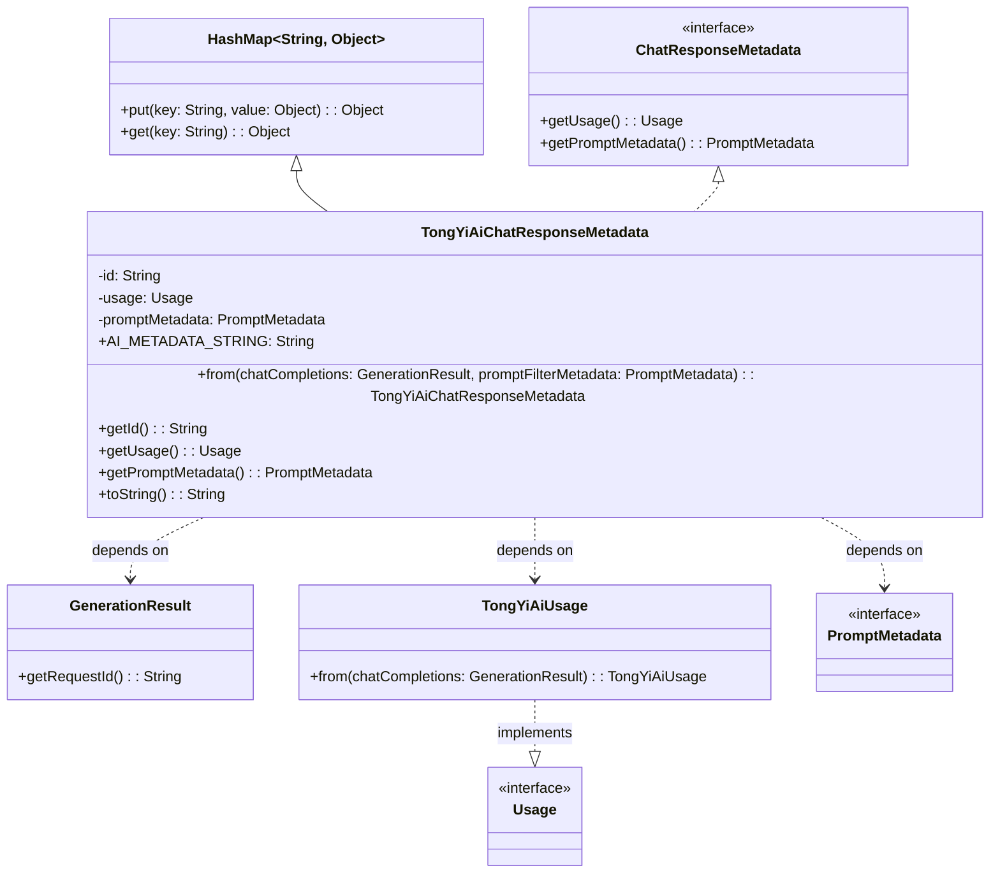
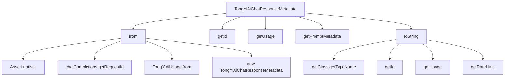

# 基础信息

|      |      |
|------|------|
| 编码语言 | .java |
| 代码路径 | yudao-module-ai/yudao-spring-boot-starter-ai/src/main/java/com/alibaba/cloud/ai/tongyi/metadata/TongYiAiChatResponseMetadata.java |
| 包名 | com.alibaba.cloud.ai.tongyi.metadata |
| 依赖项 | ['com.alibaba.dashscope.aigc.generation.GenerationResult', 'org.springframework.ai.chat.metadata.ChatResponseMetadata', 'org.springframework.ai.chat.metadata.PromptMetadata', 'org.springframework.ai.chat.metadata.Usage', 'org.springframework.util.Assert', 'java.util.HashMap'] |
| 概述说明 | TongYiAiChatResponseMetadata类继承HashMap并实现ChatResponseMetadata接口，包含id、usage和promptMetadata属性。通过from方法从GenerationResult和PromptMetadata生成实例，提供获取属性方法，并重写toString以格式化输出元数据。 |

# 说明

TongYiAiChatResponseMetadata类是一个继承自HashMap并实现了ChatResponseMetadata接口的类，主要用于处理聊天响应的元数据信息。该类包含三个主要属性：id、usage和promptMetadata。id属性用于唯一标识一个响应，usage属性记录了资源的使用情况，而promptMetadata属性则存储了与提示相关的元数据信息。

该类提供了一个from方法，用于从GenerationResult和PromptMetadata生成TongYiAiChatResponseMetadata的实例。这个方法使得开发者能够方便地将生成结果和提示元数据转换为一个包含所有必要信息的元数据对象。

此外，TongYiAiChatResponseMetadata类还提供了获取id、usage和promptMetadata的方法，使得外部代码可以轻松访问这些属性。为了便于调试和日志记录，该类还重写了toString方法，以格式化输出元数据信息，使其更易于阅读和理解。

总的来说，TongYiAiChatResponseMetadata类通过继承HashMap并实现ChatResponseMetadata接口，提供了一个灵活且功能丰富的元数据管理工具，适用于处理聊天响应的各种元数据需求。

# 类列表 Class Summary

| 名称   | 类型  | 说明 |
|-------|------|-------------|
| TongYiAiChatResponseMetadata | class | TongYiAiChatResponseMetadata类继承自HashMap并实现ChatResponseMetadata接口，包含id、usage和promptMetadata属性。通过from方法从GenerationResult和PromptMetadata生成实例，提供获取id、usage和promptMetadata的方法，并重写toString方法以格式化输出元数据信息。 |

## 类 TongYiAiChatResponseMetadata

|      |      |
|------|------|
| 访问范围 | public |
| 类型 | class |
| 名称 | TongYiAiChatResponseMetadata |
| 说明 | TongYiAiChatResponseMetadata类继承自HashMap并实现ChatResponseMetadata接口，包含id、usage和promptMetadata属性。通过from方法从GenerationResult和PromptMetadata生成实例，提供获取id、usage和promptMetadata的方法，并重写toString方法以格式化输出元数据信息。 |

### UML类图

### 描述：
该UML类图展示了`TongYiAiChatResponseMetadata`类的结构及其与其他类的关系。`TongYiAiChatResponseMetadata`继承自`HashMap`并实现了`ChatResponseMetadata`接口。它依赖于`GenerationResult`、`TongYiAiUsage`和`PromptMetadata`类，并通过`from`方法创建实例。`TongYiAiUsage`实现了`Usage`接口。

### 内部方法调用关系图

### 描述信息：
该图展示了`TongYiAiChatResponseMetadata`类中方法的调用关系。`from`方法调用了多个辅助方法，如`Assert.notNull`、`chatCompletions.getRequestId`和`TongYiAiUsage.from`，最终创建了一个新的`TongYiAiChatResponseMetadata`实例。`toString`方法则调用了多个getter方法来生成最终的字符串表示。

### 字段列表 Field List

| 名称  | 类型  | 说明 |
|-------|-------|------|
| usage | Usage | private final Usage usage; 声明了一个私有的、不可变的Usage类型变量usage。 |
| id | String | private final String id; 声明了一个私有的、不可变的字符串类型变量id。 |
| AI_METADATA_STRING = "{ @type: %1$s, id: %2$s, usage: %3$s, rateLimit: %4$s }" | String | protected static final String AI_METADATA_STRING 是一个包含类型、ID、使用情况和速率限制的格式化字符串模板。 |
| promptMetadata | PromptMetadata | private final PromptMetadata promptMetadata; 声明了一个私有的、不可变的PromptMetadata类型变量promptMetadata，用于存储与提示相关的元数据信息。 |

### 方法列表 Method List

| 名称  | 类型  | 说明 |
|-------|-------|------|
| getId | String | 该方法返回当前对象的id属性值。 |
| getUsage | Usage | 该方法返回当前对象的`usage`属性值，用于获取使用情况信息。 |
| getPromptMetadata | PromptMetadata | 该方法返回当前对象的`promptMetadata`属性，用于获取提示元数据信息。 |
| toString | String | 该方法重写了toString()，返回格式化字符串，包含类名、ID、使用情况和速率限制信息。 |
| from | TongYiAiChatResponseMetadata | 该方法从`GenerationResult`和`PromptMetadata`生成`TongYiAiChatResponseMetadata`对象，确保`chatCompletions`不为空，提取`requestId`和`usage`信息，最终返回包含`id`、`usage`和`promptFilterMetadata`的响应元数据对象。 |

