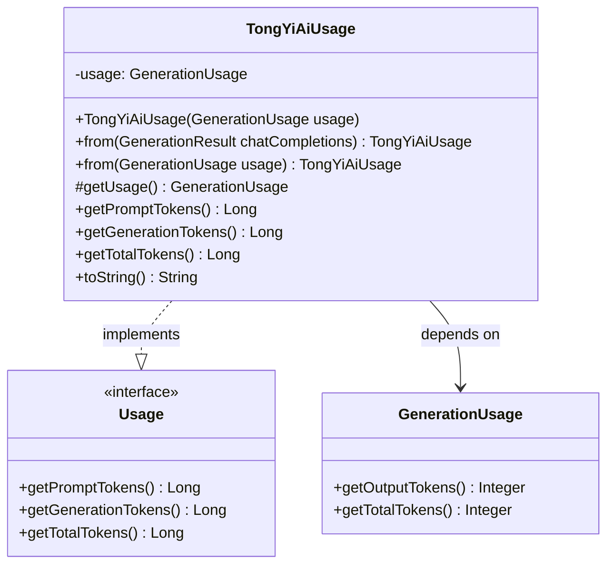

# 基础信息

|      |      |
|------|------|
| 编码语言 | .java |
| 代码路径 | yudao-module-ai/yudao-spring-boot-starter-ai/src/main/java/com/alibaba/cloud/ai/tongyi/metadata/TongYiAiUsage.java |
| 包名 | com.alibaba.cloud.ai.tongyi.metadata |
| 依赖项 | ['com.alibaba.dashscope.aigc.generation.GenerationResult', 'com.alibaba.dashscope.aigc.generation.GenerationUsage', 'org.springframework.ai.chat.metadata.Usage', 'org.springframework.util.Assert'] |
| 概述说明 | TongYiAiUsage类实现Usage接口，包含GenerationUsage属性，构造函数要求其非空。提供从GenerationResult和GenerationUsage创建实例的静态方法。类方法可获取生成令牌数和总令牌数，但未实现获取提示令牌数的方法。toString方法返回GenerationUsage的字符串表示。 |

# 说明

TongYiAiUsage类实现了Usage接口，并包含一个GenerationUsage对象作为其属性。该类的构造函数要求传入的GenerationUsage对象不能为空，确保实例化时具有有效的生成使用数据。TongYiAiUsage类提供了两个静态方法，分别用于从GenerationResult和GenerationUsage对象创建TongYiAiUsage实例，这使得从不同来源生成TongYiAiUsage对象变得灵活和方便。

在功能方面，TongYiAiUsage类提供了获取生成令牌数和总令牌数的方法，允许用户查询与生成操作相关的令牌使用情况。然而，该类尚未实现获取提示令牌数的方法，这意味着当前无法通过TongYiAiUsage类直接获取与提示相关的令牌使用信息。

此外，TongYiAiUsage类重写了toString方法，该方法返回GenerationUsage对象的字符串表示形式，便于调试和日志记录时查看生成使用的详细信息。总体而言，TongYiAiUsage类通过封装GenerationUsage对象，提供了对生成操作令牌使用情况的查询功能，但在提示令牌数的获取方面仍有待完善。

# 类列表 Class Summary

| 名称   | 类型  | 说明 |
|-------|------|-------------|
| TongYiAiUsage | class | TongYiAiUsage类实现了Usage接口，包含一个GenerationUsage对象作为属性。构造函数要求GenerationUsage不为空。提供了从GenerationResult和GenerationUsage创建TongYiAiUsage实例的静态方法。类方法包括获取生成令牌数和总令牌数，未实现获取提示令牌数的方法。toString方法返回GenerationUsage的字符串表示。 |


## 类 TongYiAiUsage

|      |      |
|------|------|
| 访问范围 | public |
| 类型 | class |
| 名称 | TongYiAiUsage |
| 说明 | TongYiAiUsage类实现了Usage接口，包含一个GenerationUsage对象作为属性。构造函数要求GenerationUsage不为空。提供了从GenerationResult和GenerationUsage创建TongYiAiUsage实例的静态方法。类方法包括获取生成令牌数和总令牌数，未实现获取提示令牌数的方法。toString方法返回GenerationUsage的字符串表示。 |


### UML类图



### 描述信息：
该UML类图展示了`TongYiAiUsage`类实现了`Usage`接口，并依赖于`GenerationUsage`类。`TongYiAiUsage`类通过构造函数和方法与`GenerationUsage`类进行交互，并重写了`Usage`接口中的方法。


### 内部方法调用关系图

```mermaid
graph TD
    TongYiAiUsage --> from[from(GenerationResult chatCompletions)]
    from --> from2[from(GenerationUsage usage)]
    from2 --> TongYiAiUsage
    TongYiAiUsage --> getUsage[getUsage()]
    TongYiAiUsage --> getPromptTokens[getPromptTokens()]
    TongYiAiUsage --> getGenerationTokens[getGenerationTokens()]
    TongYiAiUsage --> getTotalTokens[getTotalTokens()]
    TongYiAiUsage --> toString[toString()]
    getGenerationTokens --> getUsage
    getTotalTokens --> getUsage
    toString --> getUsage
```

### 描述信息：
该图展示了`TongYiAiUsage`类中方法之间的调用关系。`TongYiAiUsage`类通过`from`方法创建实例，并调用`getUsage`方法获取`GenerationUsage`对象。`getGenerationTokens`、`getTotalTokens`和`toString`方法都依赖于`getUsage`方法。`getPromptTokens`方法未实现，直接抛出异常。

### 字段列表 Field List

| 名称  | 类型  | 说明 |
|-------|-------|------|
| usage | GenerationUsage | `private final GenerationUsage usage;` 是一个私有且不可变的变量声明，类型为 `GenerationUsage`，用于存储生成使用情况的相关数据。 |

### 方法列表 Method List

| 名称  | 类型  | 说明 |
|-------|-------|------|
| getTotalTokens | Long | 该方法返回使用情况中总令牌数的长整型值。 |
| getUsage | GenerationUsage | `getUsage()` 方法返回当前对象的 `usage` 属性值。 |
| toString | String | 该代码片段重写了`toString`方法，使其返回当前对象的`usage`属性的字符串表示形式。 |
| from | TongYiAiUsage | 该方法将 `GenerationUsage` 对象转换为 `TongYiAiUsage` 对象，通过构造函数实现转换。 |
| getGenerationTokens | Long | 该方法返回生成文本的输出标记数，通过调用`getUsage().getOutputTokens()`获取并转换为`Long`类型。 |
| from | TongYiAiUsage | 该方法从`GenerationResult`对象中提取`chatCompletions`的`Usage`信息，并返回`TongYiAiUsage`对象。若`chatCompletions`为空，则抛出异常。 |
| getPromptTokens | Long | 该代码片段展示了一个Java方法的重写示例，方法名为`getPromptTokens`，返回类型为`Long`。方法当前未实现，抛出了`UnsupportedOperationException`异常，提示该方法尚未实现。 |


