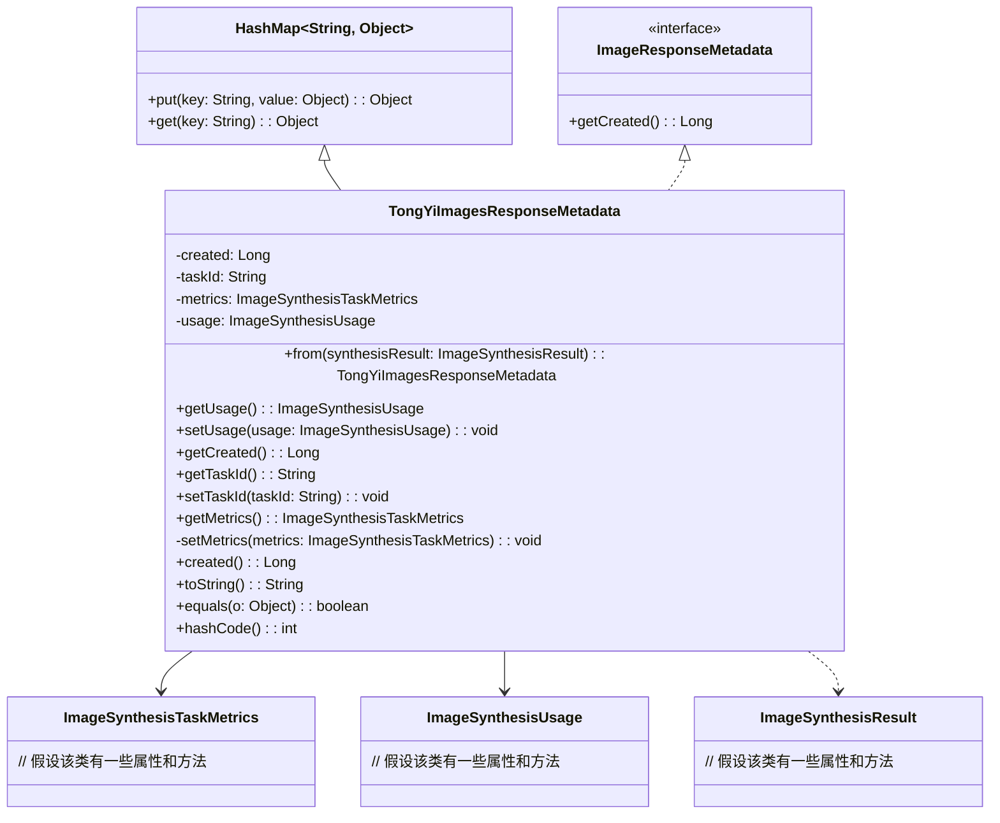

# 基础信息

|      |      |
|------|------|
| 编码语言 | .java |
| 代码路径 | yudao-module-ai/yudao-spring-boot-starter-ai/src/main/java/com/alibaba/cloud/ai/tongyi/metadata/TongYiImagesResponseMetadata.java |
| 包名 | com.alibaba.cloud.ai.tongyi.metadata |
| 依赖项 | ['com.alibaba.dashscope.aigc.imagesynthesis.ImageSynthesisResult', 'com.alibaba.dashscope.aigc.imagesynthesis.ImageSynthesisTaskMetrics', 'com.alibaba.dashscope.aigc.imagesynthesis.ImageSynthesisUsage', 'org.springframework.ai.image.ImageResponseMetadata', 'org.springframework.util.Assert', 'java.util.HashMap', 'java.util.Objects'] |
| 概述说明 | TongYiImagesResponseMetadata类继承HashMap并实现ImageResponseMetadata接口，包含创建时间、任务ID、任务指标和使用情况等属性，提供构造方法、getter/setter、toString、equals和hashCode方法，用于处理图像合成结果的元数据。 |

# 说明

TongYiImagesResponseMetadata类是一个继承自HashMap并实现了ImageResponseMetadata接口的类，主要用于处理图像合成结果的元数据。该类包含多个关键属性，包括创建时间、任务ID、任务指标和使用情况等。这些属性用于存储和描述图像合成任务的相关信息。为了便于对这些属性进行操作，类中提供了相应的构造方法、getter和setter方法。此外，类还实现了toString、equals和hashCode方法，以便于对象的字符串表示、比较和哈希计算。通过这些方法，可以方便地管理和处理图像合成结果的元数据，确保数据的完整性和一致性。

# 类列表 Class Summary

| 名称   | 类型  | 说明 |
|-------|------|-------------|
| TongYiImagesResponseMetadata | class | TongYiImagesResponseMetadata类继承自HashMap并实现ImageResponseMetadata接口，包含创建时间、任务ID、任务指标和使用情况等属性。提供构造方法、getter/setter方法、toString、equals和hashCode方法，用于处理图像合成结果的元数据。 |


## 类 TongYiImagesResponseMetadata

|      |      |
|------|------|
| 访问范围 | public |
| 类型 | class |
| 名称 | TongYiImagesResponseMetadata |
| 说明 | TongYiImagesResponseMetadata类继承自HashMap并实现ImageResponseMetadata接口，包含创建时间、任务ID、任务指标和使用情况等属性。提供构造方法、getter/setter方法、toString、equals和hashCode方法，用于处理图像合成结果的元数据。 |


### UML类图



### 描述信息：
该UML类图展示了`TongYiImagesResponseMetadata`类继承自`HashMap`并实现了`ImageResponseMetadata`接口。类中包含多个私有属性如`created`、`taskId`、`metrics`和`usage`，并提供了相应的getter和setter方法。类图还展示了`TongYiImagesResponseMetadata`与`ImageSynthesisTaskMetrics`、`ImageSynthesisUsage`和`ImageSynthesisResult`之间的关系。


### 内部方法调用关系图

```mermaid
graph TD
    TongYiImagesResponseMetadata --> from
    TongYiImagesResponseMetadata --> getUsage
    TongYiImagesResponseMetadata --> setUsage
    TongYiImagesResponseMetadata --> getCreated
    TongYiImagesResponseMetadata --> getTaskId
    TongYiImagesResponseMetadata --> setTaskId
    TongYiImagesResponseMetadata --> getMetrics
    TongYiImagesResponseMetadata --> setMetrics
    TongYiImagesResponseMetadata --> created
    TongYiImagesResponseMetadata --> toString
    TongYiImagesResponseMetadata --> equals
    TongYiImagesResponseMetadata --> hashCode
```

### 描述信息：
该图展示了`TongYiImagesResponseMetadata`类中各个方法之间的调用关系。`TongYiImagesResponseMetadata`类包含了多个方法，如`from`、`getUsage`、`setUsage`等，这些方法主要用于处理图像合成响应的元数据。图中的箭头表示方法之间的调用关系，清晰地展示了类内部方法的交互方式。

### 字段列表 Field List

| 名称  | 类型  | 说明 |
|-------|-------|------|
| taskId | String | 任务ID为私有字符串类型变量，用于标识特定任务。 |
| metrics | ImageSynthesisTaskMetrics | private ImageSynthesisTaskMetrics metrics; 是一个私有变量，用于存储图像合成任务的相关性能指标数据。 |
| usage | ImageSynthesisUsage | private ImageSynthesisUsage usage; 表示一个私有的图像合成使用情况对象，用于存储或管理图像合成的相关数据或操作。 |
| created | Long | private final Long created; 表示一个私有的、不可变的Long类型变量created，用于存储创建时间或相关时间戳。 |

### 方法列表 Method List

| 名称  | 类型  | 说明 |
|-------|-------|------|
| created | Long | 该方法返回一个长整型值，表示创建时间。 |
| getTaskId | String | 该方法返回一个字符串类型的任务ID，具体实现为直接返回成员变量taskId的值。 |
| setTaskId | void | 该方法用于设置任务ID，接受一个字符串类型的参数taskId，并将其赋值给当前对象的taskId属性。 |
| getCreated | Long | 该方法返回一个表示创建时间的`Long`类型值，变量名为`created`。 |
| toString | String | TongYiImagesResponseMetadata类的toString方法返回包含created字段的字符串表示形式。 |
| getMetrics | ImageSynthesisTaskMetrics | 方法 `getMetrics()` 返回 `ImageSynthesisTaskMetrics` 类型的 `metrics` 对象。 |
| getUsage | ImageSynthesisUsage | 该方法返回一个`ImageSynthesisUsage`类型的对象`usage`，用于获取图像合成的使用情况。 |
| hashCode | int | 该方法重写了hashCode函数，使用Objects.hash方法计算并返回由created、taskId和metrics三个属性组合生成的哈希值。 |
| setMetrics | void | 该方法用于设置图像合成任务中的度量标准，通过传入`ImageSynthesisTaskMetrics`类型的参数`metrics`，将其赋值给当前对象的`metrics`属性。 |
| from | TongYiImagesResponseMetadata | 该方法从 `ImageSynthesisResult` 对象中提取关键信息，生成 `TongYiImagesResponseMetadata` 实例。要求输入对象不能为空，返回的实例包含当前时间戳、任务指标、任务ID和用量信息。 |
| setUsage | void | 该方法用于设置图像合成用途，通过传入`ImageSynthesisUsage`类型的参数`usage`来更新当前对象的`usage`属性。 |
| equals | boolean | 该方法重写了equals方法，用于比较两个TongYiImagesResponseMetadata对象是否相等。首先检查对象是否为同一实例，若是则返回true；若对象为null或类不同则返回false。最后比较created、taskId和metrics三个属性，若全部相等则返回true，否则返回false。 |


