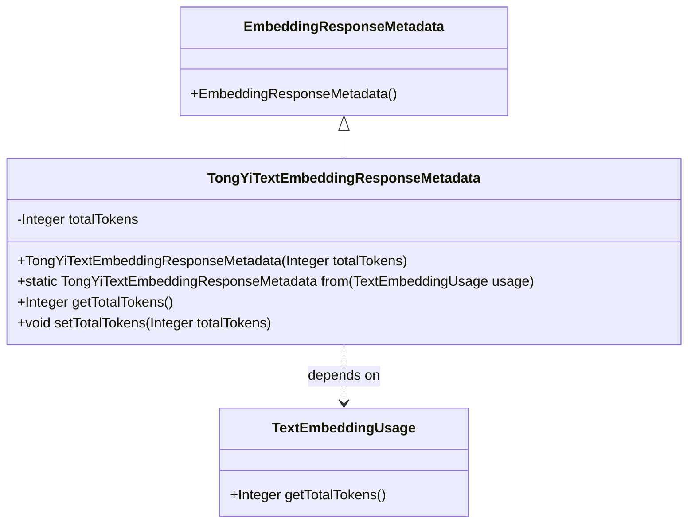

# 基础信息

|      |      |
|------|------|
| 编码语言 | .java |
| 代码路径 | yudao-module-ai/yudao-spring-boot-starter-ai/src/main/java/com/alibaba/cloud/ai/tongyi/metadata/TongYiTextEmbeddingResponseMetadata.java |
| 包名 | com.alibaba.cloud.ai.tongyi.metadata |
| 依赖项 | ['com.alibaba.dashscope.embeddings.TextEmbeddingUsage', 'org.springframework.ai.embedding.EmbeddingResponseMetadata'] |
| 概述说明 | TongYiTextEmbeddingResponseMetadata类继承自EmbeddingResponseMetadata，包含totalTokens属性，提供构造方法、静态工厂方法from用于创建实例，以及getTotalTokens和setTotalTokens方法用于访问和修改totalTokens。 |

# 说明

TongYiTextEmbeddingResponseMetadata类是一个继承自EmbeddingResponseMetadata的类，主要用于处理文本嵌入响应的元数据。该类包含一个名为totalTokens的属性，用于存储与文本嵌入相关的总令牌数。为了便于创建该类的实例，TongYiTextEmbeddingResponseMetadata提供了一个构造方法，允许在实例化时直接设置totalTokens的值。此外，该类还提供了一个静态工厂方法from，该方法可以用于从现有数据中创建TongYiTextEmbeddingResponseMetadata的实例。为了访问和修改totalTokens属性，该类提供了getTotalTokens和setTotalTokens方法。getTotalTokens方法用于获取当前实例中的totalTokens值，而setTotalTokens方法则用于更新或设置totalTokens的值。通过这些方法，用户可以方便地管理和操作与文本嵌入响应相关的元数据信息。

# 类列表 Class Summary

| 名称   | 类型  | 说明 |
|-------|------|-------------|
| TongYiTextEmbeddingResponseMetadata | class | TongYiTextEmbeddingResponseMetadata类继承自EmbeddingResponseMetadata，包含totalTokens属性，提供构造方法、静态工厂方法from用于创建实例，以及getTotalTokens和setTotalTokens方法用于访问和修改totalTokens。 |


## 类 TongYiTextEmbeddingResponseMetadata

|      |      |
|------|------|
| 访问范围 | public |
| 类型 | class |
| 名称 | TongYiTextEmbeddingResponseMetadata |
| 说明 | TongYiTextEmbeddingResponseMetadata类继承自EmbeddingResponseMetadata，包含totalTokens属性，提供构造方法、静态工厂方法from用于创建实例，以及getTotalTokens和setTotalTokens方法用于访问和修改totalTokens。 |


### UML类图



### 描述信息：
该UML类图展示了`TongYiTextEmbeddingResponseMetadata`类继承自`EmbeddingResponseMetadata`，并且依赖于`TextEmbeddingUsage`类。`TongYiTextEmbeddingResponseMetadata`类包含一个私有属性`totalTokens`，并提供了构造方法、静态工厂方法以及getter和setter方法。


### 内部方法调用关系图

```mermaid
graph TD
    A[TongYiTextEmbeddingResponseMetadata] --> B[from(TextEmbeddingUsage usage)]
    B --> C[new TongYiTextEmbeddingResponseMetadata(usage.getTotalTokens())]
    A --> D[getTotalTokens()]
    A --> E[setTotalTokens(Integer totalTokens)]
```

### 描述信息：
该图展示了`TongYiTextEmbeddingResponseMetadata`类中的方法调用关系。`from`方法调用构造函数创建新实例，`getTotalTokens`和`setTotalTokens`分别用于获取和设置`totalTokens`属性。

### 字段列表 Field List

| 名称  | 类型  | 说明 |
|-------|-------|------|
| totalTokens | Integer | 概要说明：该信息涉及一个私有整数变量totalTokens，用于存储或表示某种总数或计数。 |

### 方法列表 Method List

| 名称  | 类型  | 说明 |
|-------|-------|------|
| getTotalTokens | Integer | 该方法返回一个名为`totalTokens`的整数值。 |
| from | TongYiTextEmbeddingResponseMetadata | 该方法根据传入的TextEmbeddingUsage对象，创建一个TongYiTextEmbeddingResponseMetadata实例，并使用usage中的totalTokens值进行初始化。 |
| setTotalTokens | void | 这是一个Java方法，用于设置`totalTokens`变量的值。方法名为`setTotalTokens`，接受一个`Integer`类型的参数`totalTokens`，并将其赋值给类的成员变量`this.totalTokens`。 |


