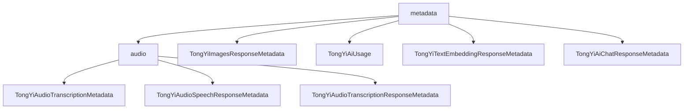

# 基础信息

|      |      |
|------|------|
| 编码语言 | .java |
| 代码路径 | yudao-module-ai/yudao-spring-boot-starter-ai/src/main/java/com/alibaba/cloud/ai/tongyi/metadata |
| 包名 | com.alibaba.cloud.ai.tongyi.metadata |
| 概述说明 | TongYiAudioSpeechResponseMetadata和TongYiAudioTranscriptionResponseMetadata类继承自HashMap并实现ResponseMetadata接口，分别用于管理语音合成和音频转录响应的元数据。TongYiImagesResponseMetadata类处理图像合成结果的元数据，包含创建时间、任务ID等属性。TongYiAiUsage类封装GenerationUsage对象，提供生成操作令牌使用情况的查询功能。TongYiTextEmbeddingResponseMetadata类处理文本嵌入响应的元数据，包含总令牌数属性。TongYiAiChatResponseMetadata类管理聊天响应的元数据，包含id、usage和promptMetadata属性。这些类通过丰富的属性和方法，支持开发者对各类响应的元数据进行有效管理和操作。 |

# 说明

TongYiAudioSpeechResponseMetadata类和TongYiAudioTranscriptionResponseMetadata类是两个继承自HashMap并实现了ResponseMetadata接口的类，分别用于处理语音合成和音频转录响应的元数据信息。TongYiAudioSpeechResponseMetadata类包含多个重要属性，如SpeechSynthesisUsage、requestId和Sentence，支持通过SpeechSynthesisResult对象或字符串创建实例，并提供对rateLimit、usage、requestId和sentence等属性的设置与获取方法。TongYiAudioTranscriptionResponseMetadata类则包含RateLimit和usage属性，支持从TranscriptionResult对象创建实例，并提供相应的getter和setter方法。两个类都重写了toString方法，便于调试和日志记录。

TongYiImagesResponseMetadata类继承自HashMap并实现了ImageResponseMetadata接口，主要用于处理图像合成结果的元数据。该类包含创建时间、任务ID、任务指标和使用情况等属性，并提供构造方法、getter和setter方法，以及toString、equals和hashCode方法，便于管理和处理图像合成结果的元数据。

TongYiAiUsage类实现了Usage接口，包含一个GenerationUsage对象作为属性，要求传入的GenerationUsage对象不能为空。该类提供了从GenerationResult和GenerationUsage对象创建实例的静态方法，并提供了获取生成令牌数和总令牌数的方法，但尚未实现获取提示令牌数的方法。类中还重写了toString方法，便于调试和日志记录。

TongYiTextEmbeddingResponseMetadata类继承自EmbeddingResponseMetadata，主要用于处理文本嵌入响应的元数据。该类包含totalTokens属性，提供构造方法和静态工厂方法from，以及getTotalTokens和setTotalTokens方法，便于管理和操作文本嵌入响应的元数据信息。

TongYiAiChatResponseMetadata类继承自HashMap并实现了ChatResponseMetadata接口，主要用于处理聊天响应的元数据信息。该类包含id、usage和promptMetadata属性，提供from方法用于从GenerationResult和PromptMetadata生成实例，并提供获取id、usage和promptMetadata的方法。类中还重写了toString方法，便于调试和日志记录。

总的来说，这些类都是功能丰富的元数据管理工具，分别适用于处理语音合成、音频转录、图像合成、文本嵌入和聊天响应的元数据信息。通过其提供的属性和方法，开发者可以有效地管理和操作这些元数据，确保系统的稳定性和可维护性。

### 包内部结构视图

### 描述信息：
该Mermaid图展示了`yudao-module-ai`模块中`metadata`文件夹及其子文件夹`audio`中的文件调用关系。`metadata`文件夹包含多个与TongYi AI相关的元数据类，而`audio`文件夹则专门处理音频相关的元数据类。图中清晰地展示了各个文件之间的层级关系。

# 文件列表 File List

| 名称   | 类型  | 说明 |
|-------|------|-------------|
| [TongYiAiChatResponseMetadata.java](TongYiAiChatResponseMetadata.md) | file | TongYiAiChatResponseMetadata类继承HashMap并实现ChatResponseMetadata接口，包含id、usage和promptMetadata属性。通过from方法从GenerationResult和PromptMetadata生成实例，提供获取属性方法，并重写toString以格式化输出元数据。 |
| [TongYiTextEmbeddingResponseMetadata.java](TongYiTextEmbeddingResponseMetadata.md) | file | TongYiTextEmbeddingResponseMetadata类继承自EmbeddingResponseMetadata，包含totalTokens属性，提供构造方法、静态工厂方法from用于创建实例，以及getTotalTokens和setTotalTokens方法用于访问和修改totalTokens。 |
| [TongYiAiUsage.java](TongYiAiUsage.md) | file | TongYiAiUsage类实现Usage接口，包含GenerationUsage属性，构造函数要求其非空。提供从GenerationResult和GenerationUsage创建实例的静态方法。类方法可获取生成令牌数和总令牌数，但未实现获取提示令牌数的方法。toString方法返回GenerationUsage的字符串表示。 |
| [TongYiImagesResponseMetadata.java](TongYiImagesResponseMetadata.md) | file | TongYiImagesResponseMetadata类继承HashMap并实现ImageResponseMetadata接口，包含创建时间、任务ID、任务指标和使用情况等属性，提供构造方法、getter/setter、toString、equals和hashCode方法，用于处理图像合成结果的元数据。 |
| [audio](audio/_package.md) | folder | TongYiAudioSpeechResponseMetadata类继承HashMap并实现ResponseMetadata接口，包含SpeechSynthesisUsage、requestId、Sentence等属性，支持通过SpeechSynthesisResult或字符串初始化，提供属性设置与获取方法，便于管理语音合成元数据。TongYiAudioTranscriptionResponseMetadata类同样继承HashMap并实现ResponseMetadata接口，包含RateLimit和usage属性，支持从TranscriptionResult初始化，提供getter/setter方法，便于管理音频转录响应元数据。两者均重写toString方法，便于调试和日志记录。 |

