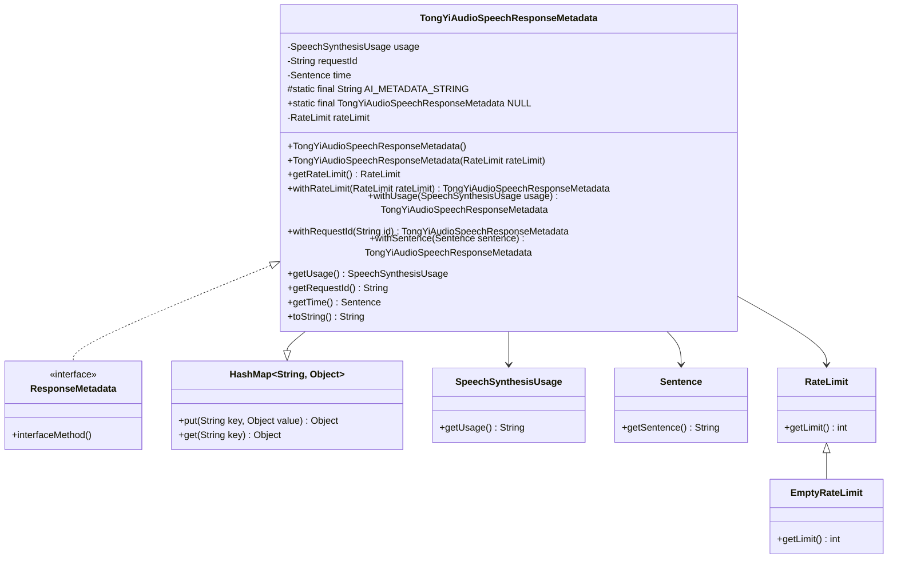

# 基础信息

|      |      |
|------|------|
| 编码语言 | .java |
| 代码路径 | yudao-module-ai/yudao-spring-boot-starter-ai/src/main/java/com/alibaba/cloud/ai/tongyi/metadata/audio/TongYiAudioSpeechResponseMetadata.java |
| 包名 | com.alibaba.cloud.ai.tongyi.metadata.audio |
| 依赖项 | ['com.alibaba.dashscope.audio.tts.SpeechSynthesisResult', 'com.alibaba.dashscope.audio.tts.SpeechSynthesisUsage', 'com.alibaba.dashscope.audio.tts.timestamp.Sentence', 'org.springframework.ai.chat.metadata.EmptyRateLimit', 'org.springframework.ai.chat.metadata.RateLimit', 'org.springframework.ai.model.ResponseMetadata', 'org.springframework.lang.Nullable', 'org.springframework.util.Assert', 'java.util.HashMap'] |
| 概述说明 | TongYiAudioSpeechResponseMetadata类继承HashMap并实现ResponseMetadata接口，包含SpeechSynthesisUsage、requestId、Sentence等属性，支持从SpeechSynthesisResult或字符串创建实例，提供相关属性的设置与获取方法，并包含NULL对象和toString方法。 |

# 说明

TongYiAudioSpeechResponseMetadata类是一个继承自HashMap并实现了ResponseMetadata接口的类。该类包含多个重要属性，包括SpeechSynthesisUsage、requestId和Sentence等。这些属性用于存储与语音合成相关的元数据信息。该类支持通过SpeechSynthesisResult对象或字符串来创建实例，提供了灵活的对象初始化方式。

在功能上，TongYiAudioSpeechResponseMetadata类提供了对rateLimit、usage、requestId和sentence等属性的设置与获取方法。这些方法使得开发者能够方便地访问和修改这些关键属性，从而实现对语音合成过程的精细控制。此外，该类还包含一个NULL对象，用于表示空值或无效状态，以及一个toString方法，用于将对象的内容以字符串形式输出，便于调试和日志记录。

总的来说，TongYiAudioSpeechResponseMetadata类是一个功能丰富的元数据管理工具，适用于处理与语音合成相关的各种信息。通过其提供的属性和方法，开发者可以有效地管理和操作语音合成的元数据，确保系统的稳定性和可维护性。

# 类列表 Class Summary

| 名称   | 类型  | 说明 |
|-------|------|-------------|
| TongYiAudioSpeechResponseMetadata | class | TongYiAudioSpeechResponseMetadata类继承自HashMap并实现ResponseMetadata接口，包含SpeechSynthesisUsage、requestId、Sentence等属性，支持从SpeechSynthesisResult或字符串创建实例。提供rateLimit、usage、requestId、sentence的设置与获取方法，并包含NULL对象和toString方法。 |


## 类 TongYiAudioSpeechResponseMetadata

|      |      |
|------|------|
| 访问范围 | public |
| 类型 | class |
| 名称 | TongYiAudioSpeechResponseMetadata |
| 说明 | TongYiAudioSpeechResponseMetadata类继承自HashMap并实现ResponseMetadata接口，包含SpeechSynthesisUsage、requestId、Sentence等属性，支持从SpeechSynthesisResult或字符串创建实例。提供rateLimit、usage、requestId、sentence的设置与获取方法，并包含NULL对象和toString方法。 |


### UML类图



### 描述信息：
该UML类图展示了`TongYiAudioSpeechResponseMetadata`类的结构及其与相关类的关系。`TongYiAudioSpeechResponseMetadata`继承自`HashMap`并实现了`ResponseMetadata`接口，包含多个属性和方法，用于处理语音合成的响应元数据。


### 内部方法调用关系图

```mermaid
graph TD
    TongYiAudioSpeechResponseMetadata --> from_SpeechSynthesisResult
    TongYiAudioSpeechResponseMetadata --> from_String
    TongYiAudioSpeechResponseMetadata --> getRateLimit
    TongYiAudioSpeechResponseMetadata --> withRateLimit
    TongYiAudioSpeechResponseMetadata --> withUsage
    TongYiAudioSpeechResponseMetadata --> withRequestId
    TongYiAudioSpeechResponseMetadata --> withSentence
    TongYiAudioSpeechResponseMetadata --> getUsage
    TongYiAudioSpeechResponseMetadata --> getRequestId
    TongYiAudioSpeechResponseMetadata --> getTime
    TongYiAudioSpeechResponseMetadata --> toString
```

### 描述信息：
该图展示了`TongYiAudioSpeechResponseMetadata`类中各个方法之间的调用关系。`TongYiAudioSpeechResponseMetadata`类通过`from`方法从`SpeechSynthesisResult`或`String`创建实例，并通过`with`方法设置属性。`get`方法用于获取属性值，`toString`方法用于生成对象的字符串表示。

### 字段列表 Field List

| 名称  | 类型  | 说明 |
|-------|-------|------|
| time | Sentence | 私人句子时间；包含所有关键点和重要信息；语言简洁；不使用任何文本语法格式。 |
| requestId | String | private String requestId; 定义了一个私有的字符串类型变量requestId，用于存储请求的唯一标识符。 |
| NULL = new TongYiAudioSpeechResponseMetadata() {
	} | TongYiAudioSpeechResponseMetadata | `TongYiAudioSpeechResponseMetadata`类中定义了一个静态常量`NULL`，该常量是`TongYiAudioSpeechResponseMetadata`类的一个空实例。 |
| usage | SpeechSynthesisUsage | SpeechSynthesisUsage类用于管理和记录语音合成的使用情况，包括调用次数、成功率和资源消耗等关键指标，以便优化性能和监控系统状态。 |
| rateLimit | RateLimit | 概要说明：该代码片段定义了一个可为空的私有变量 `rateLimit`，其类型为 `RateLimit`。`@Nullable` 注解表示该变量可以接受空值。 |
| AI_METADATA_STRING = "{ @type: %1$s, requestsLimit: %2$s }" | String | protected static final String AI_METADATA_STRING 定义了一个包含类型和请求限制的格式化字符串，其中类型和请求限制分别由占位符%1$s和%2$s表示。 |

### 方法列表 Method List

| 名称  | 类型  | 说明 |
|-------|-------|------|
| withRequestId | TongYiAudioSpeechResponseMetadata | 该方法用于设置请求ID并返回当前对象实例，以便支持链式调用。 |
| getUsage | SpeechSynthesisUsage | `getUsage()` 方法返回 `usage` 对象，用于获取语音合成的使用情况。 |
| toString | String | 该方法重写了toString()方法，返回一个格式化字符串，包含类名和速率限制信息。 |
| getTime | Sentence | 该方法 `getTime()` 返回一个 `Sentence` 类型的对象 `time`，用于获取时间信息。 |
| getRequestId | String | 该方法返回一个字符串类型的请求ID，即`requestId`，用于获取当前请求的唯一标识符。 |
| from | TongYiAudioSpeechResponseMetadata | 该方法用于从字符串结果生成TongYiAudioSpeechResponseMetadata对象，要求输入结果不能为空，并返回一个新的TongYiAudioSpeechResponseMetadata实例。 |
| getRateLimit | RateLimit | 该方法返回一个`RateLimit`对象，如果当前`rateLimit`不为空则返回该对象，否则返回一个新的`EmptyRateLimit`对象。 |
| withUsage | TongYiAudioSpeechResponseMetadata | 该方法 `withUsage` 接受一个 `SpeechSynthesisUsage` 类型的参数 `usage`，并将其赋值给当前对象的 `usage` 属性，最后返回当前对象。 |
| from | TongYiAudioSpeechResponseMetadata | 该方法从`SpeechSynthesisResult`对象生成`TongYiAudioSpeechResponseMetadata`实例，确保输入不为空，并返回新创建的`speechResponseMetadata`对象。 |
| withRateLimit | TongYiAudioSpeechResponseMetadata | `public TongYiAudioSpeechResponseMetadata withRateLimit(RateLimit rateLimit)` 方法用于设置 `TongYiAudioSpeechResponseMetadata` 对象的速率限制属性，并返回当前对象实例。 |
| withSentence | TongYiAudioSpeechResponseMetadata | `public TongYiAudioSpeechResponseMetadata withSentence(Sentence sentence)` 方法用于将传入的 `sentence` 对象赋值给 `time` 属性，并返回当前对象实例。 |


