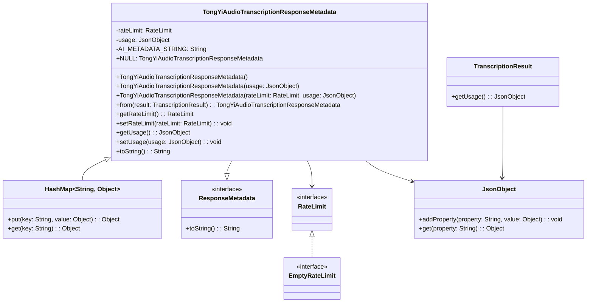

# 基础信息

|      |      |
|------|------|
| 编码语言 | .java |
| 代码路径 | yudao-module-ai/yudao-spring-boot-starter-ai/src/main/java/com/alibaba/cloud/ai/tongyi/metadata/audio/TongYiAudioTranscriptionResponseMetadata.java |
| 包名 | com.alibaba.cloud.ai.tongyi.metadata.audio |
| 依赖项 | ['com.alibaba.dashscope.audio.asr.transcription.TranscriptionResult', 'com.google.gson.JsonObject', 'org.springframework.ai.chat.metadata.EmptyRateLimit', 'org.springframework.ai.chat.metadata.RateLimit', 'org.springframework.ai.model.ResponseMetadata', 'org.springframework.util.Assert', 'javax.annotation.Nullable', 'java.util.HashMap'] |
| 概述说明 | TongYiAudioTranscriptionResponseMetadata类继承自HashMap并实现ResponseMetadata接口，包含可空的RateLimit和JsonObject usage属性。类提供多个构造函数，支持从TranscriptionResult创建实例，包含getter和setter方法，toString方法返回格式化字符串，包含类名和rateLimit信息。 |

# 说明

TongYiAudioTranscriptionResponseMetadata类是一个继承自HashMap并实现了ResponseMetadata接口的类。该类包含两个主要属性：一个可空的RateLimit对象和一个JsonObject类型的usage属性。这些属性用于存储与音频转录响应相关的元数据信息。

该类提供了多个构造函数，允许通过不同的方式创建其实例。其中一个构造函数支持从TranscriptionResult对象创建实例，这使得开发者能够方便地将转录结果转换为TongYiAudioTranscriptionResponseMetadata对象。此外，类中还包含了getter和setter方法，用于访问和修改RateLimit和usage属性的值。

为了便于调试和日志记录，TongYiAudioTranscriptionResponseMetadata类还重写了toString方法。该方法返回一个格式化的字符串，其中包含类名以及rateLimit信息，使得开发者能够快速了解对象的当前状态。

总的来说，TongYiAudioTranscriptionResponseMetadata类是一个功能丰富的工具类，旨在帮助开发者管理和处理音频转录响应的元数据。通过其灵活的构造函数和便捷的getter/setter方法，开发者可以轻松地操作和访问这些元数据信息。

# 类列表 Class Summary

| 名称   | 类型  | 说明 |
|-------|------|-------------|
| TongYiAudioTranscriptionResponseMetadata | class | TongYiAudioTranscriptionResponseMetadata类继承自HashMap并实现ResponseMetadata接口，包含可空的RateLimit和JsonObject usage属性。类提供了多个构造函数，支持从TranscriptionResult创建实例，并包含getter和setter方法。toString方法返回格式化字符串，包含类名和rateLimit信息。 |


## 类 TongYiAudioTranscriptionResponseMetadata

|      |      |
|------|------|
| 访问范围 | public |
| 类型 | class |
| 名称 | TongYiAudioTranscriptionResponseMetadata |
| 说明 | TongYiAudioTranscriptionResponseMetadata类继承自HashMap并实现ResponseMetadata接口，包含可空的RateLimit和JsonObject usage属性。类提供了多个构造函数，支持从TranscriptionResult创建实例，并包含getter和setter方法。toString方法返回格式化字符串，包含类名和rateLimit信息。 |


### UML类图



### 描述：
该UML类图展示了`TongYiAudioTranscriptionResponseMetadata`类的结构及其与其他类的关系。`TongYiAudioTranscriptionResponseMetadata`继承自`HashMap`并实现了`ResponseMetadata`接口。它包含`RateLimit`和`JsonObject`类型的属性，并通过`from`方法从`TranscriptionResult`对象创建实例。`RateLimit`接口由`EmptyRateLimit`实现。


### 内部方法调用关系图

```mermaid
graph TD
    TongYiAudioTranscriptionResponseMetadata --> from
    TongYiAudioTranscriptionResponseMetadata --> getRateLimit
    TongYiAudioTranscriptionResponseMetadata --> setRateLimit
    TongYiAudioTranscriptionResponseMetadata --> getUsage
    TongYiAudioTranscriptionResponseMetadata --> setUsage
    TongYiAudioTranscriptionResponseMetadata --> toString
    from --> Assert.notNull
    from --> new TongYiAudioTranscriptionResponseMetadata
    getRateLimit --> EmptyRateLimit
    toString --> getClass
    toString --> getRateLimit
```

### 描述信息：
该图展示了`TongYiAudioTranscriptionResponseMetadata`类中方法之间的调用关系。`from`方法调用`Assert.notNull`进行非空检查，并创建新的`TongYiAudioTranscriptionResponseMetadata`实例。`getRateLimit`方法返回`RateLimit`对象，若为空则返回`EmptyRateLimit`。`toString`方法调用`getClass`和`getRateLimit`来格式化输出字符串。

### 字段列表 Field List

| 名称  | 类型  | 说明 |
|-------|-------|------|
| rateLimit | RateLimit | 概要说明：该代码片段定义了一个可为空的私有变量 `rateLimit`，其类型为 `RateLimit`。 |
| usage | JsonObject | 该信息涉及一个私有的JsonObject对象，名为"usage"，用于存储或处理与使用情况相关的数据。 |
| NULL = new TongYiAudioTranscriptionResponseMetadata() {
	} | TongYiAudioTranscriptionResponseMetadata | 该代码片段定义了一个名为`NULL`的静态常量，类型为`TongYiAudioTranscriptionResponseMetadata`，并通过匿名类实例化。该常量用于表示某种空值或默认状态。 |
| AI_METADATA_STRING = "{ @type: %1$s, rateLimit: %4$s }" | String | protected static final String AI_METADATA_STRING 是一个包含类型和速率限制信息的字符串模板，其中类型和速率限制分别由占位符%1$s和%4$s表示。 |

### 方法列表 Method List

| 名称  | 类型  | 说明 |
|-------|-------|------|
| getUsage | JsonObject | 该方法返回一个JsonObject类型的usage对象，用于获取使用情况数据。 |
| toString | String | 该代码片段重写了toString方法，返回一个格式化字符串，包含类名和速率限制信息。 |
| getRateLimit | RateLimit | 该方法返回一个RateLimit对象，如果当前rateLimit不为空则返回该对象，否则返回一个新的EmptyRateLimit实例。 |
| setUsage | void | 该方法用于设置一个JsonObject类型的usage属性，通过传入的usage参数赋值给当前对象的usage属性。 |
| from | TongYiAudioTranscriptionResponseMetadata | 该方法从给定的TranscriptionResult对象中提取使用情况信息，并创建一个TongYiAudioTranscriptionResponseMetadata对象。要求输入的TranscriptionResult不能为空。 |
| setRateLimit | void | 该方法用于设置速率限制，接受一个可为空的RateLimit对象作为参数，并将其赋值给类的rateLimit属性。 |


