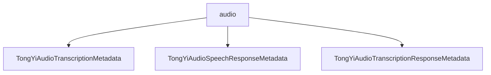

# 基础信息

|      |      |
|------|------|
| 编码语言 | .java |
| 代码路径 | yudao-module-ai/yudao-spring-boot-starter-ai/src/main/java/com/alibaba/cloud/ai/tongyi/metadata/audio |
| 包名 | com.alibaba.cloud.ai.tongyi.metadata.audio |
| 概述说明 | TongYiAudioSpeechResponseMetadata类继承HashMap并实现ResponseMetadata接口，包含SpeechSynthesisUsage、requestId、Sentence等属性，支持通过SpeechSynthesisResult或字符串初始化，提供属性设置与获取方法，便于管理语音合成元数据。TongYiAudioTranscriptionResponseMetadata类同样继承HashMap并实现ResponseMetadata接口，包含RateLimit和usage属性，支持从TranscriptionResult初始化，提供getter/setter方法，便于管理音频转录响应元数据。两者均重写toString方法，便于调试和日志记录。 |

# 说明

TongYiAudioSpeechResponseMetadata类和TongYiAudioTranscriptionResponseMetadata类是两个继承自HashMap并实现了ResponseMetadata接口的类，分别用于处理语音合成和音频转录响应的元数据信息。

TongYiAudioSpeechResponseMetadata类包含多个重要属性，如SpeechSynthesisUsage、requestId和Sentence，这些属性用于存储与语音合成相关的元数据。该类支持通过SpeechSynthesisResult对象或字符串来创建实例，提供了灵活的对象初始化方式。功能上，该类提供了对rateLimit、usage、requestId和sentence等属性的设置与获取方法，使开发者能够方便地访问和修改这些关键属性，从而实现对语音合成过程的精细控制。此外，该类还包含一个NULL对象，用于表示空值或无效状态，以及一个toString方法，用于将对象的内容以字符串形式输出，便于调试和日志记录。

TongYiAudioTranscriptionResponseMetadata类则包含两个主要属性：一个可空的RateLimit对象和一个JsonObject类型的usage属性，用于存储与音频转录响应相关的元数据信息。该类提供了多个构造函数，允许通过不同的方式创建实例，其中一个构造函数支持从TranscriptionResult对象创建实例，使得开发者能够方便地将转录结果转换为TongYiAudioTranscriptionResponseMetadata对象。类中还包含了getter和setter方法，用于访问和修改RateLimit和usage属性的值。为了便于调试和日志记录，该类还重写了toString方法，返回一个格式化的字符串，其中包含类名以及rateLimit信息。

总的来说，这两个类都是功能丰富的元数据管理工具，分别适用于处理语音合成和音频转录响应的元数据信息。通过其提供的属性和方法，开发者可以有效地管理和操作这些元数据，确保系统的稳定性和可维护性。

### 包内部结构视图

### 描述信息：
该Mermaid图展示了`audio`文件夹下的三个Java文件之间的调用关系。`audio`文件夹包含了`TongYiAudioTranscriptionMetadata`、`TongYiAudioSpeechResponseMetadata`和`TongYiAudioTranscriptionResponseMetadata`三个类文件，这些类文件都与音频处理相关，可能用于处理音频转录和语音响应的元数据。

# 文件列表 File List

| 名称   | 类型  | 说明 |
|-------|------|-------------|
| [TongYiAudioTranscriptionResponseMetadata.java](TongYiAudioTranscriptionResponseMetadata.md) | file | TongYiAudioTranscriptionResponseMetadata类继承自HashMap并实现ResponseMetadata接口，包含可空的RateLimit和JsonObject usage属性。类提供多个构造函数，支持从TranscriptionResult创建实例，包含getter和setter方法，toString方法返回格式化字符串，包含类名和rateLimit信息。 |
| [TongYiAudioSpeechResponseMetadata.java](TongYiAudioSpeechResponseMetadata.md) | file | TongYiAudioSpeechResponseMetadata类继承HashMap并实现ResponseMetadata接口，包含SpeechSynthesisUsage、requestId、Sentence等属性，支持从SpeechSynthesisResult或字符串创建实例，提供相关属性的设置与获取方法，并包含NULL对象和toString方法。 |
| [TongYiAudioTranscriptionMetadata.java](TongYiAudioTranscriptionMetadata.md) | file | 请提供需要总结的具体信息内容，以便我为您生成概要说明。 |

