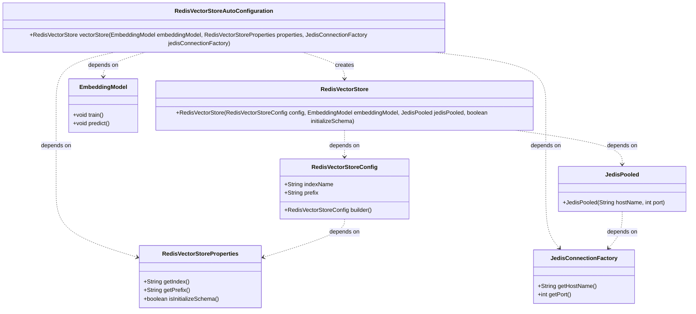
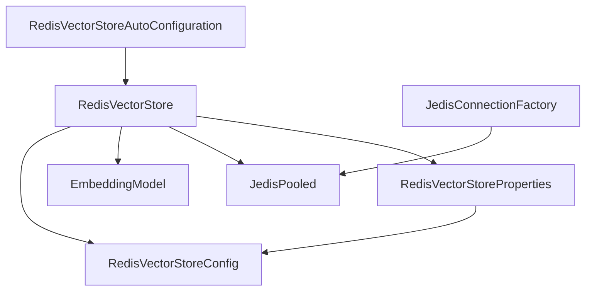

# 基础信息

|      |      |
|------|------|
| 编码语言 | .java |
| 代码路径 | yudao-module-ai/yudao-spring-boot-starter-ai/src/main/java/org/springframework/ai/autoconfigure/vectorstore/redis/RedisVectorStoreAutoConfiguration.java |
| 包名 | org.springframework.ai.autoconfigure.vectorstore.redis |
| 依赖项 | ['org.springframework.ai.embedding.EmbeddingModel', 'org.springframework.ai.vectorstore.RedisVectorStore', 'org.springframework.ai.vectorstore.RedisVectorStore.RedisVectorStoreConfig', 'org.springframework.boot.autoconfigure.AutoConfiguration', 'org.springframework.boot.autoconfigure.condition.ConditionalOnBean', 'org.springframework.boot.autoconfigure.condition.ConditionalOnClass', 'org.springframework.boot.autoconfigure.condition.ConditionalOnMissingBean', 'org.springframework.boot.autoconfigure.data.redis.RedisAutoConfiguration', 'org.springframework.boot.context.properties.EnableConfigurationProperties', 'org.springframework.context.annotation.Bean', 'org.springframework.data.redis.connection.jedis.JedisConnectionFactory', 'redis.clients.jedis.JedisPooled'] |
| 概述说明 | RedisVectorStoreAutoConfiguration在RedisAutoConfiguration后自动配置，依赖JedisPooled、JedisConnectionFactory、RedisVectorStore和EmbeddingModel类。当存在JedisConnectionFactory bean时，配置生效。通过RedisVectorStoreProperties配置属性，创建并返回RedisVectorStore bean，使用指定索引名称、前缀和Jedis连接池，可选择初始化模式。 |

# 说明

RedisVectorStoreAutoConfiguration类是一个自动配置类，它在RedisAutoConfiguration之后进行配置。该类的配置依赖于几个关键组件，包括JedisPooled、JedisConnectionFactory、RedisVectorStore和EmbeddingModel类。只有当系统中存在JedisConnectionFactory bean时，该配置才会生效。RedisVectorStoreAutoConfiguration类通过RedisVectorStoreProperties来读取和配置相关属性，这些属性用于创建并返回一个RedisVectorStore bean。在创建RedisVectorStore bean时，会使用指定的索引名称、前缀以及Jedis连接池。此外，该配置还允许选择初始化模式，以便在需要时对RedisVectorStore进行初始化。通过这种方式，RedisVectorStoreAutoConfiguration类确保了RedisVectorStore的正确配置和初始化，从而为系统提供了基于Redis的向量存储功能。

# 类列表 Class Summary

| 名称   | 类型  | 说明 |
|-------|------|-------------|
| RedisVectorStoreAutoConfiguration | class | RedisVectorStoreAutoConfiguration类在RedisAutoConfiguration之后自动配置，依赖于JedisPooled、JedisConnectionFactory、RedisVectorStore和EmbeddingModel类。当存在JedisConnectionFactory bean时，配置生效。该类通过RedisVectorStoreProperties配置属性，创建并返回一个RedisVectorStore bean，使用指定的索引名称、前缀和Jedis连接池，并可选择初始化模式。 |

## 类 RedisVectorStoreAutoConfiguration

|      |      |
|------|------|
| 访问范围 | @AutoConfiguration(after = RedisAutoConfiguration.class);@ConditionalOnClass({JedisPooled.class, JedisConnectionFactory.class, RedisVectorStore.class, EmbeddingModel.class});@ConditionalOnBean(JedisConnectionFactory.class);@EnableConfigurationProperties(RedisVectorStoreProperties.class);public |
| 类型 | class |
| 名称 | RedisVectorStoreAutoConfiguration |
| 说明 | RedisVectorStoreAutoConfiguration类在RedisAutoConfiguration之后自动配置，依赖于JedisPooled、JedisConnectionFactory、RedisVectorStore和EmbeddingModel类。当存在JedisConnectionFactory bean时，配置生效。该类通过RedisVectorStoreProperties配置属性，创建并返回一个RedisVectorStore bean，使用指定的索引名称、前缀和Jedis连接池，并可选择初始化模式。 |

### UML类图

### 描述信息：
该UML类图展示了`RedisVectorStoreAutoConfiguration`类及其依赖关系。`RedisVectorStoreAutoConfiguration`通过`vectorStore`方法创建`RedisVectorStore`实例，并依赖于`EmbeddingModel`、`RedisVectorStoreProperties`和`JedisConnectionFactory`。`RedisVectorStore`依赖于`RedisVectorStoreConfig`和`JedisPooled`，而`RedisVectorStoreConfig`则依赖于`RedisVectorStoreProperties`。

### 内部方法调用关系图

### 描述信息：
该图展示了`RedisVectorStoreAutoConfiguration`类中`vectorStore`方法的调用关系。`vectorStore`方法依赖于`RedisVectorStoreConfig`、`EmbeddingModel`、`JedisPooled`和`RedisVectorStoreProperties`等组件。`JedisConnectionFactory`用于创建`JedisPooled`实例，而`RedisVectorStoreProperties`则用于配置`RedisVectorStoreConfig`。

### 字段列表 Field List

| 名称  | 类型  | 说明 |
|-------|-------|------|

### 方法列表 Method List

| 名称  | 类型  | 说明 |
|-------|-------|------|
| vectorStore | RedisVectorStore | 该代码定义了一个名为`vectorStore`的Bean，用于创建Redis向量存储实例。它依赖于`EmbeddingModel`、`RedisVectorStoreProperties`和`JedisConnectionFactory`。通过`RedisVectorStoreConfig`配置索引名称和前缀，并使用`JedisPooled`连接Redis。如果未定义相同类型的Bean，则自动创建该实例，并可选择初始化数据库模式。 |

