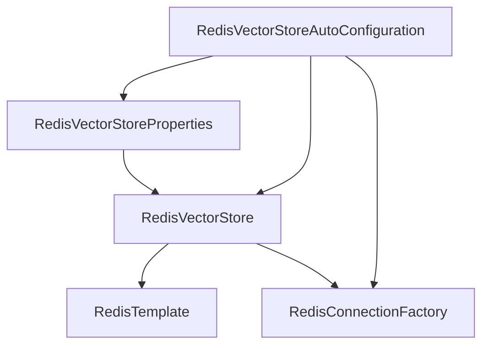

# 基础信息

|      |      |
|------|------|
| 编码语言 | .java |
| 代码路径 | yudao-module-ai/yudao-spring-boot-starter-ai/src/main/java/org/springframework/ai/autoconfigure/vectorstore/redis |
| 包名 | org.springframework.ai.autoconfigure.vectorstore.redis |
| 概述说明 | RedisVectorStoreAutoConfiguration在RedisAutoConfiguration后自动配置，依赖JedisPooled、JedisConnectionFactory、RedisVectorStore和EmbeddingModel类。当存在JedisConnectionFactory bean时，配置生效。通过RedisVectorStoreProperties配置属性，创建并返回RedisVectorStore bean，使用指定索引名称、前缀和Jedis连接池，可选择初始化模式。 |

# 说明

RedisVectorStoreAutoConfiguration类是一个自动配置类，它在RedisAutoConfiguration之后进行配置。该类的配置依赖于几个关键组件，包括JedisPooled、JedisConnectionFactory、RedisVectorStore和EmbeddingModel类。只有当系统中存在JedisConnectionFactory bean时，该配置才会生效。RedisVectorStoreAutoConfiguration类通过RedisVectorStoreProperties来读取和配置相关属性，这些属性用于创建并返回一个RedisVectorStore bean。在创建RedisVectorStore bean时，会使用指定的索引名称、前缀以及Jedis连接池。此外，该配置还允许选择初始化模式，以便在需要时对RedisVectorStore进行初始化。通过这种方式，RedisVectorStoreAutoConfiguration类确保了RedisVectorStore的正确配置和初始化，从而为系统提供了基于Redis的向量存储功能。

### 包内部结构视图

### 描述信息：
该图展示了`RedisVectorStoreAutoConfiguration`类与其他相关类之间的调用关系。`RedisVectorStoreAutoConfiguration`依赖于`RedisVectorStoreProperties`、`RedisVectorStore`和`RedisConnectionFactory`。`RedisVectorStore`进一步依赖于`RedisTemplate`和`RedisConnectionFactory`。这些类共同协作，实现了Redis向量存储的自动配置功能。

# 文件列表 File List

| 名称   | 类型  | 说明 |
|-------|------|-------------|
| [RedisVectorStoreAutoConfiguration.java](RedisVectorStoreAutoConfiguration.md) | file | RedisVectorStoreAutoConfiguration在RedisAutoConfiguration后自动配置，依赖JedisPooled、JedisConnectionFactory、RedisVectorStore和EmbeddingModel类。当存在JedisConnectionFactory bean时，配置生效。通过RedisVectorStoreProperties配置属性，创建并返回RedisVectorStore bean，使用指定索引名称、前缀和Jedis连接池，可选择初始化模式。 |

