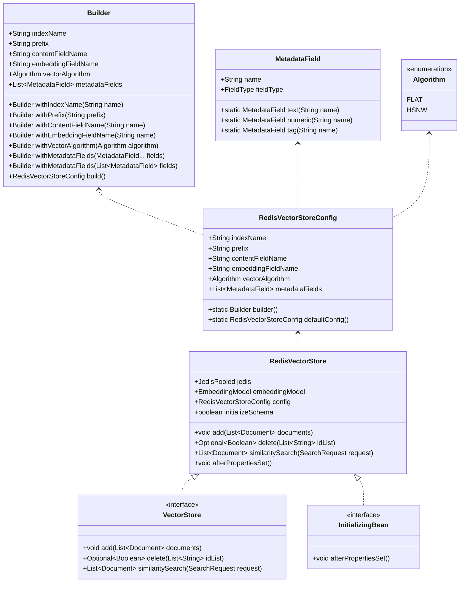
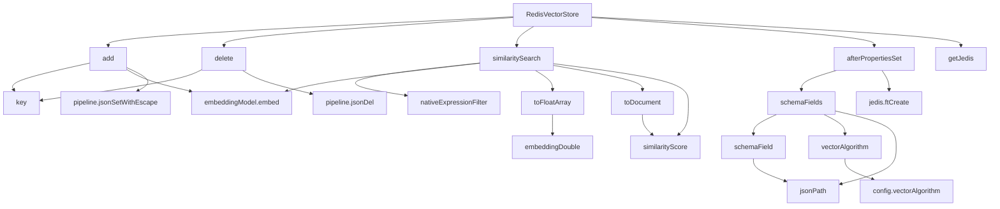

# 基础信息

|      |      |
|------|------|
| 编码语言 | .java |
| 代码路径 | yudao-module-ai/yudao-spring-boot-starter-ai/src/main/java/org/springframework/ai/vectorstore/RedisVectorStore.java |
| 包名 | org.springframework.ai.vectorstore |
| 依赖项 | ['org.slf4j.Logger', 'org.slf4j.LoggerFactory', 'org.springframework.ai.document.Document', 'org.springframework.ai.embedding.EmbeddingModel', 'org.springframework.ai.vectorstore.filter.FilterExpressionConverter', 'org.springframework.beans.factory.InitializingBean', 'org.springframework.util.Assert', 'org.springframework.util.CollectionUtils', 'redis.clients.jedis.JedisPooled', 'redis.clients.jedis.Pipeline', 'redis.clients.jedis.json.Path2', 'redis.clients.jedis.search', 'redis.clients.jedis.search.Schema.FieldType', 'redis.clients.jedis.search.schemafields', 'redis.clients.jedis.search.schemafields.VectorField.VectorAlgorithm', 'java.text.MessageFormat', 'java.util', 'java.util.function.Function', 'java.util.function.Predicate', 'java.util.stream.Collectors'] |
| 概述说明 | RedisVectorStore类实现VectorStore和InitializingBean接口，用于在Redis中存储和检索向量数据，支持FLAT和HSNW算法，可配置索引名称、前缀、内容字段、嵌入字段和元数据字段。通过JedisPooled与Redis交互，支持文档的添加、删除和相似性搜索，初始化时自动创建索引，支持JSON格式数据存储，并提供默认和自定义配置选项。 |

# 说明

RedisVectorStore类是一个用于在Redis中存储和检索向量数据的实现类，它同时实现了VectorStore和InitializingBean接口。该类支持两种向量算法：FLAT和HSNW，用户可以根据需求选择合适的算法进行向量存储和检索。在配置方面，RedisVectorStore允许用户自定义索引名称、前缀、内容字段、嵌入字段以及元数据字段，提供了灵活的配置选项以满足不同的应用场景。

RedisVectorStore通过JedisPooled与Redis进行交互，支持对文档的添加、删除以及相似性搜索操作。在初始化时，该类会自动创建索引，确保数据能够被高效地存储和检索。此外，RedisVectorStore支持以JSON格式存储数据，使得数据的存储和读取更加灵活和方便。

为了简化使用，RedisVectorStore提供了默认配置选项，同时也允许用户根据具体需求进行自定义配置。这种设计使得RedisVectorStore既适用于快速上手的场景，也能够满足复杂应用的需求。通过结合Redis的高性能和向量算法的优势，RedisVectorStore能够有效地处理大规模的向量数据存储和检索任务。

# 类列表 Class Summary

| 名称   | 类型  | 说明 |
|-------|------|-------------|
| RedisVectorStore | class | RedisVectorStore类实现了VectorStore和InitializingBean接口，用于在Redis中存储和检索向量数据。它支持FLAT和HSNW两种向量算法，并允许配置索引名称、前缀、内容字段、嵌入字段和元数据字段。通过JedisPooled与Redis交互，支持文档的添加、删除和相似性搜索。初始化时自动创建索引，支持JSON格式数据存储，并提供默认配置和自定义配置选项。 |

## 类 RedisVectorStore

|      |      |
|------|------|
| 访问范围 | public |
| 类型 | class |
| 名称 | RedisVectorStore |
| 说明 | RedisVectorStore类实现了VectorStore和InitializingBean接口，用于在Redis中存储和检索向量数据。它支持FLAT和HSNW两种向量算法，并允许配置索引名称、前缀、内容字段、嵌入字段和元数据字段。通过JedisPooled与Redis交互，支持文档的添加、删除和相似性搜索。初始化时自动创建索引，支持JSON格式数据存储，并提供默认配置和自定义配置选项。 |

### UML类图

### 描述：
该UML类图展示了`RedisVectorStore`类的结构及其与相关接口和类的关联。`RedisVectorStore`实现了`VectorStore`和`InitializingBean`接口，并依赖于`RedisVectorStoreConfig`类来管理配置。`RedisVectorStoreConfig`类通过`Builder`模式构建，并包含`MetadataField`和`Algorithm`枚举类。

### 内部方法调用关系图

### 描述信息：
该图展示了`RedisVectorStore`类中各个方法之间的调用关系。`RedisVectorStore`类主要负责与Redis数据库的交互，包括文档的添加、删除、相似性搜索等操作。图中清晰地展示了从主类到各个方法的调用路径，如`add`方法调用`key`和`embeddingModel.embed`，`similaritySearch`方法调用`nativeExpressionFilter`和`toDocument`等。

### 字段列表 Field List

| 名称  | 类型  | 说明 |
|-------|-------|------|
| filterExpressionConverter | FilterExpressionConverter | 代码片段定义了一个私有的FilterExpressionConverter类型的变量filterExpressionConverter。 |
| embeddingModel | EmbeddingModel | private final EmbeddingModel embeddingModel; 声明了一个私有的、不可变的EmbeddingModel实例变量。 |
| config | RedisVectorStoreConfig | private final RedisVectorStoreConfig config; 表示一个私有的、不可变的Redis向量存储配置对象。 |
| initializeSchema | boolean | private final boolean initializeSchema 表示一个私有的、不可变的布尔变量，用于指示是否初始化模式。 |
| jedis | JedisPooled | 该代码片段定义了一个私有且不可变的JedisPooled类型变量jedis，用于管理与Redis服务器的连接池。 |
| DEFAULT_INDEX_NAME = "spring-ai-index" | String | 该代码定义了一个公共静态常量`DEFAULT_INDEX_NAME`，其值为`"spring-ai-index"`，用于指定默认的索引名称。 |
| DISTANCE_FIELD_NAME = "vector_score" | String | public static final String DISTANCE_FIELD_NAME = "vector_score"; 定义了一个常量字符串，表示距离字段的名称为"vector_score"。 |
| EMBEDDING_PARAM_NAME = "BLOB" | String | private static final String EMBEDDING_PARAM_NAME = "BLOB"; 定义了一个常量字符串，用于表示嵌入参数的名称，其值为"BLOB"。 |
| DEFAULT_DISTANCE_METRIC = "COSINE" | String | 代码中定义了一个私有静态常量DEFAULT_DISTANCE_METRIC，其值为"COSINE"，表示默认的距离度量方式为余弦距离。 |
| JSON_PATH_PREFIX = "$." | String | private static final String JSON_PATH_PREFIX = "$."; 定义了一个常量，用于表示JSON路径的前缀。 |
| RESPONSE_OK = Predicate.isEqual("OK") | Predicate<Object> | 该代码定义了一个名为`RESPONSE_OK`的静态常量，类型为`Predicate<Object>`，其功能是判断输入对象是否等于字符串"OK"。 |
| DEFAULT_CONTENT_FIELD_NAME = "content" | String | 该信息定义了一个名为`DEFAULT_CONTENT_FIELD_NAME`的公共静态常量字符串，其值为`"content"`，用于表示默认内容字段的名称。 |
| DEFAULT_EMBEDDING_FIELD_NAME = "embedding" | String | public static final String DEFAULT_EMBEDDING_FIELD_NAME 是一个常量字符串，其值为 "embedding"，用于表示默认的嵌入字段名称。 |
| QUERY_FORMAT = "%s=>[KNN %s @%s $%s AS %s]" | String | 该代码定义了一个静态常量字符串QUERY_FORMAT，格式为"%s=>[KNN %s @%s $%s AS %s]"，用于生成KNN查询语句。 |
| logger = LoggerFactory.getLogger(RedisVectorStore.class) | Logger | 代码片段定义了一个静态常量`logger`，使用`LoggerFactory`获取`RedisVectorStore`类的日志记录器实例，用于记录日志信息。 |
| DEFAULT_VECTOR_ALGORITHM = Algorithm.HSNW | Algorithm | `DEFAULT_VECTOR_ALGORITHM` 是一个公共静态常量，其值为 `Algorithm.HSNW`，表示默认的向量算法为 HSNW。 |
| VECTOR_TYPE_FLOAT32 = "FLOAT32" | String | private static final String VECTOR_TYPE_FLOAT32 = "FLOAT32"; 定义了一个常量字符串VECTOR_TYPE_FLOAT32，其值为"FLOAT32"，表示浮点32位向量类型。 |
| JSON_SET_PATH = Path2.of("$") | Path2 | private static final Path2 JSON_SET_PATH = Path2.of("$"); 定义了一个静态常量JSON_SET_PATH，其值为Path2对象，路径为根路径"$"。 |
| RESPONSE_DEL_OK = Predicate.isEqual(1l) | Predicate<Object> | 该代码定义了一个名为`RESPONSE_DEL_OK`的静态常量，类型为`Predicate<Object>`，用于判断对象是否等于长整型数值`1`。 |
| DEFAULT_PREFIX = "embedding:" | String | public static final String DEFAULT_PREFIX = "embedding:"; 定义了一个静态常量字符串DEFAULT_PREFIX，其值为"embedding:"。 |

### 方法列表 Method List

| 名称  | 类型  | 说明 |
|-------|-------|------|
| getJedis | JedisPooled | 该方法返回一个JedisPooled对象，具体返回的是当前实例中的jedis成员变量。 |
| jsonPath | String | 该方法用于生成JSON路径字符串，通过将传入的字段名与预设的JSON路径前缀拼接，返回完整的JSON路径。 |
| key | String | 该方法 `key` 接受一个字符串参数 `id`，并将其与 `this.config.prefix` 拼接后返回，生成一个新的字符串。 |
| nativeExpressionFilter | String | 该方法用于处理搜索请求中的过滤表达式。如果请求中没有过滤表达式，则返回通配符“*”；否则，将过滤表达式转换为特定格式并返回。 |
| vectorAlgorithm | VectorAlgorithm | 该方法根据配置中的vectorAlgorithm参数决定返回的向量算法类型。如果配置为HSNW，则返回HNSW算法；否则返回FLAT算法。 |
| similarityScore | float | 该方法计算文档的相似度分数，通过解析文档中的距离字段值，将其转换为一个0到1之间的分数，公式为(2 - 距离值) / 2。 |
| toFloatArray | float[] | 该方法将包含Double类型元素的列表转换为float类型数组，通过遍历列表中的每个元素，调用floatValue()方法将其转换为float类型，并存入新创建的float数组中，最后返回该数组。 |
| add | void | 该方法通过Redis管道批量添加文档，首先使用嵌入模型生成文档的嵌入向量，并将嵌入向量、内容和元数据存储在Redis中。如果操作过程中出现错误，会记录错误日志并抛出异常。 |
| afterPropertiesSet | void | 在`afterPropertiesSet`方法中，若`initializeSchema`为`false`或索引已存在，则不执行操作；否则，尝试创建索引。若创建失败，抛出异常提示无法创建索引。 |
| toDocument | Document | 该方法将Redis搜索文档转换为自定义文档对象。通过移除配置前缀获取ID，检查并提取内容字段，收集元数据字段并计算相似度得分，最后返回包含ID、内容和元数据的自定义文档对象。 |
| delete | Optional<Boolean> | 该方法通过Redis管道批量删除指定ID列表对应的JSON文档。遍历ID列表，使用`jsonDel`命令删除每个文档，然后同步并获取所有响应。如果响应中存在错误，记录错误日志并返回`false`；否则返回`true`。 |
| similaritySearch | List<Document> | 该方法用于执行相似性搜索，首先验证请求参数的有效性，包括返回文档数量和相似度阈值。然后构建查询字符串，指定返回字段，并生成嵌入向量。通过Redis执行搜索，过滤结果以确保相似度满足阈值，最终返回符合条件的文档列表。 |
| schemaField | SchemaField | 该代码定义了一个方法`schemaField`，根据传入的`MetadataField`对象的字段类型生成相应的字段对象。如果字段类型为`NUMERIC`，则生成`NumericField`；如果为`TAG`，则生成`TagField`；如果为`TEXT`，则生成`TextField`。如果字段类型不支持，则抛出异常。 |
| schemaFields | Iterable<SchemaField> | 该方法生成一个包含多个SchemaField的列表，其中包括一个文本字段和一个向量字段。文本字段基于配置的内容字段名称，权重为1.0；向量字段基于配置的嵌入字段名称，使用指定的向量算法和属性（维度、距离度量、类型）。如果配置中包含元数据字段，也会将其添加到列表中。最终返回所有字段的集合。 |

