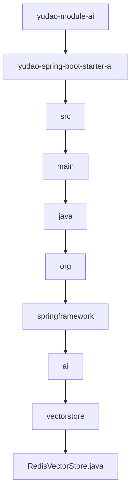

# 基础信息

|      |      |
|------|------|
| 编码语言 | .java |
| 代码路径 | yudao-module-ai/yudao-spring-boot-starter-ai/src/main/java/org/springframework/ai/vectorstore |
| 包名 | org.springframework.ai.vectorstore |
| 概述说明 | RedisVectorStore类实现VectorStore和InitializingBean接口，用于在Redis中存储和检索向量数据，支持FLAT和HSNW算法，可配置索引名称、前缀、内容字段、嵌入字段和元数据字段。通过JedisPooled与Redis交互，支持文档的添加、删除和相似性搜索，初始化时自动创建索引，支持JSON格式数据存储，并提供默认和自定义配置选项。 |

# 说明

RedisVectorStore类是一个用于在Redis中存储和检索向量数据的实现类，它同时实现了VectorStore和InitializingBean接口。该类支持两种向量算法：FLAT和HSNW，用户可以根据需求选择合适的算法进行向量存储和检索。在配置方面，RedisVectorStore允许用户自定义索引名称、前缀、内容字段、嵌入字段以及元数据字段，提供了灵活的配置选项以满足不同的应用场景。

RedisVectorStore通过JedisPooled与Redis进行交互，支持对文档的添加、删除以及相似性搜索操作。在初始化时，该类会自动创建索引，确保数据能够被高效地存储和检索。此外，RedisVectorStore支持以JSON格式存储数据，使得数据的存储和读取更加灵活和方便。

为了简化使用，RedisVectorStore提供了默认配置选项，同时也允许用户根据具体需求进行自定义配置。这种设计使得RedisVectorStore既适用于快速上手的场景，也能够满足复杂应用的需求。通过结合Redis的高性能和向量算法的优势，RedisVectorStore能够有效地处理大规模的向量数据存储和检索任务。

### 包内部结构视图

### 描述信息：
该Mermaid图展示了从`yudao-module-ai`到`RedisVectorStore.java`的层级调用关系。图中清晰地展示了从模块到具体文件的路径，最终指向`RedisVectorStore.java`文件。

# 文件列表 File List

| 名称   | 类型  | 说明 |
|-------|------|-------------|
| [RedisVectorStore.java](RedisVectorStore.md) | file | RedisVectorStore类实现VectorStore和InitializingBean接口，用于在Redis中存储和检索向量数据，支持FLAT和HSNW算法，可配置索引名称、前缀、内容字段、嵌入字段和元数据字段。通过JedisPooled与Redis交互，支持文档的添加、删除和相似性搜索，初始化时自动创建索引，支持JSON格式数据存储，并提供默认和自定义配置选项。 |

